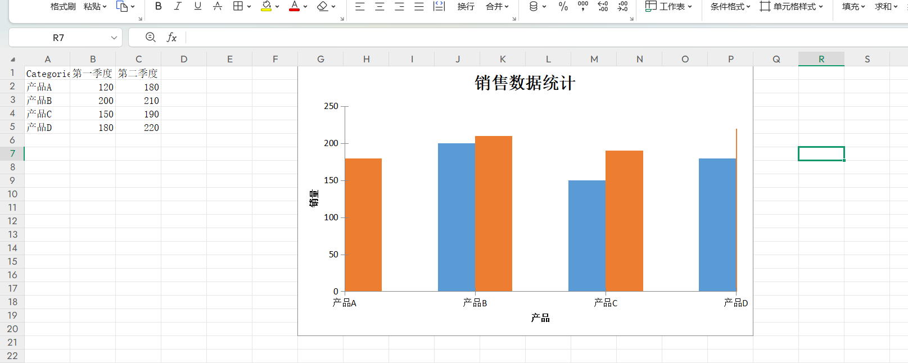
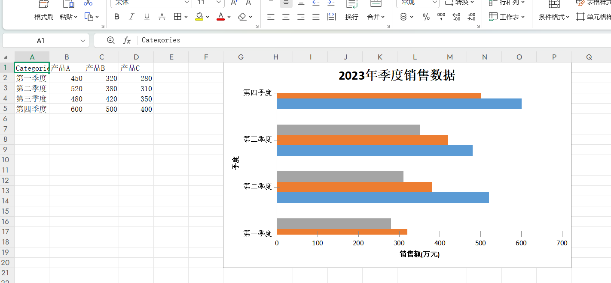
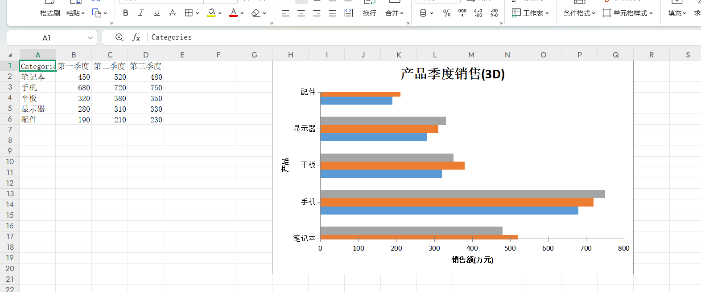
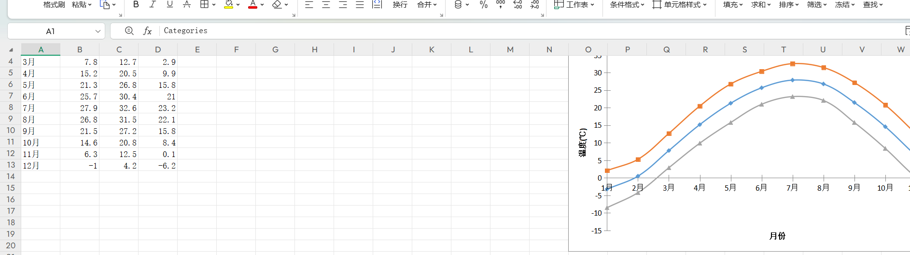

# 🚀 jquick-excel: 轻量级、高性能的 Java Excel 操作框架
简体中文 | [English](./README_EN.md)
⚡ 一个简洁、强大且易于使用的 Java Excel 读写工具，支持 xls/xlsx 格式，提供丰富的 API 和灵活的配置语法

## 📦 项目简介
jquick-excel 是一个专为 Java 开发者设计的轻量级 Excel 操作框架。它结合了 **易用性**、**灵活性** 和 **高性能**，支持主流 Excel 格式（xls/xlsx），并提供丰富的 API 帮助开发者快速实现复杂的 Excel 导入导出功能。

## ✨ 核心特性
✅ 双格式支持 - 完美兼容 .xls 和 .xlsx 格式  
✅ 声明式配置 - 使用简洁的 DSL 语法定义导入导出规则  
✅ 高性能处理 - 优化大数据量读写，内存占用低  
✅ 丰富验证规则 - 内置 20+ 种数据验证规则  
✅ 强大公式支持 - 支持 50+ 种 Excel 公式  
✅ 图表生成 - 支持 10 种图表类型一键生成  
✅ 样式自定义 - 完整的单元格样式控制  
✅ 单元格合并 - 灵活的多维数据合并策略  
✅ 上下文转换 - 支持动态数据转换和映射

## 🛠️ 技术栈
[](https://www.java.com/)
[](https://poi.apache.org/)
[](https://projectlombok.org/)
[](LICENSE)
[](https://github.com/paohaijiao/jquick-excel/commits/main)
[](https://github.com/paohaijiao/jquick-excel/stargazers)
[](https://github.com/paohaijiao/jquick-excel/network/members)

## 📥 快速开始
### Maven 依赖
```xml
<dependency>
  <groupId>io.github.paohaijiao</groupId>
  <artifactId>jquick-excel</artifactId>
  <version>最新版本</version>
</dependency>
```
### gradle 依赖
```gradle
implementation 'io.github.paohaijiao:jquick-excel:最新版本'
```
## 📚 功能总览
### 🔄 导入功能
- 智能映射 - 字段自动映射与转换
- 数据验证 - 20+ 种验证规则（邮箱、手机、正则等）
- 格式转换 - 日期、数字、字符串格式化
- 批量处理 - 支持大数据量分批次导入

### 📤 导出功能
- 模板导出 - 基于配置模板快速导出
- 公式计算 - 支持 50+ 种 Excel 公式
- 图表生成 - 10 种图表类型
- 样式定制 - 完整的单元格样式控制
- 数据合并 - 多种合并策略（最大、最小、平均等）

## 🎯 使用示例
### 基础语法
```string
IMPORT [WITH option1, option2, ...]
```
### 配置项说明
| 项          | 语法                          | 描述                         |
|-------------|-------------------------------|------------------------------|
| `SHEET`     | `SHEET = (字符串 \| 数字)`    | 指定工作表（名称/索引）|
| `HEADER`    | `HEADER = 布尔值`            | 是否包含表头 (`true`/`false`) |
| `MAPPING`   | `MAPPING = { 映射关系 }`      | 源字段 ↔ 目标字段映射        |
| `TRANSFORM` | `TRANSFORM = { 转换规则 }`    | 数据转换规则                 |
| `VALIDATION`| `VALIDATION = { 验证规则 }`   | 数据验证规则                 |
### SHEET 语法
```string
IMPORT WITH SHEET="Sheet1"
```
### HEADER 语法
```string
IMPORT WITH HEADER=true
```
### 字段映射语法
```string
IMPORT WITH MAPPING = {
"学号": "no",
"姓名": "name",
"性别": "sex",
"年龄": "age",
"出生日期": "birthday"
}
```
### 转换规则语法（支持 JEvaluator 所有方法）
```string
IMPORT WITH TRANSFORM={
"sex": trans(${dict},${sex}),
"birthday": dateFormat(${birthday},'yyyy-MM-dd')
}
```
### 导入验证
## 📊 支持的验证规则
| 规则类型       | 示例                          | 说明                     |
|----------------|-------------------------------|--------------------------|
| 布尔验证       | boolean{required:true}        | 验证布尔值               |
| 日期格式       | date_format{format:'yyyy-MM-dd'} | 日期格式验证         |
| 数值范围       | range{min:1, max:100}         | 数值范围验证             |
| 字典验证       | dict{map:{'1':'男','2':'女'}} | 值必须在字典中           |
| 正则表达式     | regex{pattern:'^\\d+$'}       | 正则匹配验证             |
| 长度验证       | max_length{maxLength:10}      | 字符串长度验证           |
| 邮箱验证       | email{}                       | 邮箱格式验证             |
| 手机验证       | mobile{}                      | 手机号格式验证           |

#### 验证规则语法
```string
// 行验证
ROW 5 - 验证第5行
ROW 1..10 - 验证第1行到第10行
// 列验证
COL A - 验证A列
COL A..D - 验证A列到D列
// 单元格验证
C1 - 验证第1行C列单元格
// 范围验证
A1:B5 - 验证A1到B5的矩形区域
```
#### 验证规则配置示例
```string
IMPORT WITH VALIDATION={
ROW 1..10 {
required {required: true, msg: "不能为空"},
range {required: true, msg: "数值超出范围", map: {min: 1, max: 100}}
},
COL A {
required {required: true, msg: "A列不能为空"}
},
B1:C5 {
regex {required: true, msg: "格式错误", map: {pattern: "^\\d+$"}}
}
}
```
#### 验证规则类型
#### 验证规则列表
| 规则名称         | 参数键              | 参数类型    | 描述                                   |
|------------------|---------------------|-------------|----------------------------------------|
| `boolean`        | -                   | -           | 验证值是否为布尔值                     |
| `date_format`    | `format`            | `String`    | 验证字符串是否符合指定的日期格式       |
| `max_date`       | `maxDate`, `format` | `Date`, `String` | 验证日期是否不超过指定的最大日期     |
| `min_date`       | `minDate`, `format` | `Date`, `String` | 验证日期是否不小于指定的最小日期     |
| `integer`        | -                   | -           | 验证值是否为整数                       |
| `decimal`        | -                   | -           | 验证值是否为小数                       |
| `max_value`      | `maxValue`          | `BigDecimal`| 验证数值是否不大于指定的最大值         |
| `min_value`      | `minValue`          | `BigDecimal`| 验证数值是否不小于指定的最小值         |
| `dict`           | key-value pairs     | `Map`       | 验证值是否存在于提供的字典中           |
| `email`          | -                   | -           | 验证字符串是否为有效的电子邮件格式     |
| `mobile`         | -                   | -           | 验证字符串是否为有效的手机号码格式（中国标准） |
| `max_length`     | `maxLength`         | `BigDecimal`| 验证字符串长度是否不超过指定的最大长度 |
| `min_length`     | `minLength`         | `BigDecimal`| 验证字符串长度是否不小于指定的最小长度 |
| `regex`          | `pattern`           | `String`    | 验证字符串是否匹配指定的正则表达式     |
| `start_with`     | `startWith`         | `String`    | 验证字符串是否以指定的子字符串开头     |
| `not_start_with` | `notStartWith`      | `String`    | 验证字符串是否不以指定的子字符串开头   |
| `end_with`       | `endWith`           | `String`    | 验证字符串是否以指定的子字符串结尾     |
| `not_end_with`   | `notEndWith`        | `String`    | 验证字符串是否不以指定的子字符串结尾   |
| `contain`        | `contains`          | `String`    | 验证字符串是否包含指定的子字符串       |
| `not_contain`    | `notContain`        | `String`    | 验证字符串是否不包含指定的子字符串     |
#####  布尔验证
```string
IMPORT WITH VALIDATION={   
    C2:C4:{
        boolean{required:true,msg:'性别非法',map:{'1':'男','2':'女'}}
    }
}
```
#####  日期格式验证
```string
IMPORT WITH VALIDATION={   E2:E4:{
date_format{required:true,msg:'不符合日期格式',map:{'format':'yyyy-MM-dd'}   }
}
```
#####  最大日期验证
```string
IMPORT WITH VALIDATION={   E2:E4:{
    max_date{required:true,msg:'超过最大日期',map:{'format':'yyyy-MM-dd',maxDate:2025-01-01}   }
}
```
#####  最小日期验证
```string
IMPORT WITH VALIDATION={   E2:E4:{
    min_date{required:true,msg:'不能小于最小日期',map:{'format':'yyyy-MM-dd',minDate:2022-01-01}   }
}
```
#####  整数验证
```string
IMPORT WITH VALIDATION={   D2:D4:{
    integer{required:true,msg:'要求该字段是整形'   }
}
```
#####  小数验证
```string
IMPORT WITH VALIDATION={   D2:D4:{
    decimal{required:true,msg:'要求该字段是整形'   }
}
```
#####  最大值验证
```string
IMPORT WITH VALIDATION={   D2:D4:{
    max_value{required:true,msg:'年龄不能超过最大值',map:{'maxValue':50}   }
}
```
#####  最小值验证
```string
IMPORT WITH VALIDATION={   D2:D4:{
    min_value{required:true,msg:'年龄不能小于xx',map:{'minValue':2}   }
}
```
#####  字典验证
```string
IMPORT WITH VALIDATION={   C2:C4:{
    dict{required:true,msg:'性别非法',map:{'1':'男','2':'女'}   }
}
```
#####   邮箱验证
```string
IMPORT WITH VALIDATION={   C2:C4:{
    email{required:true,msg:'邮箱格式不正确'   }
}
```
#####   手机号验证
```string
IMPORT WITH VALIDATION={   C2:C4:{
    mobile{required:true,msg:'手机格式不正确'   }
}
```
#####   最大长度验证
```string
IMPORT WITH VALIDATION={   B2:B4:{
    max_length{required:true,msg:'最大长度有误',map:{'maxLength':7}   }
}
```
#####   最小长度验证
```string
IMPORT WITH VALIDATION={   B2:B4:{
    min_length{required:true,msg:'最小长度有误',map:{'minLength':1}   }
}
```
#####   正则表达式验证
```string
IMPORT WITH VALIDATION={   D2:D4:{
    regex{required:true,msg:'不符合正则表达式',map:{pattern:'^\d+$'}   }
}
```
#####   开头字符串验证
```string
IMPORT WITH VALIDATION={   B2:B4:{
   start_with{required:true,msg:'开始字符串有误',map:{startWith:'张三'}   }
}
```
#####   非开头字符串验证
```string
IMPORT WITH VALIDATION={   B2:B4:{
   not_start_with{required:true,msg:'不能以该字符串开始',map:{notStartWith:'张三'}   }
}
```
#####   结尾字符串验证
```string
IMPORT WITH VALIDATION={   B2:B4:{
   end_with{required:true,msg:'不符合以张三结束的字符',map:{endWith:'张三'}   }
}
```
#####   非结尾字符串验证
```string
IMPORT WITH VALIDATION={   B2:B4:{
   not_end_with{required:true,msg:'不符合表达式',map:{notEndWith:'张三'}   }
}
```
#####   包含字符串验证
```string
IMPORT WITH VALIDATION={   B2:B4:{
   not_end_with{required:true,msg:'不符合表达式',map:{notEndWith:'张三'}   }
}
```
#####   不包含字符串验证
```string
IMPORT WITH VALIDATION={   B2:B4:{
   not_contain{required:true,msg:'不应该包含该关键字',map:{notContain:'张三'}   }
}
```
### 基础导入示例
## 🔧 导入配置
```java
String rule = """
    IMPORT WITH 
    SHEET="Sheet1",
    HEADER=true,
    MAPPING={
        "学号": "no",
        "姓名": "name",
        "性别": "sex",
        "年龄": "age",
        "出生日期": "birthday"
    }  """
JQuickExcelCommonImportExecutor executor = new JQuickExcelCommonImportExecutor();
JExcelImportModel model = (JExcelImportModel) executor.execute(rule);
InputStream is = getClass().getClassLoader().getResourceAsStream("templates/student.xlsx");
XSSFWorkbook workbook = new XSSFWorkbook(is);
JExcelImportHandler handler = new JExcelImportHandler(workbook);
List<Map<String, Object>> data = handler.importData(model);
```
### 基础导出示例
```java
String rule = """
EXPORT WITH
SHEET="学生表",
HEADER=true,
MAPPING={
"id": "主键",
"name": "姓名",
"gender": "性别",
"age": "年龄",
"enrollmentDate": "入学时间",
"className": "班级"
}
""";

List<Map<String, Object>> data = JObjectConverter.convert(getData());
FileOutputStream fos = new FileOutputStream("导出结果.xlsx");
JQuickExcelCommonExportExecutor executor = new JQuickExcelCommonExportExecutor();
JExcelExportModel config = (JExcelExportModel) executor.execute(rule);
JExcelExportHandler handler = new JExcelExportHandler(config, data);
Workbook workbook = handler.getWorkBook();
workbook.write(fos);
fos.close();
```
## 📤 导出配置
### 基础语法
```string
EXPORT [WITH option1, option2, ...]
```
### 导出选项说明
| 配置项       | 语法格式                                                  | 描述说明                     |
|--------------|-----------------------------------------------------------|------------------------------|
| 📑 `SHEET`   | `SHEET '=' (STRING \| NUMBER)`                           | 按名称或索引指定目标工作表   |
| 📋 `HEADER`  | `HEADER '=' BOOLEAN`                                     | 控制是否包含表头 (`true`/`false`) |
| 🎨 `FORMAT`  | `FORMAT '=' '{' cellFormat (',' cellFormat)* '}'`        | 定义单元格格式化规则         |
| 🗺️ `MAPPING` | `MAPPING '=' '{' fieldMapping (',' fieldMapping)* '}'`    | 源数据与导出数据之间的字段映射 |
| 🔄 `TRANSFORM`| `TRANSFORM '=' '{' transformRule (',' transformRule)* '}'`| 导出前的数据转换规则         |
| 🧮 `FORMULAS`| `FORMULAS '=' '{' formulaTarget (',' formulaTarget)* '}'` | 导出时应用的公式             |
| ✨ `STYLE`   | `STYLE '=' '{' styleTarget (',' styleTarget)* '}'`        | 单元格样式规则               |
| 🧩 `MERGE`   | `MERGE '=' '{' mergeSpec (',' mergeSpec)* '}'`            | 单元格合并规则               |
| 📊 `GRAPH`   | `GRAPH '=' '{' graphSpec (',' graphSpec)* '}'`            | 图表 / 图形配置               |
| 📝 `FOOTER`  | `FOOTER '=' (STRING \| IDENTIFIER)`                      | 页脚文本或变量引用           |
### SHEET 选项
```string
EXPORT WITH SHEET="Report"
```
### 表头选项
```string
EXPORT WITH HEADER=true
```
### 映射选项
```string
EXPORT  WITH MAPPING={
	"id":"主键",
	"name":"姓名",
	"gender":"性别",
	"age":"年龄",
	"enrollmentDate":"入学时间",
	"className":"班级",
	"ignoreField":"是否忽略"
}
```
```java
public static List<JStudentModel> getData() {
  List<JStudentModel> students = new ArrayList<>();
  students.add(new JStudentModel("1001", "张三", 1, 20, new Date(), "计算机1班", "true"));
  students.add(new JStudentModel("1002", "李四", 0, 21, new Date(), "计算机2班", "true"));
  students.add(new JStudentModel("1003", "王五", 1, 22, new Date(), "计算机3班", "true"));
  return students;
}
List<Map<String, Object>> data = JObjectConverter.convert(getData());
FileOutputStream fileOutputStream=new FileOutputStream("d://test//format.xlsx");
JQuickExcelCommonExportExecutor executor = new JQuickExcelCommonExportExecutor();
JExcelExportModel config = (JExcelExportModel) executor.execute(input);
JExcelExportHandler handler = new JExcelExportHandler(config,data);
Workbook workbook=handler.getWorkBook();
workbook.write(fileOutputStream);
```
### 格式化选项
```string
EXPORT  WITH MAPPING={
	"id":"主键",
	"name":"姓名",
	"gender":"性别",
	"age":"年龄",
	"enrollmentDate":"入学时间",
	"className":"班级",
	"ignoreField":"是否忽略"
},FORMAT={"enrollmentDate":"yyyy-MM-dd"}
```
### 转换选项
```string
EXPORT  WITH MAPPING={
	"id":"主键",
	"name":"姓名",
	"gender":"性别",
	"age":"年龄",
	"enrollmentDate":"入学时间",
	"className":"班级",
	"ignoreField":"是否忽略"
},
FORMAT={	
  "enrollmentDate":"yyyy-MM-dd"
},
TRANSFORM={
  "name": toUpper(${name}),
  "enrollmentDate": dateFormat(${enrollmentDate},'yyyy-MM-dd'),
  "gender": trans(${dict},${gender})
}
```
``` java
List<Map<String, Object>> data = JObjectConverter.convert(getData());
FileOutputStream fileOutputStream=new FileOutputStream("d://test//transform.xlsx");
JQuickExcelCommonExportExecutor executor = new JQuickExcelCommonExportExecutor();
JExcelExportModel config = (JExcelExportModel) executor.execute(input);
HashMap<String,Object> map = new HashMap<>();
  map.put("1","男");
  map.put("0","女");
JContext context = new JContext();
context.put("dict",map);
JExcelExportHandler handler = new JExcelExportHandler(config,context,data);
Workbook workbook=handler.getWorkBook();
workbook.write(fileOutputStream);
```
###  公式选项
#### 应用范围支持
支持**行**、**列**、**单元格**、**区域**四种类型：
1. **行**
   `ROW 5` - 应用第 5 行
   `ROW 1..10` - 应用第 1 行至第 10 行
2. **列**
   `COL A:` - 应用 A 列
   `COL A..D:` - 应用 A 列至 D 列
3. **单元格**
   `C1:` - 应用第 1 行 C 列的单元格
4. **区域**
   `A1:B5` - 代表从 A1 单元格到 B5 单元格的矩形区域
5. 
## 🔢 支持的公式类型
### 📈 数学公式（16个）
### 数学公式（16个）
| 公式名 | 语法示例 | 参数数量 | 描述说明 | 对应类名 |
|--------|----------|----------|----------|----------|
| 📏 `ABS` | `ABS(D2)` | 1 | 绝对值 | `JABSFormula` |
| 📊 `AVERAGE` | `AVERAGE(D2:D4)` | ≥1 | 算术平均值 | `JAverageFormula` |
| 🔢 `COUNT` | `COUNT(D2:D4)` | ≥1 | 计数 | `JCountFormula` |
| ⬆️ `MAX` | `MAX(D2:D4)` | ≥1 | 最大值 | `JMaxFormula` |
| ⬇️ `MIN` | `MIN(D2:D4)` | ≥1 | 最小值 | `JMinFormula` |
| ⚡ `POWER` | `POWER(2,3)` | 2 | 幂运算 | `JPowerFormula` |
| 🎲 `RAND` | `RAND()` | 0 | 随机数 [0,1) | `JRandFormula` |
| 🏆 `RANK` | `RANK(20,D2:D4)` | 2 | 列表中排名 | `JRankFormula` |
| 🎯 `ROUND` | `ROUND(3.1415926,3)` | 2 | 四舍五入指定位数 | `JRoundFormula` |
| √️ `SQRT` | `SQRT(4)` | 1 | 平方根 | `JSQRTFormula` |
| 📈 `STDEV` | `STDEV(D2:D4)` | ≥1 | 标准差 | `JSTDEVFormula` |
| ➕ `SUM` | `SUM(D2:D4)` | ≥1 | 求和 | `JSumFormula` |
```string
# 数学公式配置示例（整合版）
# 格式说明：FORMULAS = { 目标单元格: '公式表达式' }
# 所有公式均配置在 D5 单元格，可根据实际需求修改目标单元格
FORMULAS={
# 1. 绝对值计算：取 D2 单元格的绝对值
D5:'ABS(D2)',
# 2. 算术平均值：计算 D2 至 D4 单元格的平均值
D5:'AVERAGE(D2:D4)',
# 3. 计数：统计 D2 至 D4 单元格的有效数值个数
D5:'COUNT(D2:D4)',
# 4. 最大值：取 D2 至 D4 单元格中的最大值
D5:'MAX(D2:D4)',
# 5. 最小值：取 D2 至 D4 单元格中的最小值
D5:'MIN(D2:D4)',
# 6. 幂运算：计算 2 的 3 次方（2^3）
D5:'POWER(2,3)',
# 7. 随机数：生成 0（包含）到 1（不包含）之间的随机数
D5:'RAND()',
# 8. 排名：计算数值 20 在 D2 至 D4 区域中的排名
D5:'RANK(20,D2:D4)',
# 9. 四舍五入：将 3.1415926 保留 3 位小数
D5:'ROUND(3.1415926,3)',
# 10. 平方根：计算 4 的平方根
D5:'SQRT(4)',
# 11. 标准差：计算 D2 至 D4 单元格数据的标准差（反映数据离散程度）
D5:'STDEV(D2:D4)',
# 12. 求和：计算 D2 至 D4 单元格的数值总和
D5:'SUM(D2:D4)'
}
```
### 📅 日期公式（15个）
### 📅 日期公式 (15)
| 公式名 | 语法示例 | 特殊规则 | 对应类名 |
|--------|----------|----------|----------|
| 🕒 `DATETIME` | `DATETIME(2023,5,15,14,30,0)` | 返回当前日期时间 | `JDateTimeFormula` |
| 📆 `DAY` | `DAY("2025-01-23")` | 提取日期中的日（1-31） | `JDayFormula` |
| 📊 `DAYS` | `DAYS("2025-01-23","2025-01-28")` | 计算两个日期之间的天数 | `JDaysFormula` |
| 📈 `EDATE` | `EDATE(start,months)` | 给日期添加指定月份 | `JEDATEFormula` |
| 🗓️ `EOMONTH` | `EOMONTH("2025-01-23",3)` | 返回指定月份的月末日期 | `JEOMONTHFormula` |
| ⏰ `HOUR` | `HOUR('2025-01-23')` | 提取时间中的小时（0-23） | `JHourFormula` |
| 💼 `NETWORKDAYS` | `NETWORKDAYS(s,e,[h])` | 参数数量 2-3 个（计算工作日） | `JNetworkDayFormula` |
| �实时 `NOW` | `NOW()` | 需精确匹配语法，返回当前时间戳 | `JNowFormula` |
| 📅 `TODAY` | `TODAY()` | 需精确匹配语法，返回当前日期 | `JTodayFormula` |
| 🛠️ `WORKDAY` | `WORKDAY(s,days,[h])` | 参数数量 2-3 个（计算工作日偏移） | `JWorkDayFormula` |
| ⏱️ `MINUTE` | `MINUTE(time_value)` | 1 个时间序列参数，提取分钟（0-59） | - |
| 📍 `MONTH` | `MONTH(date_value)` | 1 个日期序列参数，提取月份（1-12） | - |
| 🎯 `SECOND` | `SECOND(time_value)` | 1 个时间序列参数，提取秒（0-59） | - |
| ⏲️ `TIME` | `TIME(hour,min,sec)` | 3 个参数（时/分/秒），返回Excel时间序列（0-0.999） | - |
| 📆 `TODAY` | `TODAY()` | 精确匹配语法，返回当前日期序列 | - |
| 📝 `WEEKDAY` | `WEEKDAY(date,[type])` | 参数数量 1-2 个，返回星期几（可配置） | - |
| 📊 `WEEKNUM` | `WEEKNUM(date,[type])` | 参数数量 1-2 个，返回周数 | - |
| 📅 `YEAR` | `YEAR(date_value)` | 1 个日期序列参数，提取年份（1900-9999） | - |
### 📅 日期公式配置 & 等效 Java 代码（整合版）
#### 1. 基础日期时间公式
```string
# -------------------------- 1. DATETIME - 构造日期时间 --------------------------
# 配置格式：FORMULAS = { 目标单元格: '公式表达式' }
FORMULAS={
    D5:'DATETIME(2023,5,15,14,30,0)'  # 构造 2023-05-15 14:30:00 日期时间
}
# 等效 Java 代码
/*
 * 直接创建 DATETIME 公式实例
 */
JAbstractExcelFormula formula = factory.createFormulaInstance("DATETIME(2023,5,15,14,30,0)");

# -------------------------- 2. DAY - 提取日期中的“日” --------------------------
FORMULAS={
    D5:'DAY("2025-01-23")'  # 提取 2025-01-23 的“日”（结果：23）
}
# 等效 Java 代码
/*
 * 1. 先在 A1 单元格写入日期值
 * 2. 基于 A1 单元格创建 DAY 公式
 */
sheet.createRow(0).createCell(0).setCellValue("2023-05-15");
JAbstractExcelFormula formula = factory.createFormulaInstance("DAY(A1)");

# -------------------------- 3. DAYS - 计算两个日期的天数差 --------------------------
FORMULAS={
    D5:'DAYS("2025-01-23","2025-01-28")'  # 计算 2025-01-28 与 2025-01-23 的天数差
}
# 等效 Java 代码
/*
 * 1. A1 写入起始日期，A2 写入结束日期
 * 2. 计算 A2 - A1 的天数差
 */
sheet.createRow(0).createCell(0).setCellValue("2023-01-01");
sheet.createRow(1).createCell(0).setCellValue("2023-12-31");
JAbstractExcelFormula formula = factory.createFormulaInstance("DAYS(A2,A1)");

# -------------------------- 4. EDATE - 日期添加指定月份 --------------------------
FORMULAS={
    D5:'EDATE("2025-01-23",3)'  # 2025-01-23 加 3 个月
}
# 等效 Java 代码
/*
 * 1. A1 写入基础日期
 * 2. 给 A1 日期添加 3 个月
 */
sheet.createRow(0).createCell(0).setCellValue("2023-01-31");
JAbstractExcelFormula formula = factory.createFormulaInstance("EDATE(A1,3)");

# -------------------------- 5. EOMONTH - 获取月末日期 --------------------------
FORMULAS={
    D5:'EOMONTH("2025-01-23",3)'  # 2025-01-23 加 3 个月后的月末日期
}
# 等效 Java 代码
/*
 * 1. A1 写入基础日期
 * 2. 获取 A1 日期当月的月末日期（参数 0 表示当前月）
 */
sheet.createRow(0).createCell(0).setCellValue("2023-02-15");
JAbstractExcelFormula formula = factory.createFormulaInstance("EOMONTH(A1,0)");
# -------------------------- 6. HOUR - 提取小时 --------------------------
# 前提：A1 单元格值为 14:30:00
FORMULAS={
    D5:'HOUR("A1")'  # 提取 A1 单元格时间的小时部分（结果：14）
}
# 等效 Java 代码
/*
 * 1. A1 写入时间值
 * 2. 提取 A1 时间的小时
 */
sheet.createRow(0).createCell(0).setCellValue("14:30:00");
JAbstractExcelFormula formula = factory.createFormulaInstance("HOUR(A1)");

# -------------------------- 11. MINUTE - 提取分钟 --------------------------
# 等效 Java 代码
/*
 * 1. A1 写入时间值 14:30:45
 * 2. 提取 A1 时间的分钟部分（结果：30）
 */
sheet.createRow(0).createCell(0).setCellValue("14:30:45");
JAbstractExcelFormula formula = factory.createFormulaInstance("MINUTE(A1)");

# -------------------------- 14. SECOND - 提取秒 --------------------------
# 等效 Java 代码
/*
 * 1. A1 写入时间值 14:30:45
 * 2. 提取 A1 时间的秒部分（结果：45）
 */
sheet.createRow(0).createCell(0).setCellValue("14:30:45");
JAbstractExcelFormula formula = factory.createFormulaInstance("SECOND(A1)");
# -------------------------- 7. NETWORKDAYS - 计算工作日数 --------------------------
# 前提：A1=2023-05-01，A2=2023-05-07
FORMULAS={
    D5:'NETWORKDAYS(A1,A2)'  # 计算 A1 到 A2 之间的工作日数（排除周末）
}
# 等效 Java 代码
/*
 * 1. A1 写入起始日期，A2 写入结束日期
 * 2. 计算两个日期之间的工作日数
 */
sheet.createRow(0).createCell(0).setCellValue("2023-05-01");
sheet.createRow(1).createCell(0).setCellValue("2023-05-07");
JAbstractExcelFormula formula = factory.createFormulaInstance("NETWORKDAYS(A1,A2)");

# -------------------------- 10. WORKDAY - 计算偏移工作日 --------------------------
# 等效 Java 代码
/*
 * 1. A1 写入起始日期，A2 写入节假日（可选）
 * 2. 从 A1 开始偏移 3 个工作日（排除 A2 节假日）
 */
sheet.createRow(0).createCell(0).setCellValue("2023-05-15");
sheet.createRow(1).createCell(0).setCellValue("2023-05-17");
JAbstractExcelFormula formula = factory.createFormulaInstance("WORKDAY(A1,3,A2)");
# -------------------------- 8. NOW - 获取当前日期时间 --------------------------
FORMULAS={
    D5:'NOW()'  # 获取当前系统日期+时间
}
# 等效 Java 代码
JAbstractExcelFormula formula = factory.createFormulaInstance("NOW()");

# -------------------------- 9. TODAY - 获取当前日期 --------------------------
FORMULAS={
    D5:'TODAY()'  # 获取当前系统日期（不含时间）
}
# 等效 Java 代码
JAbstractExcelFormula formula = factory.createFormulaInstance("TODAY()");

# -------------------------- 15. TIME - 构造时间 --------------------------
# 等效 Java 代码
/*
 * 构造 14:30:00 时间（Excel 时间序列：0-0.999）
 */
JAbstractExcelFormula formula = factory.createFormulaInstance("TIME(14,30,0)");
# -------------------------- 12. MONTH - 提取月份 --------------------------
# 等效 Java 代码
/*
 * 1. A1 写入日期值 2023-05-15
 * 2. 提取 A1 日期的月份（结果：5）
 */
sheet.createRow(0).createCell(0).setCellValue("2023-05-15");
JAbstractExcelFormula formula = factory.createFormulaInstance("MONTH(A1)");

# -------------------------- 16. WEEKDAY - 提取星期几 --------------------------
# 等效 Java 代码
/*
 * 1. A1 写入日期值 2023-05-15
 * 2. 提取星期几（参数 2 表示：周一=1，周日=7）
 */
sheet.createRow(0).createCell(0).setCellValue("2023-05-15");
JAbstractExcelFormula formula = factory.createFormulaInstance("WEEKDAY(A1,2)");

# -------------------------- 18. WEEKNUM - 提取周数 --------------------------
# 等效 Java 代码
/*
 * 1. A1 写入日期值 2023-01-01
 * 2. 提取周数（参数 1 表示：周日为一周起始）
 */
sheet.createRow(0).createCell(0).setCellValue("2023-01-01");
JAbstractExcelFormula formula = factory.createFormulaInstance("WEEKNUM(A1,1)");

# -------------------------- 19. YEAR - 提取年份 --------------------------
# 等效 Java 代码
/*
 * 1. A1 写入日期值 2023-05-15
 * 2. 提取 A1 日期的年份（结果：2023）
 */
sheet.createRow(0).createCell(0).setCellValue("2023-05-15");
JAbstractExcelFormula formula = factory.createFormulaInstance("YEAR(A1)");
```
### 🔤 字符串公式（17个）
### 🔤 字符串公式 (17)
| 公式名 | 语法格式 | 参数规则 | 示例 & 结果 | 对应类名 |
|--------|----------|----------|-------------|----------|
| 🧩 `CONCAT` | `CONCAT(s1,s2...)` | ≥1 个参数 | `CONCAT("A","B")` → "AB" | `JConcatFormula` |
| 🆚 `EXACT` | `EXACT(s1,s2)` | 2 个参数（区分大小写） | `EXACT("a","A")` → FALSE | `JExactFormula` |
| 🔍 `FIND` | `FIND(sub,str,[pos])` | 2-3 个参数 | `FIND("n","apple")` → 0 | `JFindFormula` |
| ← `LEFT`/→ `RIGHT` | `LEFT(text,len)`/`RIGHT(text,len)` | 2 个参数 | `LEFT("hello",2)` → "he" | `JLeftFormula`/`JRightFormula` |
| 📏 `LEN` | `LEN(text)` | 1 个参数 | `LEN("text")` → 4 | `JLenFormula` |
| 🔪 `MID` | `MID(text,start,len)` | 3 个参数 | `MID("apple",2,3)` → "ppl" | `JMIDFormula` |
| 🔄 `SUBSTITUTE` | `SUBSTITUTE(s,o,n,[i])` | 3-4 个参数 | `SUBSTITUTE("a-a","a","b")` → "b-b" | `JSubstituteFormula` |
| 🧹 `TRIM` | `TRIM(text)` | 1 个参数 | `TRIM(" a ")` → "a" | `JTrimFormula` |
| 📝 `CONCATENATE` | `CONCATENATE(text1, [text2]...)` | ≥1 个参数 | `CONCATENATE("A",1,TRUE)` → "A1TRUE" | `JConcatenateFormula` |
| 📉 `LOWER` | `LOWER(text)` | 1 个参数 | `LOWER("ExCeL")` → "excel" | `JLowerFormula` |
| 🎩 `PROPER` | `PROPER(text)` | 1 个参数 | `PROPER("john o'reilly")` → "John O'Reilly" | `JProperFormula` |
| ✏️ `REPLACE` | `REPLACE(old,start,num,new)` | 4 个参数 | `REPLACE("ABCD",2,2,"XY")` → "AXYD" | `JReplaceFormula` |
| 🔎 `SEARCH` | `SEARCH(find,within,[start])` | 2-3 个参数 | `SEARCH("n","Banana",3)` → 5 | `JSearchFormula` |
| 🔁 `SUBSTITUTE` | `SUBSTITUTE(text,old,new,[nth])` | 3-4 个参数 | `SUBSTITUTE("A-A-A","A","B",2)` → "A-B-A" | `JSubstituteFormula` |
| 🎨 `TEXT` | `TEXT(value,format)` | 2 个参数 | `TEXT(0.25,"0.0%")` → "25.0%" | `JTextFormula` |
| 📈 `UPPER` | `UPPER(text)` | 1 个参数 | `UPPER("email")` → "EMAIL" | `JUpperFormula` |
| 🔢 `VALUE` | `VALUE(text)` | 1 个参数 | `VALUE("¥1,000")` → 1000.0 | `JValueFormula` |
### 🔤 字符串公式配置示例（整合版）
```string
# 字符串公式配置说明：FORMULAS = { 目标单元格: '公式表达式' }
# 所有公式均映射到 D5 单元格，可根据实际需求修改目标单元格
FORMULAS={
    # ====================== 字符串拼接类 ======================
    # 1. CONCATENATE - 拼接多个单元格/字符串（兼容旧版Excel）
    D5:'CONCATENATE(A1, B1)',  # 拼接 A1 和 B1 单元格内容
    # 2. CONCAT - 拼接多个字符串（新版推荐）
    D5:'CONCAT(A1, B1)',       # 拼接 A1 和 B1 单元格内容（效果同 CONCATENATE）

    # ====================== 字符串对比/查找类 ======================
    # 3. EXACT - 精确对比两个字符串（区分大小写）
    D5:'EXACT("A1", "B1")',    # 对比字符串 "A1" 和 "B1" 是否完全一致
    # 4. FIND - 精准查找子串位置（区分大小写，找不到返回0）
    D5:'FIND("o", "Microsoft")',# 在 "Microsoft" 中查找 "o" 的位置
    # 16. SEARCH - 模糊查找子串位置（不区分大小写）
    D5:'SEARCH("e","Excel")',  # 在 "Excel" 中查找 "e" 的位置（不区分大小写）

    # ====================== 字符串截取类 ======================
    # 5. LEFT - 从左侧截取指定长度字符串
    D5:'LEFT("hello world", 3)',# 截取 "hello world" 左侧3个字符 → "hel"
    # 6. RIGHT - 从右侧截取指定长度字符串
    D5:'RIGHT("hello world", 3)',# 截取 "hello world" 右侧3个字符 → "rld"
    # 7. LEN - 计算字符串长度（含空格）
    D5:'LEN("hello world")',   # 计算 "hello world" 的长度 → 11
    # 8. MID - 从指定位置截取指定长度字符串（起始位置从1开始）
    D5:'MID("hello world",1,2)',# 从第1位开始截取2个字符 → "he"

    # ====================== 字符串替换/清理类 ======================
    # 9. SUBSTITUTE - 替换指定子串（全量替换）
    D5:'SUBSTITUTE("hello world","hello","new")',# 将 "hello" 替换为 "new" → "new world"
    # 10. TRIM - 去除字符串首尾空格（保留中间空格）
    D5:'TRIM("hello world")',  # 清理首尾空格（示例无空格，结果仍为 "hello world"）
    # 12. REPLACE - 按位置替换指定长度子串
    D5:'REPLACE("ABCD",2,2,"XY")',# 从第2位开始替换2个字符 → "AXYD"

    # ====================== 字符串格式转换类 ======================
    # 10. LOWER - 转换为全小写
    D5:'LOWER("hello world")', # 转换为小写（示例无大写，结果仍为 "hello world"）
    # 11. PROPER - 首字母大写（其余小写）
    D5:'PROPER("hello world")',# 转换为首字母大写 → "Hello World"
    # 13. TEXT - 将数值格式化为指定字符串
    D5:'TEXT(0.25,"0.0%")',    # 将 0.25 格式化为百分比 → "25.0%"
    # 14. UPPER - 转换为全大写
    D5:'UPPER("email")',       # 转换为大写 → "EMAIL"
    # 15. VALUE - 将字符串转换为数值（自动识别金额/千分位）
    D5:'VALUE("¥1,000")'       # 将金额字符串转为数值 → 1000.0
}
```
### 🔍 逻辑公式（3个）
IF、AND、OR
### 🧠 逻辑公式
| 公式名 | 语法格式 | 参数规则 | 示例 & 结果 | 对应类名 |
|--------|----------|----------|-------------|----------|
| 🎯 `IF` | `IF(cond,t,f)` | 3 个参数 | `IF(A1>0,"Yes","No")` → 若A1>0返回"Yes"，否则返回"No" | `JIfFormula` |
| ✅ `AND` | `AND(b1,b2...)` | ≥1 个参数 | `AND(TRUE,FALSE)` → FALSE | `JAndFormula` |
| 🟡 `OR` | `OR(b1,b2...)` | ≥1 个参数 | `OR(TRUE,FALSE)` → TRUE | `JORFormula` |
### 🧠 逻辑&查找公式配置示例（整合版）
```string
# 公式配置说明：FORMULAS = { 目标单元格: '公式表达式' }
# 所有公式均映射到 D5 单元格，可根据实际需求修改目标单元格
FORMULAS={
    # ====================== 逻辑判断类 ======================
    # 1. IF - 条件判断（满足条件返回t，否则返回f）
    D5:'IF(D2>0,"Yes","No")',  # 若 D2 单元格值>0，返回"Yes"；否则返回"No"
    
    # 2. AND - 多条件与判断（所有条件为TRUE时，结果才为TRUE）
    D5:'AND(TRUE,FALSE)',      # 同时满足TRUE和FALSE → 结果为FALSE
    
    # 3. OR - 多条件或判断（任一条件为TRUE时，结果即为TRUE）
    D5:'OR(TRUE,FALSE)',       # 满足TRUE或FALSE → 结果为TRUE

    # ====================== 数据查找类 ======================
    # 4. LOOKUP - 向量查找（在指定区域查找值，返回对应区域结果）
    D5:'LOOKUP(22, D2:D4, C2:C4)'  # 在 D2:D4 区域查找22，返回 C2:C4 对应位置的值
}
```
## 📊 图表类型支持
| 图表类型   | 示例           | 用途         |
|------------|----------------|--------------|
| 柱状图     | 销售数据对比   | 数据比较     |
| 条形图     | 季度销售排行   | 排名展示     |
| 折线图     | 温度变化趋势   | 趋势分析     |
| 饼图       | 市场份额分布   | 占比展示     |
| 面积图     | 销售趋势分析   | 累积趋势     |
| 散点图     | 身高体重分布   | 相关性分析   |
| 雷达图     | 能力评估       | 多维评估     |
| 3D图表     | 地形高度示例   | 三维数据     |
### 基础结构
#### 图表配置采用类 JSON 格式的领域特定语言 (DSL)，基础结构如下
# 图表配置关键字说明

## 1. TYPE（必填）
- **说明**：指定图表类型
- **支持类型**：
    - `LINE`（折线图）
    - `COLUMN`（柱状图）
    - `BAR`（条形图）
    - `BAR3D`（3D 条形图）
    - `PIE`（饼图）
    - `AREA`（面积图）
    - `AREA3D`（3D 面积图）
    - `SCATTER`（散点图）
    - `RADAR`（雷达图）
    - `SURFACE`（曲面图）

## 2. TITLE（必填）
- **说明**：图表的标题文本
- **类型**：字符串
- **格式要求**：需用双引号`"`或单引号`'`包裹
- **示例**：`TITLE = "2023年销售数据统计"`

## 3. CATEGORY_AXIS（可选）
- **说明**：分类轴（通常为X轴）的标题文本
- **适用范围**：除饼图外的大多数图表类型
- **类型**：字符串
- **格式要求**：需用双引号`"`或单引号`'`包裹
- **示例**：`CATEGORY_AXIS = "产品类别"`

## 4. VALUE_AXIS（可选）
- **说明**：数值轴（通常为Y轴）的标题文本
- **适用范围**：除饼图、雷达图外的图表类型
- **类型**：字符串
- **格式要求**：需用双引号`"`或单引号`'`包裹
- **示例**：`VALUE_AXIS = "销售额(万元)"`

## 5. CATEGORIES（必填）
- **说明**：图表的分类维度数据（X轴数据或分组依据）
- **类型**：数组
- **内容**：包含字符串或数值类型的分类值集合
- **示例**：
    - `CATEGORIES = ["1月", "2月", "3月", "4月"]`
    - `CATEGORIES = ["Apple", "Samsung", "Xiaomi"]`

## 6. SERIES（必填）
- **说明**：图表的数据系列集合，每个系列代表一组相关数据
- **类型**：数组，包含一个或多个数据系列对象
- **每个系列对象包含**：
    - `NAME`：系列名称（字符串类型，需用引号包裹）
    - `DATA`：系列数据（数组类型，包含数值集合）

```string 
// ============================================================================
#  柱状图 column chart
// ============================================================================
```

<table style="width: 100%; border: none; border-collapse: collapse;">
  <tr>
    <td style="width: 10%; vertical-align: middle; padding-right: 2%; border: none;">
      <strong>柱状图</strong><br>
      <pre style="background: #f5f5f5; padding: 10px; border-radius: 4px; font-size: 0.9em; overflow-x: auto;">
          <code class="language-java">
        JChartData chartData = new JChartData();
        chartData.setTitle("销售数据统计");
        chartData.setCategoryAxisTitle("产品");
        chartData.setValueAxisTitle("销量");
        chartData.setCategories(Arrays.asList(
        "产品A", "产品B", "产品C", "产品D"));
        JSeriesData series1 = new JSeriesData();
        series1.setName("第一季度");
        series1.setData(Arrays.asList(120, 200, 150, 180));
        JSeriesData series2 = new JSeriesData();
        series2.setName("第二季度");
        series2.setData(Arrays.asList(180, 210, 190, 220));
        chartData.setSeries(Arrays.asList(series1, series2));
        XSSFWorkbook workbook = JExcelChartFactory.
        createWorkbookWithChart(chartData, JExcelChartType
        .COLUMN, "销售报表");
        try (FileOutputStream out = new FileOutputStream(
           "D://test//SalesReport.xlsx")
        ) {
            JExcelChartFactory.writeWorkbookToStream(workbook, out);
        } catch (IOException e) {
            e.printStackTrace();
        }
          </code>
      </pre>
    </td>
    <td style="width: 80%; vertical-align: middle; text-align: center; border: none;">
      
      <div style="font-size: 0.9em; color: #666; margin-top: 10px;">column</div>
    </td>
  </tr>
</table>

```string 
// ============================================================================
#  条形图 bar chart
// ============================================================================
```

<table style="width: 100%; border: none; border-collapse: collapse;">
  <tr>
    <td style="width: 10%; vertical-align: middle; padding-right: 2%; border: none;">
      <strong>条形图</strong><br>
      <pre style="background: #f5f5f5; padding: 10px; border-radius: 4px; font-size: 0.9em; overflow-x: auto;">
          <code class="language-java">
       JChartData salesData = new JChartData();
        salesData.setTitle("2023年季度销售数据");
        salesData.setCategoryAxisTitle("季度");
        salesData.setValueAxisTitle("销售额(万元)");
        salesData.setCategories(Arrays.asList("第一季度",
        "第二季度", "第三季度", "第四季度"));
        JSeriesData productA = new JSeriesData();
        productA.setName("产品A");
        productA.setData(Arrays.asList(450, 520, 480, 600));
        JSeriesData productB = new JSeriesData();
        productB.setName("产品B");
        productB.setData(Arrays.asList(320, 380, 420, 500));
        JSeriesData productC = new JSeriesData();
        productC.setName("产品C");
        productC.setData(Arrays.asList(280, 310, 350, 400));
        salesData.setSeries(Arrays.asList(productA, productB,
        productC));
        salesData.setSeries(Arrays.asList(productA, productB,
         productC));
        XSSFWorkbook workbook = JExcelChartFactory
        .createWorkbookWithChart(
                salesData, JExcelChartType.BAR, "销售报表");
        try (FileOutputStream out = new FileOutputStream(
         "D://test//bar.xlsx")) {
            JExcelChartFactory.writeWorkbookToStream(workbook,
           out);
            System.out.println("Excel文件生成成功！");
        } catch (IOException e) {
            e.printStackTrace();
        }
      </pre>
    </td>
    <td style="width: 80%; vertical-align: middle; text-align: center; border: none;">
      
      <div style="font-size: 0.9em; color: #666; margin-top: 10px;">bar</div>
    </td>
  </tr>
</table>

```string 
// ============================================================================
#  条形图 bar3d chart
// ============================================================================
```

<table style="width: 100%; border: none; border-collapse: collapse;">
  <tr>
    <td style="width: 10%; vertical-align: middle; padding-right: 2%; border: none;">
      <strong>条形图</strong><br>
      <pre style="background: #f5f5f5; padding: 10px; border-radius: 4px; font-size: 0.9em; overflow-x: auto;">
          <code class="language-java">
        JChartData chartData = new JChartData();
        chartData.setTitle("产品季度销售(3D)");
        chartData.setCategoryAxisTitle("产品");
        chartData.setValueAxisTitle("销售额(万元)");
        chartData.setCategories(Arrays.asList("笔记本"
        , "手机", "平板", "显示器", "配件"));
        JSeriesData q1 = new JSeriesData();
        q1.setName("第一季度");
        q1.setData(Arrays.asList(450, 680, 320, 280, 190));
        JSeriesData q2 = new JSeriesData();
        q2.setName("第二季度");
        q2.setData(Arrays.asList(520, 720, 380, 310, 210));
        JSeriesData q3 = new JSeriesData();
        q3.setName("第三季度");
        q3.setData(Arrays.asList(480, 750, 350, 330, 230));
        chartData.setSeries(Arrays.asList(q1, q2, q3));
        XSSFWorkbook workbook = JExcelChartFactory
        .createWorkbookWithChart(
                chartData, JExcelChartType.BAR3D, "销售报表");
        try (FileOutputStream out = new FileOutputStream(
          "D://test//bar3D.xlsx")) {
            JExcelChartFactory.writeWorkbookToStream(workbook, out);
            System.out.println("Excel文件生成成功！");
        } catch (IOException e) {
            e.printStackTrace();
        }
      </pre>
    </td>
    <td style="width: 80%; vertical-align: middle; text-align: center; border: none;">
      
      <div style="font-size: 0.9em; color: #666; margin-top: 10px;">bar3d</div>
    </td>
  </tr>
</table>


```string 
// ============================================================================
#  折线图 line chart
// ============================================================================
```

<table style="width: 100%; border: none; border-collapse: collapse;">
  <tr>
    <td style="width: 10%; vertical-align: middle; padding-right: 2%; border: none;">
      <strong>折线图</strong><br>
      <pre style="background: #f5f5f5; padding: 10px; border-radius: 4px; font-size: 0.9em; overflow-x: auto;">
          <code class="language-java">
        JChartData chartData = new JChartData();
        chartData.setTitle("2023年北京月平均温度变化");
        chartData.setCategoryAxisTitle("月份");
        chartData.setValueAxisTitle("温度(℃)");
        chartData.setCategories(Arrays.asList(
                "1月", "2月", "3月", "4月", "5月", "6月",
                "7月", "8月", "9月", "10月", "11月", "12月"
        ));
        JSeriesData avgTemp = new JSeriesData();
        avgTemp.setName("平均温度");
        avgTemp.setData(Arrays.asList(
                -3.2, 0.5, 7.8, 15.2, 21.3, 25.7,
                27.9, 26.8, 21.5, 14.6, 6.3, -1.0
        ));
        JSeriesData maxTemp = new JSeriesData();
        maxTemp.setName("最高温度");
        maxTemp.setData(Arrays.asList(
                2.1, 5.3, 12.7, 20.5, 26.8, 30.4,
                32.6, 31.5, 27.2, 20.8, 12.5, 4.2
        ));
        JSeriesData minTemp = new JSeriesData();
        minTemp.setName("最低温度");
        minTemp.setData(Arrays.asList(
                -8.5, -4.2, 2.9, 9.9, 15.8, 21.0,
                23.2, 22.1, 15.8, 8.4, 0.1, -6.2
        ));
        chartData.setSeries(Arrays.asList(avgTemp,
        maxTemp, minTemp));
        XSSFWorkbook workbook = JExcelChartFactory
        .createWorkbookWithChart(
                chartData, JExcelChartType.LINE, "销售报表");
        try (FileOutputStream out = new FileOutputStream(
           "D://test//line.xlsx")) {
            JExcelChartFactory.writeWorkbookToStream(workbook, out);
            System.out.println("Excel文件生成成功！");
        } catch (IOException e) {
            e.printStackTrace();
        }
      </pre>
    </td>
    <td style="width: 80%; vertical-align: middle; text-align: center; border: none;">
      
      <div style="font-size: 0.9em; color: #666; margin-top: 10px;">line</div>
    </td>
  </tr>
</table>

## 🎨 样式配置
### 🎨 行 & 字体样式配置参数
| 元素名称 | 描述 | 取值/格式 |
|----------|------|-----------|
| 📏 `height` | 行高 | 像素值（整数） |
| 🔢 `rowNum` | 行号 | 整数（0 起始） |
| 🎨 `rowStyle` | 关联单元格样式 | `JCellStyle` 对象 |
| 📐 `heightInPoints` | 行高（点数） | 高精度小数（1点=1/72英寸） |
| 🙈 `zeroHeight` | 行是否隐藏 | `true`/`false` |
| 🔤 `fontHeightInPoints` | 字体大小（点数） | 高精度小数（如 12.0）/整数（如 3） |
| ✍️ `fontName` | 字体名称 | 字符串（如 "Arial"） |
| 📏 `fontHeight` | 字体高度 | 整数（如 3） |
| 📝 `underLine` | 下划线 | 参考 `JFont` 枚举 |
| 𝗕 `bold` | 粗体 | `true`/`false` |
| ⁱ `italic` | 斜体 | `true`/`false` |
| 🌈 `color` | 字体颜色 | 参考 `JColorEnum` 枚举 |
| 🚫 `strikeout` | 删除线 | `true`/`false` |
### 📋 表格元素配置参数
| 常量名称 | 描述 | 取值/格式 |
|----------|------|-----------|
| 🔢 `index` | 样式索引标识 | 高精度小数 |
| 📊 `dataFormat` | 数据格式编码 | 高精度小数格式码 |
| 📝 `dataFormatString` | 数据格式字符串 | 格式字符串（如 "yyyy-MM-dd"） |
| ✍️ `font` | 字体对象引用 | Font 对象 |
| 🔖 `fontIndex` | 字体索引引用 | 高精度小数索引值 |
| 🙈 `hidden` | 单元格可见性 | true/false |
| 🔒 `locked` | 单元格保护 | true/false |
| 📜 `quotePrefixed` | 引号前缀显示 | true/false |
| 🧭 `alignment` | 水平对齐方式 | left/right/center/center-section/general/fill/justify/distributed |
| 📥 `wrapText` | 文本自动换行 | true/false |
| 🧱 `verticalAlignment` | 垂直对齐方式 | top/bottom/center/justify/distributed |
| 🔄 `rotation` | 文本旋转角度 | 高精度小数（0-180 度） |
| 📏 `indention` | 文本缩进级别 | 高精度小数（缩进层级） |
| 📐 `borderLeft` | 左侧边框样式 | 边框样式常量 |
| 📐 `borderRight` | 右侧边框样式 | 边框样式常量 |
| 📐 `borderTop` | 顶部边框样式 | 边框样式常量 |
| 📐 `borderBottom` | 底部边框样式 | 边框样式常量 |
| 🌈 `leftBorderColor` | 左侧边框颜色 | 颜色编码/十六进制值 |
| 🌈 `rightBorderColor` | 右侧边框颜色 | 颜色编码/十六进制值 |
| 🌈 `topBorderColor` | 顶部边框颜色 | 颜色编码/十六进制值 |
| 🌈 `bottomBorderColor` | 底部边框颜色 | 颜色编码/十六进制值 |
| 🎨 `fillPattern` | 单元格填充样式 | 填充样式常量 |
| 🎨 `fillBackgroundColor` | 背景填充颜色 | 颜色编码/十六进制值 |
| 🎨 `fillForegroundColor` | 前景填充颜色 | 颜色编码/十六进制值 |
| 🪄 `shrinkToFit` | 文本自适应单元格 | true/false |
| 𝗕 `bold` | 字体粗体样式 | Boolean (true/false) |
| 📛 `fontName` | 字体系列名称 | 字符串（如 "Arial", "Times New Roman"） |
| 📏 `fontHeightInPoints` | 字体大小（点数） | 高精度小数（如 12.0, 14.5） |
| 📏 `fontHeight` | 字体高度（缇） | 高精度小数（如 240, 280） |
| ⁱ `italic` | 字体斜体样式 | Boolean (true/false) |
| 📝 `underLine` | 下划线类型 | 字符串（通过 JFont.nameOf() 映射） |
| 🌈 `color` | 字体颜色 | 字符串（通过 JColorEnum.codeOf() 映射） |
| 🚫 `strikeout` | 删除线文本 | Boolean (true/false) |

### 📐 边框样式取值说明
| 输入字符串值 | 边框样式常量 | 描述 |
|--------------|--------------|------|
| `"none"` | `NONE` | 无边框 |
| `"thin"` | `THIN` | 细线条边框 |
| `"medium"` | `MEDIUM` | 中等粗细边框 |
| `"dashed"` | `DASHED` | 虚线边框 |
| `"dotted"` | `DOTTED` | 点线边框 |
| `"thick"` | `THICK` | 粗线条边框 |
| `"double"` | `DOUBLE` | 双线条边框 |
| `"hair"` | `HAIR` | 极细边框（发丝线） |
| `"medium_dashed"` | `MEDIUM_DASHED` | 中等粗细虚线边框 |
| `"dash_dot"` | `DASH_DOT` | 点划线交替边框 |
| `"medium_dash_dot"` | `MEDIUM_DASH_DOT` | 中等粗细点划线边框 |
| `"dash_dot_dot"` | `DASH_DOT_DOT` | 点划点交替边框 |
| `"medium_dash_dot_dot"` | `MEDIUM_DASH_DOT_DOT` | 中等粗细点划点边框 |
| `"slanted_dash_dot"` | `SLANTED_DASH_DOT` | 斜向点划线边框 |

### 🎨 填充样式取值说明
| 常量名称 | 描述 | 取值/格式 |
|----------|------|-----------|
| `no_fill` | 无填充样式 | `FillPatternType.NO_FILL` |
| `solid_foreground` | 纯色前景填充 | `FillPatternType.SOLID_FOREGROUND` |
| `fine_dots` | 细点填充样式 | `FillPatternType.FINE_DOTS` |
| `alt_bars` | 交替条纹填充 | `FillPatternType.ALT_BARS` |
| `sparse_dots` | 稀疏点填充样式 | `FillPatternType.SPARSE_DOTS` |
| `thick_horz_bands` | 粗水平条纹 | `FillPatternType.THICK_HORZ_BANDS` |
| `thick_vert_bands` | 粗垂直条纹 | `FillPatternType.THICK_VERT_BANDS` |
| `thick_backward_diag` | 粗反向对角线 | `FillPatternType.THICK_BACKWARD_DIAG` |
| `thick_forward_diag` | 粗正向对角线 | `FillPatternType.THICK_FORWARD_DIAG` |
| `big_spots` | 大斑点填充样式 | `FillPatternType.BIG_SPOTS` |
| `bricks` | 砖块纹理填充 | `FillPatternType.BRICKS` |
| `thin_horz_bands` | 细水平条纹 | `FillPatternType.THIN_HORZ_BANDS` |
| `thin_vert_bands` | 细垂直条纹 | `FillPatternType.THIN_VERT_BANDS` |
| `thin_backward_diag` | 细反向对角线 | `FillPatternType.THIN_BACKWARD_DIAG` |
| `thin_forward_diag` | 细正向对角线 | `FillPatternType.THIN_FORWARD_DIAG` |
| `squares` | 正方形纹理填充 | `FillPatternType.SQUARES` |
| `diamonds` | 菱形纹理填充 | `FillPatternType.DIAMONDS` |
| `less_dots` | 低密度点填充 | `FillPatternType.LESS_DOTS` |
| `least_dots` | 最低密度点填充 | `FillPatternType.LEAST_DOTS` |

### 🌈 JColorEnum 颜色常量（按编码名）
| 编码名 | 描述 | 索引值 | 映射颜色 |
|--------|------|--------|----------|
| `black1` | 黑色（变体1） | 0 | `IndexedColors.BLACK` |
| `white1` | 白色（变体1） | 1 | `IndexedColors.WHITE` |
| `red1` | 红色（变体1） | 2 | `IndexedColors.RED` |
| `brightGreen1` | 亮绿色（变体1） | 3 | `IndexedColors.BRIGHT_GREEN` |
| `blue1` | 蓝色（变体1） | 4 | `IndexedColors.BLUE` |
| `yellow1` | 黄色（变体1） | 5 | `IndexedColors.YELLOW` |
| `pink1` | 粉色（变体1） | 6 | `IndexedColors.PINK` |
| `turquoise1` | 青绿色（变体1） | 7 | `IndexedColors.TURQUOISE` |
| `black` | 标准黑色 | 8 | `IndexedColors.BLACK` |
| `white` | 标准白色 | 9 | `IndexedColors.WHITE` |
| `red` | 标准红色 | 10 | `IndexedColors.RED` |
| `brightGreen` | 标准亮绿色 | 11 | `IndexedColors.BRIGHT_GREEN` |
| `blue` | 标准蓝色 | 12 | `IndexedColors.BLUE` |
| `yellow` | 标准黄色 | 13 | `IndexedColors.YELLOW` |
| `pink` | 标准粉色 | 14 | `IndexedColors.PINK` |
| `turquoise` | 标准青绿色 | 15 | `IndexedColors.TURQUOISE` |
| `darkRed` | 深红色 | 16 | `IndexedColors.DARK_RED` |
| `green` | 绿色 | 17 | `IndexedColors.GREEN` |
| `darkBlue` | 深蓝色 | 18 | `IndexedColors.DARK_BLUE` |
| `darkYellow` | 深黄色 | 19 | `IndexedColors.DARK_YELLOW` |
| `violet` | 紫罗兰色 | 20 | `IndexedColors.VIOLET` |
| `teal` | 水鸭色 | 21 | `IndexedColors.TEAL` |
| `grey25Percent` | 25%灰色 | 22 | `IndexedColors.GREY_25_PERCENT` |
| `grey50Percent` | 50%灰色 | 23 | `IndexedColors.GREY_50_PERCENT` |
| `cornflowerBlue` | 矢车菊蓝 | 24 | `IndexedColors.CORNFLOWER_BLUE` |
| `maroon` | 褐红色 | 25 | `IndexedColors.MAROON` |
| `lemonChiffon` | 柠檬绸色 | 26 | `IndexedColors.LEMON_CHIFFON` |
| `lightTurquoise1` | 浅青绿色（变体1） | 27 | `IndexedColors.LIGHT_TURQUOISE` |
| `orchid` | 兰花紫 | 28 | `IndexedColors.ORCHID` |
| `coral` | 珊瑚色 | 29 | `IndexedColors.CORAL` |
| `royalBlue` | 宝蓝色 | 30 | `IndexedColors.ROYAL_BLUE` |
| `lightCornflowerBlue` | 浅矢车菊蓝 | 31 | `IndexedColors.LIGHT_CORNFLOWER_BLUE` |
| `skyBlue` | 天蓝色 | 40 | `IndexedColors.SKY_BLUE` |
| `lightTurquoise` | 浅青绿色 | 41 | `IndexedColors.LIGHT_TURQUOISE` |
| `lightGreen` | 浅绿色 | 42 | `IndexedColors.LIGHT_GREEN` |
| `lightYellow` | 浅黄色 | 43 | `IndexedColors.LIGHT_YELLOW` |
| `paleBlue` | 淡蓝色 | 44 | `IndexedColors.PALE_BLUE` |
| `rose` | 玫瑰红 | 45 | `IndexedColors.ROSE` |
| `lavender` | 薰衣草紫 | 46 | `IndexedColors.LAVENDER` |
| `tan` | 棕褐色 | 47 | `IndexedColors.TAN` |
| `lightBlue` | 浅蓝色 | 48 | `IndexedColors.LIGHT_BLUE` |
| `aqua` | 水绿色 | 49 | `IndexedColors.AQUA` |
| `lime` | 酸橙绿 | 50 | `IndexedColors.LIME` |
| `gold` | 金色 | 51 | `IndexedColors.GOLD` |
| `lightOrange` | 浅橙色 | 52 | `IndexedColors.LIGHT_ORANGE` |
| `orange` | 橙色 | 53 | `IndexedColors.ORANGE` |
| `blueGrey` | 蓝灰色 | 54 | `IndexedColors.BLUE_GREY` |
| `grey40Percent` | 40%灰色 | 55 | `IndexedColors.GREY_40_PERCENT` |
| `darkTeal` | 深水鸭色 | 56 | `IndexedColors.DARK_TEAL` |
| `seaGreen` | 海绿色 | 57 | `IndexedColors.SEA_GREEN` |
| `darkGreen` | 深绿色 | 58 | `IndexedColors.DARK_GREEN` |
| `oliveGreen` | 橄榄绿 | 59 | `IndexedColors.OLIVE_GREEN` |
| `brown` | 棕色 | 60 | `IndexedColors.BROWN` |
| `plum` | 李子紫 | 61 | `IndexedColors.PLUM` |
| `indigo` | 靛蓝色 | 62 | `IndexedColors.INDIGO` |
| `grey80Percent` | 80%灰色 | 63 | `IndexedColors.GREY_80_PERCENT` |
| `automatic` | 自动颜色 | 64 | `IndexedColors.AUTOMATIC` |

### 单元格样式
```string
EXPORT  WITH SHEET="学生表",HEADER=true,
MAPPING={
	"id":"主键",
	"name":"姓名",
	"gender":"性别",
	"age":"年龄",
	"enrollmentDate":"入学时间",
	"className":"班级",
	"ignoreField":"是否忽略"
},
FORMULAS={
D5:'ABS(D2)'},  STYLE={
    ROW 1: {
      fontName: Arial,
      fontHeightInPoints: 12,
      italic: true,
      color: yellow,
      bold: true
    }}
```
```java
List<Map<String, Object>> data = JObjectConverter.convert(getData());
FileOutputStream fileOutputStream=new FileOutputStream("d://test//style.xlsx");
JQuickExcelCommonExportExecutor executor = new JQuickExcelCommonExportExecutor();
JExcelExportModel config = (JExcelExportModel) executor.execute(rule);
HashMap<String,Object> map = new HashMap<>();
map.put("1","男");
map.put("0","女");
JContext context = new JContext();
context.put("dict",map);
JExcelExportHandler handler = new JExcelExportHandler(config,context,data);
Workbook workbook=handler.getWorkBook();
workbook.write(fileOutputStream);
```
## 🔄 合并策略
| 策略             | 描述       | 适用场景               |
|------------------|------------|------------------------|
| MERGE_WITH_MAX   | 取最大值   | 成绩、销售额统计       |
| MERGE_WITH_MIN   | 取最小值   | 最低价、最低分         |
| MERGE_WITH_AVG   | 取平均值   | 平均分、平均工资       |
| MERGE_WITH_SUM   | 求和       | 总计、汇总             |
| MERGE_WITH_FIRST | 取第一个值 | 主数据保留             |
| MERGE_WITH_LAST  | 取最后一个值 | 最新数据              |
| MERGE_WITH_CONCAT | 字符串连接 | 名称合并               |
| MERGE_WITH_COUNT | 计数       | 统计数量               |
| MERGE_WITH_VALUE | 固定值     | 汇总标签               |


### footer Option
```string
EXPORT WITH FOOTER="Generated by JQuickExcel on ${current_date()}"
```
#### Comprehensive Export Test
```string
EXPORT WITH
SHEET="AnnualReport",
HEADER=true,
FORMAT={
"A:A": "text",
"B:B": "number",
"C:C": "currency",
"D1:D100": "date"
},
STYLE={
ROW 1: {"font": "bold", "color": "blue", "align": "center"},
COL B: {"bgcolor": "lightyellow"},
A1:D1: {"border": "thick"}
},
FORMULAS={
E2:E100: "SUM(B2:D2)",
F1: "TOTAL:",
F2:F100: "AVERAGE(B2:D2)"
},
MERGE: {
ROWS 1..1,
COLS A..F WITH FIRST
},
GRAPH={
TYPE=PIE,
TITLE="Revenue Breakdown",
CATEGORIES=["Q1", "Q2", "Q3", "Q4"],
SERIES=[{NAME="2023", DATA=[45000, 52000, 48000, 51000]}]
},
FOOTER="Confidential - Internal Use Only"
```
# **捐献 ☕**

感谢您使用这个开源项目！它完全免费并将持续维护，但开发者确实需要您的支持。

---

## **如何支持我们**

1. **请我喝杯咖啡**  
   果这个项目为您节省了时间或金钱，请考虑通过小额捐赠支持我。

2. **您的捐赠用途**
- 维持项目运行的服务器成本.
- 开发新功能以提供更多价值.
- 优化文档以提升用户体验.

3. **每一分都很重要**  
   即使是1分钱的捐赠也能激励我熬夜调试！


## **为什么捐赠?**
✔️ 保持项目永远免费且无广告.  
✔️ 支持及时响应问题和社区咨询.  
✔️ 实现计划中的未来功能.

感谢您成为让开源世界更美好的伙伴！

--- 

### **补充说明**
- 本项目和产品维护.
- 您的支持确保其可持续性和成长 .
---

## **🌟 立即支持**
赞助时欢迎通过 [email](mailto:goudingcheng@gmail.com) 留言。您的名字将被列入项目README文件的 **"特别感谢"** 名单中！


---