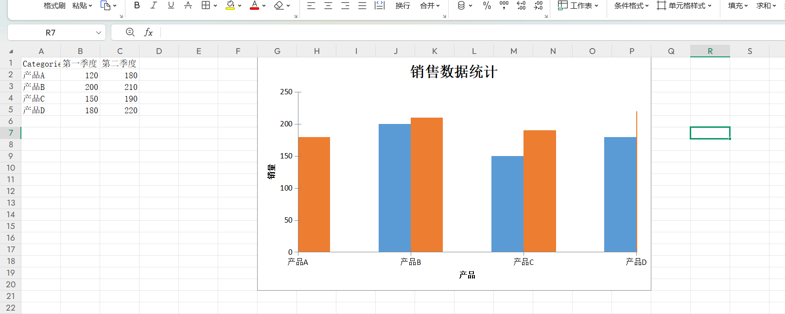
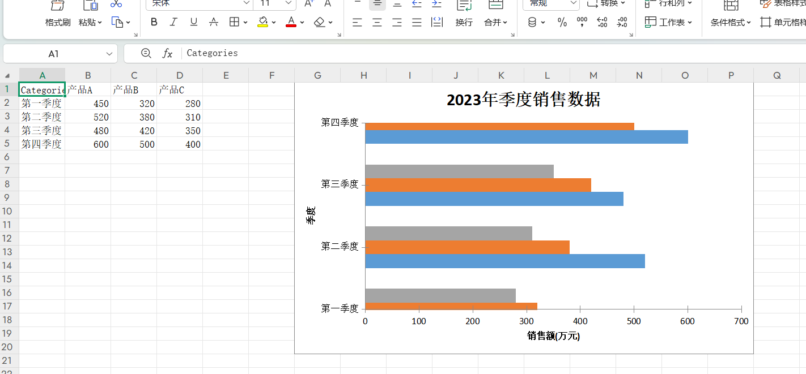
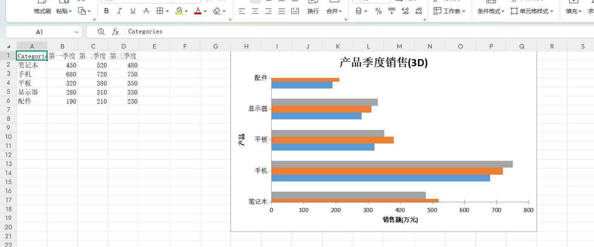
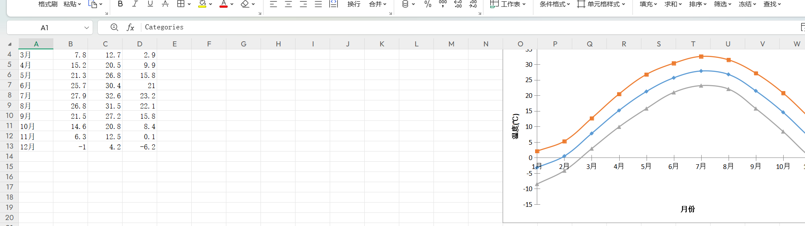
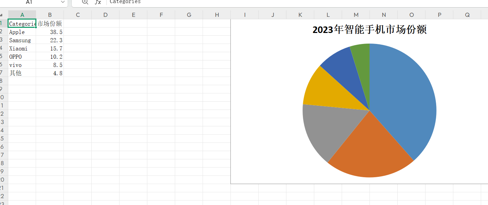
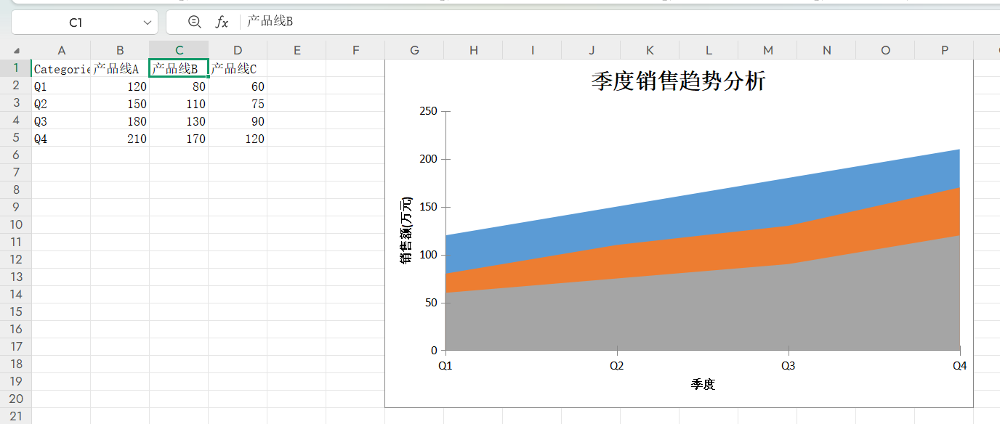
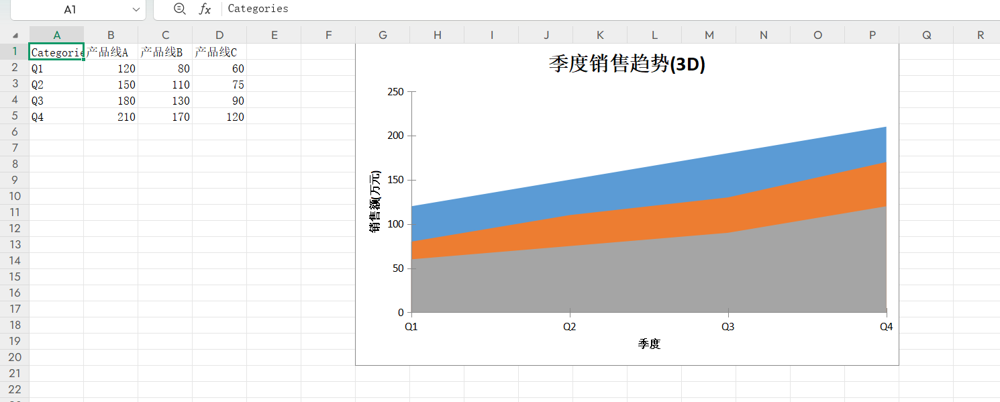
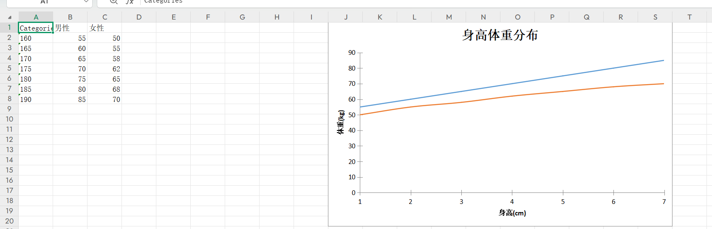
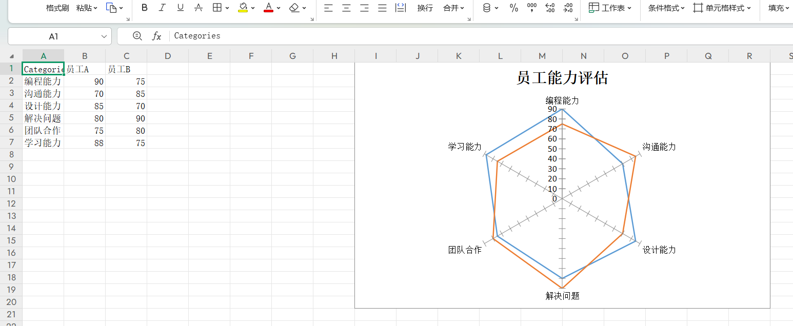
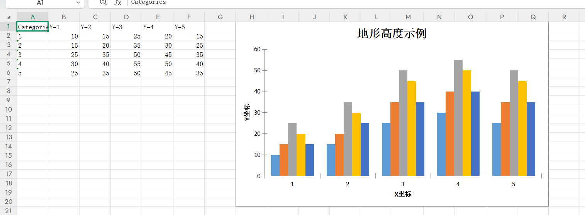

# 🚀 jquick-excel: Lightweight and high-performance Java Excel operating framework

[简体中文](./README.md) | English

[](https://github.com/akullpp/awesome-java)
> Featured in the [Awesome Java](https://github.com/akullpp/awesome-java) curated list — **Document Processing**

⚡ A concise, powerful, and easy-to-use Java Excel reading and writing tool that supports xls/xlsx formats, provides rich
APIs, and flexible configuration syntax

## 📦 Project Introduction

Jquick Excel is a lightweight Excel operating framework designed specifically for Java developers. It combines *
*usability**, **flexibility**, and **high performance**,
supports mainstream Excel formats (xls/xlsx), and provides rich APIs to help developers quickly implement complex Excel
import and export functions.

## 🎨 Theme Templates

JQuickExcel provides 42 built-in theme templates covering classic business, blue/green/teal/red-orange/pink-purple/gold-brown families and special styles, ready to use out of the box.


## 主题编码汇总 / Theme Code Summary

| 序号 / No. | Code | 中文名称 / Chinese Name |
|---------|------|----------------------|
| 1 | `default` | 经典皇家蓝 |
| 2 | `minimalistGrey` | 极简灰 |
| 3 | `slate` | 板岩灰 |
| 4 | `charcoal` | 炭灰 |
| 5 | `navyBlue` | 海军蓝 |
| 6 | `oceanBlue` | 海洋蓝 |
| 7 | `skyBlue` | 天空蓝 |
| 8 | `azure` | 蔚蓝 |
| 9 | `steelBlue` | 钢蓝 |
| 10 | `denim` | 牛仔蓝 |
| 11 | `indigo` | 靛蓝 |
| 12 | `periwinkle` | 长春花蓝 |
| 13 | `forestGreen` | 森林绿 |
| 14 | `emerald` | 祖母绿 |
| 15 | `jade` | 翡翠绿 |
| 16 | `mintFresh` | 清新薄荷 |
| 17 | `sage` | 鼠尾草绿 |
| 18 | `oliveGreen` | 橄榄绿 |
| 19 | `tropicalTeal` | 热带青 |
| 20 | `turquoise` | 绿松石 |
| 21 | `cyan` | 青色 |
| 22 | `sunsetOrange` | 落日橙 |
| 23 | `coral` | 珊瑚 |
| 24 | `peach` | 蜜桃 |
| 25 | `crimsonRed` | 深红 |
| 26 | `wineRed` | 酒红 |
| 27 | `sakuraPink` | 樱花粉 |
| 28 | `roseQuartz` | 粉晶 |
| 29 | `lavenderPurple` | 薰衣草紫 |
| 30 | `amethyst` | 紫水晶 |
| 31 | `plum` | 紫梅 |
| 32 | `royalGold` | 皇家金 |
| 33 | `champagne` | 香槟金 |
| 34 | `amber` | 琥珀 |
| 35 | `mustard` | 芥末黄 |
| 36 | `bronze` | 青铜 |
| 37 | `vintageSepia` | 复古棕 |
| 38 | `espresso` | 浓缩咖啡 |
| 39 | `mahogany` | 红木 |
| 40 | `terracotta` | 陶土 |
| 41 | `midnightDark` | 午夜深色 |
| 42 | `pearl` | 珍珠 |

👉 [View all theme template previews / 查看全部主题模板预览](./template.md)

```java
// Specify theme by code / 通过 code 指定主题
JQuickParseHandler parser = new JQuickExcelExportXmlParseFactory(template_code, rows, fileOutputStream);

```

## ✨ Core Features

✅ Dual format support - perfect compatibility with. xls and. xlsx formats

✅ Declarative configuration - Define import and export rules using concise DSL syntax

✅ High performance processing - optimized for reading and writing large amounts of data, with low memory usage

✅ Rich Validation Rules - Built in 20+Data Validation Rules

✅ Powerful Formula Support - Supports 50+Excel Formulas

✅ Chart Generation - Supports one click generation of 10 chart types

✅ Style Customization - Complete Cell Style Control

✅ Cell Merge - Flexible Multidimensional Data Merge Strategy

✅ Context conversion - supports dynamic data conversion and mapping

## 🛠️ Tech Stack

[](https://www.java.com/)
[](https://poi.apache.org/)
[](https://projectlombok.org/)
[](LICENSE)
[](https://github.com/paohaijiao/jquick-excel/commits/main)
[](https://github.com/paohaijiao/jquick-excel/stargazers)
[](https://github.com/paohaijiao/jquick-excel/network/members)

## 📥 Quick Start

### Maven Dependency

```xml
<dependency>
  <groupId>io.github.paohaijiao</groupId>
  <artifactId>jquick-excel</artifactId>
  <version>${latest.version}</version>
</dependency>
```

### gradle Dependency

```gradle
implementation 'io.github.paohaijiao:jquick-excel:${latest.version}'
```

#### 🚀 Quick Integration

> Create a jquick-excel.xml configuration file in the resources directory of the project, which serves as the "command
> center" for the entire Excel import and export function.

```xml
<?xml version="1.0" encoding="UTF-8"?>
<!DOCTYPE excels PUBLIC "-//PAOHAIJIAO//DTD API EXCEL 1.0//EN"
        "classpath:paohaijiao/dtd/Jquick-excel.dtd">
<excels namespace="com.github.paohaijiao.xml.service.JQuickExcelExportService">

    <excel name="exportExcel" returnClass="void">
        <![CDATA[
             Lexer Content
        ]]>
    </excel>
    <excel name="importExcel" returnClass="jva.util.List">
        <![CDATA[
         Lexer Content
        ]]>
    </excel>
</excels>

```

> The service interface is a bridge that connects XML configuration with actual business logic. Through interface method
> declarations,
> the framework can automatically parse XML configuration and generate corresponding proxy implementations. The
> interface method uses
> @ Param annotation to annotate parameters, which can be used in dynamic SQL or conditional queries configured in XML.

```java
import com.github.paohaijiao.statement.JQuickRow;
import com.github.paohaijiao.xml.param.Param;

import java.util.List;

public interface JQuickExcelExportService {

    public void exportExcel(@Param("field")String field, @Param("value")String value);

    public List<JQuickRow> importExcel(@Param("field")String field, @Param("value")String value);
}

```

> Everything is ready, now with just a few lines of code, Excel's import and export functions can come to life!
> The framework will automatically complete complex operations such as data conversion, style rendering, and file
> generation

```java
 public static List<JStudentModel> getData() {
        List<JStudentModel> students = new ArrayList<>();
        students.add(new JStudentModel("1001", "张三", 1, 20, new Date(), "计算机1班", "true"));
        students.add(new JStudentModel("1002", "李四", 0, 21, new Date(), "计算机2班", "true"));
        students.add(new JStudentModel("1003", "王五", 1, 22, new Date(), "计算机3班", "true"));
        return students;
    }
    @Test
    public void exportExcel() throws FileNotFoundException {
        List<JQuickRow> rows= JQuickRow.toRows( JObjectConverter.convert(getData()));
        OutputStream fileOutputStream=new FileOutputStream("d://test//style.xlsx");
        JQuickParseHandler parser = new JQuickExcelExportXmlParseFactory(rows,fileOutputStream);
        JQuickFactory factory = new JQuickXmlFactory(parser,"jquick-excel.xml");
        System.out.println(factory);
        JQuickExcelExportService excelExportService = factory.createApi(JQuickExcelExportService.class);
        excelExportService.exportExcel("1","2");
        System.out.println("导出成功");
    }
    @Test
    public void importExcel() throws FileNotFoundException {
        InputStream is = JMappingTest.class.getClassLoader().getResourceAsStream("templates/student.xlsx");
        Map<String,Object> sex=new HashMap<>();
        sex.put("男","1");
        sex.put("女","2");
        JContext context = new JContext();
        context.put("dict",sex);
        JQuickParseHandler parser = new JQuickExcelImportXmlParseFactory(context,is);
        JQuickFactory factory = new JQuickXmlFactory(parser,"jquick-excel.xml");
        System.out.println(factory);
        JQuickExcelExportService excelExportService = factory.createApi(JQuickExcelExportService.class);
        List<JQuickRow> list=excelExportService.importExcel("1","2");
        System.out.println("导入成功:"+list.size());
    }
```

## 📚 Function Overview

### 🔄 Import function

- Intelligent Mapping - Automatic Field Mapping and Conversion
- Data Validation -20+validation rules (email, phone, regular, etc.)
- Format Conversion - Date, Number, String Format
- Batch processing - supports importing large amounts of data in batches

### 📤 Export function

- Template Export - Quickly Export Based on Configuration Templates
- Formula Calculation - Supports 50+Excel Formulas
- Chart Generation -10 Chart Types
- Style Customization - Complete Cell Style Control
- Data merging - multiple merging strategies (maximum, minimum, average, etc.)


## 🎯 Usage example

### basic syntax

```string
IMPORT [WITH option1, option2, ...]
```

### 配置项说明

| rule         | syntax                       | desc                                      |
|--------------|------------------------------|-------------------------------------------|
| `SHEET`      | `SHEET = (string \| number)` | Specify worksheet (name/index)            |
| `HEADER`     | `HEADER = boolean`           | Does it include a header (`true`/`false`) |
| `MAPPING`    | `MAPPING = { rule }`         | Source field ↔  Target field mapping      |
| `TRANSFORM`  | `TRANSFORM = { rule }`       | Data Conversion Rules                     |
| `VALIDATION` | `VALIDATION = { rule }`      | Data Validation Rules                     |

### SHEET syntax

```string
IMPORT WITH SHEET="Sheet1"
```

### HEADER syntax

```string
IMPORT WITH HEADER=true
```

### Field Mapping Syntax

```string
IMPORT WITH MAPPING = {
"学号": "no",
"姓名": "name",
"性别": "sex",
"年龄": "age",
"出生日期": "birthday"
}
```

### TRANS MAPPING syntax（support JEvaluator all method）

```string
IMPORT WITH TRANSFORM={
"sex": trans(${dict},${sex}),
"birthday": dateFormat(${birthday},'yyyy-MM-dd')
}
```

### import validation

## 📊 Supported validation rules

| rule type         | sample                           |
|-------------------|----------------------------------|
| boolean           | boolean{required:true}           | 
| date              | date_format{format:'yyyy-MM-dd'} |
| number range      | range{min:1, max:100}            |
| dict validation   | dict{map:{'1':'男','2':'女'}}      |
| regex validation  | regex{pattern:'^\\d+$'}          | 
| length validation | max_length{maxLength:10}         | 
| email validation  | email{}                          | 
| phone validation  | mobile{}                         | 

#### 验证规则语法

```string
// Row Validation
ROW 5 - Validate row 5
ROW 1..10 - Validate rows 1 to 10
// Column Validation
COL A - Validate column A
COL A..D - Validate columns A to D
// Cell Validation
C1 - Validate cell C1 (row 1, column C)
// Range Validation
A1:B5 - Validate the range from A1 to B5
```

#### Example of Verification Rule Configuration

```string
IMPORT_WITH_VALIDATION = {
    ROW 1..10 {
        required {
            required: true,
            msg: "Cannot be empty"
        },
        range {
            required: true,
            msg: "Value out of range",
            map: {
                min: 1,
                max: 100
            }
        }
    },
    COL A {
        required {
            required: true,
            msg: "Column A cannot be empty"
        }
    },
    B1:C5 {
        regex {
            required: true,
            msg: "Format error",
            map: {
                pattern: "^\\d+$"
            }
        }
    }
}
```

### Validation Rule Type

#### Validation Rule List

| Rule Name        | Parameter Keys      | Parameter Types  | Description                                                                  |
|------------------|---------------------|------------------|------------------------------------------------------------------------------|
| `boolean`        | -                   | -                | Validates if the value is a boolean                                          |
| `date_format`    | `format`            | `String`         | Validates if the string matches the specified date format                    |
| `max_date`       | `maxDate`, `format` | `Date`, `String` | Validates if the date does not exceed the specified maximum date             |
| `min_date`       | `minDate`, `format` | `Date`, `String` | Validates if the date is not less than the specified minimum date            |
| `integer`        | -                   | -                | Validates if the value is an integer                                         |
| `decimal`        | -                   | -                | Validates if the value is a decimal number                                   |
| `max_value`      | `maxValue`          | `BigDecimal`     | Validates if the numeric value does not exceed the specified maximum value   |
| `min_value`      | `minValue`          | `BigDecimal`     | Validates if the numeric value is not less than the specified minimum value  |
| `dict`           | key-value pairs     | `Map`            | Validates if the value exists in the provided dictionary                     |
| `email`          | -                   | -                | Validates if the string is a valid email address format                      |
| `mobile`         | -                   | -                | Validates if the string is a valid Chinese mobile phone number format        |
| `max_length`     | `maxLength`         | `BigDecimal`     | Validates if the string length does not exceed the specified maximum length  |
| `min_length`     | `minLength`         | `BigDecimal`     | Validates if the string length is not less than the specified minimum length |
| `regex`          | `pattern`           | `String`         | Validates if the string matches the specified regular expression             |
| `start_with`     | `startWith`         | `String`         | Validates if the string starts with the specified substring                  |
| `not_start_with` | `notStartWith`      | `String`         | Validates if the string does not start with the specified substring          |
| `end_with`       | `endWith`           | `String`         | Validates if the string ends with the specified substring                    |
| `not_end_with`   | `notEndWith`        | `String`         | Validates if the string does not end with the specified substring            |
| `contain`        | `contains`          | `String`         | Validates if the string contains the specified substring                     |
| `not_contain`    | `notContain`        | `String`         | Validates if the string does not contain the specified substring             |

##### Verification With Boolean

```string
IMPORT WITH VALIDATION={   
    C2:C4:{
        boolean{required:true,msg:'性别非法',map:{'1':'男','2':'女'}}
    }
}
```

##### Verification With date_format

```string
IMPORT WITH VALIDATION={   E2:E4:{
date_format{required:true,msg:'不符合日期格式',map:{'format':'yyyy-MM-dd'}   }
}
```

##### Verification With max_date

```string
IMPORT WITH VALIDATION={   E2:E4:{
    max_date{required:true,msg:'超过最大日期',map:{'format':'yyyy-MM-dd',maxDate:2025-01-01}   }
}
```

##### Verification With min_date

```string
IMPORT WITH VALIDATION={   E2:E4:{
    min_date{required:true,msg:'不能小于最小日期',map:{'format':'yyyy-MM-dd',minDate:2022-01-01}   }
}
```

##### Verification With integer

```string
IMPORT WITH VALIDATION={   D2:D4:{
    integer{required:true,msg:'要求该字段是整形'   }
}
```

##### Verification With decimal

```string
IMPORT WITH VALIDATION={   D2:D4:{
    decimal{required:true,msg:'要求该字段是整形'   }
}
```

##### Verification With max_value

```string
IMPORT WITH VALIDATION={   D2:D4:{
    max_value{required:true,msg:'年龄不能超过最大值',map:{'maxValue':50}   }
}
```

##### Verification With min_value

```string
IMPORT WITH VALIDATION={   D2:D4:{
    min_value{required:true,msg:'年龄不能小于xx',map:{'minValue':2}   }
}
```

##### Verification With dict

```string
IMPORT WITH VALIDATION={   C2:C4:{
    dict{required:true,msg:'性别非法',map:{'1':'男','2':'女'}   }
}
```

##### Verification With email

```string
IMPORT WITH VALIDATION={   C2:C4:{
    email{required:true,msg:'邮箱格式不正确'   }
}
```

##### Verification With mobile

```string
IMPORT WITH VALIDATION={   C2:C4:{
    mobile{required:true,msg:'手机格式不正确'   }
}
```

##### Verification With max_length

```string
IMPORT WITH VALIDATION={   B2:B4:{
    max_length{required:true,msg:'最大长度有误',map:{'maxLength':7}   }
}
```

##### Verification With min_length

```string
IMPORT WITH VALIDATION={   B2:B4:{
    min_length{required:true,msg:'最小长度有误',map:{'minLength':1}   }
}
```

##### Verification With regex

```string
IMPORT WITH VALIDATION={   D2:D4:{
    regex{required:true,msg:'不符合正则表达式',map:{pattern:'^\d+$'}   }
}
```

##### Verification With start_with

```string
IMPORT WITH VALIDATION={   B2:B4:{
   start_with{required:true,msg:'开始字符串有误',map:{startWith:'张三'}   }
}
```

##### Verification With not_start_with

```string
IMPORT WITH VALIDATION={   B2:B4:{
   not_start_with{required:true,msg:'不能以该字符串开始',map:{notStartWith:'张三'}   }
}
```

##### Verification With end_with

```string
IMPORT WITH VALIDATION={   B2:B4:{
   end_with{required:true,msg:'不符合以张三结束的字符',map:{endWith:'张三'}   }
}
```

##### Verification With not_end_with

```string
IMPORT WITH VALIDATION={   B2:B4:{
   not_end_with{required:true,msg:'不符合表达式',map:{notEndWith:'张三'}   }
}
```

##### Verification With not_end_with

```string
IMPORT WITH VALIDATION={   B2:B4:{
   not_end_with{required:true,msg:'不符合表达式',map:{notEndWith:'张三'}   }
}
```

##### Verification With not_contain

```string
IMPORT WITH VALIDATION={   B2:B4:{
   not_contain{required:true,msg:'不应该包含该关键字',map:{notContain:'张三'}   }
}
```

### Basic Import Example

## 🔧 Import configuration

```java
String rule = """
    IMPORT WITH 
    SHEET="Sheet1",
    HEADER=true,
    MAPPING={
        "学号": "no",
        "姓名": "name",
        "性别": "sex",
        "年龄": "age",
        "出生日期": "birthday"
    }  """
JQuickExcelCommonImportExecutor executor = new JQuickExcelCommonImportExecutor();
JExcelImportModel model = (JExcelImportModel) executor.execute(rule);
InputStream is = getClass().getClassLoader().getResourceAsStream("templates/student.xlsx");
XSSFWorkbook workbook = new XSSFWorkbook(is);
JExcelImportHandler handler = new JExcelImportHandler(workbook);
List<Map<String, Object>> data = handler.importData(model);
```

### Basic export example

```java
String rule = """
EXPORT WITH
SHEET="学生表",
HEADER=true,
MAPPING={
"id": "主键",
"name": "姓名",
"gender": "性别",
"age": "年龄",
"enrollmentDate": "入学时间",
"className": "班级"
}
""";

List<Map<String, Object>> data = JObjectConverter.convert(getData());
FileOutputStream fos = new FileOutputStream("导出结果.xlsx");
JQuickExcelCommonExportExecutor executor = new JQuickExcelCommonExportExecutor();
JExcelExportModel config = (JExcelExportModel) executor.execute(rule);
JExcelExportHandler handler = new JExcelExportHandler(config, data);
Workbook workbook = handler.getWorkBook();
workbook.write(fos);
fos.close();
```

## 📤 Export Configuration

### basic grammar

```string
EXPORT [WITH option1, option2, ...]
```

### Export Options Description

| Configuration Item | Syntax Format                                              | Description                                                                |
|--------------------|------------------------------------------------------------|----------------------------------------------------------------------------|
| 📑 `SHEET`         | `SHEET '=' (STRING \| NUMBER)`                             | Specify the target worksheet by name or index                              |
| 📋 `HEADER`        | `HEADER '=' BOOLEAN`                                       | Control whether to include header (`true`/`false`)                         |
| 🎨 `FORMAT`        | `FORMAT '=' '{' cellFormat (',' cellFormat)* '}'`          | Define cell formatting rules                                               |
| 🗺️ `MAPPING`      | `MAPPING '=' '{' fieldMapping (',' fieldMapping)* '}'`     | Configure field mapping relationship between source data and exported data |
| 🔄 `TRANSFORM`     | `TRANSFORM '=' '{' transformRule (',' transformRule)* '}'` | Set data transformation rules before export                                |
| 🧮 `FORMULAS`      | `FORMULAS '=' '{' formulaTarget (',' formulaTarget)* '}'`  | Configure calculation formulas to be applied during export                 |
| ✨ `STYLE`          | `STYLE '=' '{' styleTarget (',' styleTarget)* '}'`         | Define cell style rules                                                    |
| 🧩 `MERGE`         | `MERGE '=' '{' mergeSpec (',' mergeSpec)* '}'`             | Set cell merging rules                                                     |
| 📊 `GRAPH`         | `GRAPH '=' '{' graphSpec (',' graphSpec)* '}'`             | Configure generation parameters for charts/graphs                          |
| 📝 `FOOTER`        | `FOOTER '=' (STRING \| IDENTIFIER)`                        | Set footer text or reference variables                                     |

### SHEET OPTION

```string
EXPORT WITH SHEET="Report"
```

### HEADER OPTION

```string
EXPORT WITH HEADER=true
```

### Mapping OPTION

```string
EXPORT  WITH MAPPING={
	"id":"主键",
	"name":"姓名",
	"gender":"性别",
	"age":"年龄",
	"enrollmentDate":"入学时间",
	"className":"班级",
	"ignoreField":"是否忽略"
}
```

```java
public static List<JStudentModel> getData() {
  List<JStudentModel> students = new ArrayList<>();
  students.add(new JStudentModel("1001", "张三", 1, 20, new Date(), "计算机1班", "true"));
  students.add(new JStudentModel("1002", "李四", 0, 21, new Date(), "计算机2班", "true"));
  students.add(new JStudentModel("1003", "王五", 1, 22, new Date(), "计算机3班", "true"));
  return students;
}
List<Map<String, Object>> data = JObjectConverter.convert(getData());
FileOutputStream fileOutputStream=new FileOutputStream("d://test//format.xlsx");
JQuickExcelCommonExportExecutor executor = new JQuickExcelCommonExportExecutor();
JExcelExportModel config = (JExcelExportModel) executor.execute(input);
JExcelExportHandler handler = new JExcelExportHandler(config,data);
Workbook workbook=handler.getWorkBook();
workbook.write(fileOutputStream);
```

### FORMAT OPTION

```string
EXPORT  WITH MAPPING={
	"id":"主键",
	"name":"姓名",
	"gender":"性别",
	"age":"年龄",
	"enrollmentDate":"入学时间",
	"className":"班级",
	"ignoreField":"是否忽略"
},FORMAT={"enrollmentDate":"yyyy-MM-dd"}
```

### TRANSFORM OPTION

```string
EXPORT  WITH MAPPING={
	"id":"主键",
	"name":"姓名",
	"gender":"性别",
	"age":"年龄",
	"enrollmentDate":"入学时间",
	"className":"班级",
	"ignoreField":"是否忽略"
},
FORMAT={	
  "enrollmentDate":"yyyy-MM-dd"
},
TRANSFORM={
  "name": toUpper(${name}),
  "enrollmentDate": dateFormat(${enrollmentDate},'yyyy-MM-dd'),
  "gender": trans(${dict},${gender})
}
```

``` java
List<Map<String, Object>> data = JObjectConverter.convert(getData());
FileOutputStream fileOutputStream=new FileOutputStream("d://test//transform.xlsx");
JQuickExcelCommonExportExecutor executor = new JQuickExcelCommonExportExecutor();
JExcelExportModel config = (JExcelExportModel) executor.execute(input);
HashMap<String,Object> map = new HashMap<>();
  map.put("1","男");
  map.put("0","女");
JContext context = new JContext();
context.put("dict",map);
JExcelExportHandler handler = new JExcelExportHandler(config,context,JQuickRow.toRows(data));
Workbook workbook=handler.getWorkBook();
workbook.write(fileOutputStream);
```

### Formula Options

#### Apply scope support

Supports four types: **Row**, **Column**, **Cell**, and **Range**:

1. **Row**
   `ROW 5` - Applies to row 5
   `ROW 1..10` - Applies to rows 1 to 10
2. **Column**
   `COL A:` - Applies to column A
   `COL A..D:` - Applies to columns A to D
3. **Cell**
   `C1:` - Applies to the cell at column C, row 1
4. **Range**
   `A1:B5` - Represents the rectangular area from cell A1 to cell B5

## 🔢 Supported formula types

### 📈 Mathematical formulas (16)

| Formula Name | Syntax Example       | Parameter Count | Description                       | Corresponding Class Name |
|--------------|----------------------|-----------------|-----------------------------------|--------------------------|
| 📏 `ABS`     | `ABS(D2)`            | 1               | Absolute value                    | `JABSFormula`            |
| 📊 `AVERAGE` | `AVERAGE(D2:D4)`     | ≥1              | Arithmetic mean                   | `JAverageFormula`        |
| 🔢 `COUNT`   | `COUNT(D2:D4)`       | ≥1              | Count of numeric values           | `JCountFormula`          |
| ⬆️ `MAX`     | `MAX(D2:D4)`         | ≥1              | Maximum value                     | `JMaxFormula`            |
| ⬇️ `MIN`     | `MIN(D2:D4)`         | ≥1              | Minimum value                     | `JMinFormula`            |
| ⚡ `POWER`    | `POWER(2,3)`         | 2               | Exponentiation                    | `JPowerFormula`          |
| 🎲 `RAND`    | `RAND()`             | 0               | Random number [0,1)               | `JRandFormula`           |
| 🏆 `RANK`    | `RANK(20,D2:D4)`     | 2               | Rank in list                      | `JRankFormula`           |
| 🎯 `ROUND`   | `ROUND(3.1415926,3)` | 2               | Round to specified decimal places | `JRoundFormula`          |
| √️ `SQRT`    | `SQRT(4)`            | 1               | Square root                       | `JSQRTFormula`           |
| 📈 `STDEV`   | `STDEV(D2:D4)`       | ≥1              | Standard deviation                | `JSTDEVFormula`          |
| ➕ `SUM`      | `SUM(D2:D4)`         | ≥1              | Sum of values                     | `JSumFormula`            |

```string
# Mathematical Formula Configuration Example (Integrated Version)
# Format Description: FORMULAS = { Target Cell: 'Formula Expression' }
# All formulas are configured in cell D5; modify the target cell as needed
FORMULAS={
# 1. Absolute Value Calculation: Get the absolute value of cell D2
D5:'ABS(D2)',
# 2. Arithmetic Mean: Calculate the average value of cells D2 to D4
D5:'AVERAGE(D2:D4)',
# 3. Count: Count the number of valid numeric values in cells D2 to D4
D5:'COUNT(D2:D4)',
# 4. Maximum Value: Get the maximum value among cells D2 to D4
D5:'MAX(D2:D4)',
# 5. Minimum Value: Get the minimum value among cells D2 to D4
D5:'MIN(D2:D4)',
# 6. Exponentiation: Calculate 2 to the power of 3 (2^3)
D5:'POWER(2,3)',
# 7. Random Number: Generate a random number between 0 (inclusive) and 1 (exclusive)
D5:'RAND()',
# 8. Rank: Calculate the rank of the value 20 in the range D2 to D4
D5:'RANK(20,D2:D4)',
# 9. Rounding: Round 3.1415926 to 3 decimal places
D5:'ROUND(3.1415926,3)',
# 10. Square Root: Calculate the square root of 4
D5:'SQRT(4)',
# 11. Standard Deviation: Calculate the standard deviation of data in cells D2 to D4 (reflects data dispersion)
D5:'STDEV(D2:D4)',
# 12. Sum: Calculate the total sum of values in cells D2 to D4
D5:'SUM(D2:D4)'
```

### 📅 Date formulas (15)

| Formula Name     | Syntax Example                    | Special Rules                                                                                               | Corresponding Class Name |
|------------------|-----------------------------------|-------------------------------------------------------------------------------------------------------------|--------------------------|
| 🕒 `DATETIME`    | `DATETIME(2023,5,15,14,30,0)`     | Returns the specified date and time                                                                         | `JDateTimeFormula`       |
| 📆 `DAY`         | `DAY("2025-01-23")`               | Extracts the day of the month (1-31) from a date                                                            | `JDayFormula`            |
| 📊 `DAYS`        | `DAYS("2025-01-23","2025-01-28")` | Calculates the number of days between two dates                                                             | `JDaysFormula`           |
| 📈 `EDATE`       | `EDATE(start,months)`             | Adds the specified number of months to a date                                                               | `JEDATEFormula`          |
| 🗓️ `EOMONTH`    | `EOMONTH("2025-01-23",3)`         | Returns the last day of the month that is the specified number of months before/after a date                | `JEOMONTHFormula`        |
| ⏰ `HOUR`         | `HOUR('2025-01-23')`              | Extracts the hour (0-23) from a time value                                                                  | `JHourFormula`           |
| 💼 `NETWORKDAYS` | `NETWORKDAYS(s,e,[h])`            | 2-3 parameters (calculates the number of working days between two dates)                                    | `JNetworkDayFormula`     |
| 🕒 `NOW`         | `NOW()`                           | Exact syntax match required; returns the current timestamp                                                  | `JNowFormula`            |
| 📅 `TODAY`       | `TODAY()`                         | Exact syntax match required; returns the current date                                                       | `JTodayFormula`          |
| 🛠️ `WORKDAY`    | `WORKDAY(s,days,[h])`             | 2-3 parameters (calculates the date that is the specified number of working days before/after a start date) | `JWorkDayFormula`        |
| ⏱️ `MINUTE`      | `MINUTE(time_value)`              | 1 time series parameter; extracts the minute (0-59) from a time value                                       | -                        |
| 📍 `MONTH`       | `MONTH(date_value)`               | 1 date series parameter; extracts the month (1-12) from a date                                              | -                        |
| 🎯 `SECOND`      | `SECOND(time_value)`              | 1 time series parameter; extracts the second (0-59) from a time value                                       | -                        |
| ⏲️ `TIME`        | `TIME(hour,min,sec)`              | 3 parameters (hour/minute/second); returns an Excel time serial number (0-0.999)                            | -                        |
| 📆 `TODAY`       | `TODAY()`                         | Exact syntax match required; returns the current date serial number                                         | -                        |
| 📝 `WEEKDAY`     | `WEEKDAY(date,[type])`            | 1-2 parameters; returns the day of the week (configurable)                                                  | -                        |
| 📊 `WEEKNUM`     | `WEEKNUM(date,[type])`            | 1-2 parameters; returns the week number of the year                                                         | -                        |
| 📅 `YEAR`        | `YEAR(date_value)`                | 1 date series parameter; extracts the year (1900-9999) from a date                                          | -                        |

### 📅 Date formula configuration&equivalent Java code (integrated version)

#### 1. Basic date and time formula

```string
# -------------------------- 1. DATETIME - Construct Date and Time --------------------------
# Configuration Format: FORMULAS = { Target Cell: 'Formula Expression' }
FORMULAS={
    D5:'DATETIME(2023,5,15,14,30,0)'  # Constructs the datetime 2023-05-15 14:30:00
}
# Equivalent Java Code
/*
 * Directly create a DATETIME formula instance
 */
JAbstractExcelFormula formula = factory.createFormulaInstance("DATETIME(2023,5,15,14,30,0)");

# -------------------------- 2. DAY - Extract "Day" from Date --------------------------
FORMULAS={
    D5:'DAY("2025-01-23")'  # Extracts the "day" from 2025-01-23 (Result: 23)
}
# Equivalent Java Code
/*
 * 1. First write the date value to cell A1
 * 2. Create a DAY formula based on cell A1
 */
sheet.createRow(0).createCell(0).setCellValue("2023-05-15");
JAbstractExcelFormula formula = factory.createFormulaInstance("DAY(A1)");

# -------------------------- 3. DAYS - Calculate Day Difference Between Two Dates --------------------------
FORMULAS={
    D5:'DAYS("2025-01-23","2025-01-28")'  # Calculates the day difference between 2025-01-28 and 2025-01-23
}
# Equivalent Java Code
/*
 * 1. Write the start date to A1 and end date to A2
 * 2. Calculate the day difference between A2 - A1
 */
sheet.createRow(0).createCell(0).setCellValue("2023-01-01");
sheet.createRow(1).createCell(0).setCellValue("2023-12-31");
JAbstractExcelFormula formula = factory.createFormulaInstance("DAYS(A2,A1)");

# -------------------------- 4. EDATE - Add Specified Months to Date --------------------------
FORMULAS={
    D5:'EDATE("2025-01-23",3)'  # Adds 3 months to 2025-01-23
}
# Equivalent Java Code
/*
 * 1. Write the base date to A1
 * 2. Add 3 months to the date in A1
 */
sheet.createRow(0).createCell(0).setCellValue("2023-01-31");
JAbstractExcelFormula formula = factory.createFormulaInstance("EDATE(A1,3)");

# -------------------------- 5. EOMONTH - Get End-of-Month Date --------------------------
FORMULAS={
    D5:'EOMONTH("2025-01-23",3)'  # Gets the end-of-month date 3 months after 2025-01-23
}
# Equivalent Java Code
/*
 * 1. Write the base date to A1
 * 2. Get the end-of-month date of the month for the date in A1 (parameter 0 means current month)
 */
sheet.createRow(0).createCell(0).setCellValue("2023-02-15");
JAbstractExcelFormula formula = factory.createFormulaInstance("EOMONTH(A1,0)");

# -------------------------- 6. HOUR - Extract Hour --------------------------
# Prerequisite: Cell A1 value is 14:30:00
FORMULAS={
    D5:'HOUR("A1")'  # Extracts the hour part from the time in cell A1 (Result: 14)
}
# Equivalent Java Code
/*
 * 1. Write the time value to A1
 * 2. Extract the hour from the time in A1
 */
sheet.createRow(0).createCell(0).setCellValue("14:30:00");
JAbstractExcelFormula formula = factory.createFormulaInstance("HOUR(A1)");

# -------------------------- 11. MINUTE - Extract Minute --------------------------
# Equivalent Java Code
/*
 * 1. Write the time value 14:30:45 to A1
 * 2. Extract the minute part from the time in A1 (Result: 30)
 */
sheet.createRow(0).createCell(0).setCellValue("14:30:45");
JAbstractExcelFormula formula = factory.createFormulaInstance("MINUTE(A1)");

# -------------------------- 14. SECOND - Extract Second --------------------------
# Equivalent Java Code
/*
 * 1. Write the time value 14:30:45 to A1
 * 2. Extract the second part from the time in A1 (Result: 45)
 */
sheet.createRow(0).createCell(0).setCellValue("14:30:45");
JAbstractExcelFormula formula = factory.createFormulaInstance("SECOND(A1)");

# -------------------------- 7. NETWORKDAYS - Calculate Working Days --------------------------
# Prerequisite: A1=2023-05-01, A2=2023-05-07
FORMULAS={
    D5:'NETWORKDAYS(A1,A2)'  # Calculates the number of working days between A1 and A2 (excludes weekends)
}
# Equivalent Java Code
/*
 * 1. Write the start date to A1 and end date to A2
 * 2. Calculate the number of working days between the two dates
 */
sheet.createRow(0).createCell(0).setCellValue("2023-05-01");
sheet.createRow(1).createCell(0).setCellValue("2023-05-07");
JAbstractExcelFormula formula = factory.createFormulaInstance("NETWORKDAYS(A1,A2)");

# -------------------------- 10. WORKDAY - Calculate Offset Working Day --------------------------
# Equivalent Java Code
/*
 * 1. Write the start date to A1 and holidays to A2 (optional)
 * 2. Offset 3 working days from A1 (excludes holidays in A2)
 */
sheet.createRow(0).createCell(0).setCellValue("2023-05-15");
sheet.createRow(1).createCell(0).setCellValue("2023-05-17");
JAbstractExcelFormula formula = factory.createFormulaInstance("WORKDAY(A1,3,A2)");

# -------------------------- 8. NOW - Get Current Date and Time --------------------------
FORMULAS={
    D5:'NOW()'  # Gets the current system date + time
}
# Equivalent Java Code
JAbstractExcelFormula formula = factory.createFormulaInstance("NOW()");

# -------------------------- 9. TODAY - Get Current Date --------------------------
FORMULAS={
    D5:'TODAY()'  # Gets the current system date (without time)
}
# Equivalent Java Code
JAbstractExcelFormula formula = factory.createFormulaInstance("TODAY()");

# -------------------------- 15. TIME - Construct Time --------------------------
# Equivalent Java Code
/*
 * Constructs the time 14:30:00 (Excel time serial number: 0-0.999)
 */
JAbstractExcelFormula formula = factory.createFormulaInstance("TIME(14,30,0)");

# -------------------------- 12. MONTH - Extract Month --------------------------
# Equivalent Java Code
/*
 * 1. Write the date value 2023-05-15 to A1
 * 2. Extract the month from the date in A1 (Result: 5)
 */
sheet.createRow(0).createCell(0).setCellValue("2023-05-15");
JAbstractExcelFormula formula = factory.createFormulaInstance("MONTH(A1)");

# -------------------------- 16. WEEKDAY - Extract Day of the Week --------------------------
# Equivalent Java Code
/*
 * 1. Write the date value 2023-05-15 to A1
 * 2. Extract the day of the week (parameter 2 means: Monday=1, Sunday=7)
 */
sheet.createRow(0).createCell(0).setCellValue("2023-05-15");
JAbstractExcelFormula formula = factory.createFormulaInstance("WEEKDAY(A1,2)");

# -------------------------- 18. WEEKNUM - Extract Week Number --------------------------
# Equivalent Java Code
/*
 * 1. Write the date value 2023-01-01 to A1
 * 2. Extract the week number (parameter 1 means: Sunday is the start of the week)
 */
sheet.createRow(0).createCell(0).setCellValue("2023-01-01");
JAbstractExcelFormula formula = factory.createFormulaInstance("WEEKNUM(A1,1)");

# -------------------------- 19. YEAR - Extract Year --------------------------
# Equivalent Java Code
/*
 * 1. Write the date value 2023-05-15 to A1
 * 2. Extract the year from the date in A1 (Result: 2023)
 */
sheet.createRow(0).createCell(0).setCellValue("2023-05-15");
JAbstractExcelFormula formula = factory.createFormulaInstance("YEAR(A1)");
```

### 🔤 17 string formulas

| Formula Name       | Syntax Format                      | Parameter Rules               | Example & Result                            | Corresponding Class Name       |
|--------------------|------------------------------------|-------------------------------|---------------------------------------------|--------------------------------|
| 🧩 `CONCAT`        | `CONCAT(s1,s2...)`                 | ≥1 parameter(s)               | `CONCAT("A","B")` → "AB"                    | `JConcatFormula`               |
| 🆚 `EXACT`         | `EXACT(s1,s2)`                     | 2 parameters (case-sensitive) | `EXACT("a","A")` → FALSE                    | `JExactFormula`                |
| 🔍 `FIND`          | `FIND(sub,str,[pos])`              | 2-3 parameters                | `FIND("n","apple")` → 0                     | `JFindFormula`                 |
| ← `LEFT`/→ `RIGHT` | `LEFT(text,len)`/`RIGHT(text,len)` | 2 parameters                  | `LEFT("hello",2)` → "he"                    | `JLeftFormula`/`JRightFormula` |
| 📏 `LEN`           | `LEN(text)`                        | 1 parameter                   | `LEN("text")` → 4                           | `JLenFormula`                  |
| 🔪 `MID`           | `MID(text,start,len)`              | 3 parameters                  | `MID("apple",2,3)` → "ppl"                  | `JMIDFormula`                  |
| 🔄 `SUBSTITUTE`    | `SUBSTITUTE(s,o,n,[i])`            | 3-4 parameters                | `SUBSTITUTE("a-a","a","b")` → "b-b"         | `JSubstituteFormula`           |
| 🧹 `TRIM`          | `TRIM(text)`                       | 1 parameter                   | `TRIM(" a ")` → "a"                         | `JTrimFormula`                 |
| 📝 `CONCATENATE`   | `CONCATENATE(text1, [text2]...)`   | ≥1 parameter(s)               | `CONCATENATE("A",1,TRUE)` → "A1TRUE"        | `JConcatenateFormula`          |
| 📉 `LOWER`         | `LOWER(text)`                      | 1 parameter                   | `LOWER("ExCeL")` → "excel"                  | `JLowerFormula`                |
| 🎩 `PROPER`        | `PROPER(text)`                     | 1 parameter                   | `PROPER("john o'reilly")` → "John O'Reilly" | `JProperFormula`               |
| ✏️ `REPLACE`       | `REPLACE(old,start,num,new)`       | 4 parameters                  | `REPLACE("ABCD",2,2,"XY")` → "AXYD"         | `JReplaceFormula`              |
| 🔎 `SEARCH`        | `SEARCH(find,within,[start])`      | 2-3 parameters                | `SEARCH("n","Banana",3)` → 5                | `JSearchFormula`               |
| 🔁 `SUBSTITUTE`    | `SUBSTITUTE(text,old,new,[nth])`   | 3-4 parameters                | `SUBSTITUTE("A-A-A","A","B",2)` → "A-B-A"   | `JSubstituteFormula`           |
| 🎨 `TEXT`          | `TEXT(value,format)`               | 2 parameters                  | `TEXT(0.25,"0.0%")` → "25.0%"               | `JTextFormula`                 |
| 📈 `UPPER`         | `UPPER(text)`                      | 1 parameter                   | `UPPER("email")` → "EMAIL"                  | `JUpperFormula`                |
| 🔢 `VALUE`         | `VALUE(text)`                      | 1 parameter                   | `VALUE("¥1,000")` → 1000.0                  | `JValueFormula`                |

### 🔤 Example of string formula configuration (integrated version)

```string
# String Formula Configuration Instructions: FORMULAS = { Target Cell: 'Formula Expression' }
# All formulas are mapped to cell D5; modify the target cell as needed
FORMULAS={
    # ====================== String Concatenation ======================
    # 1. CONCATENATE - Concatenate multiple cells/strings (compatible with older Excel versions)
    D5:'CONCATENATE(A1, B1)',  # Concatenate contents of cells A1 and B1
    # 2. CONCAT - Concatenate multiple strings (recommended for new versions)
    D5:'CONCAT(A1, B1)',       # Concatenate contents of cells A1 and B1 (same effect as CONCATENATE)

    # ====================== String Comparison/Search ======================
    # 3. EXACT - Precisely compare two strings (case-sensitive)
    D5:'EXACT("A1", "B1")',    # Check if strings "A1" and "B1" are exactly identical
    # 4. FIND - Precisely find substring position (case-sensitive, returns 0 if not found)
    D5:'FIND("o", "Microsoft")',# Find the position of "o" in "Microsoft"
    # 16. SEARCH - Fuzzily find substring position (case-insensitive)
    D5:'SEARCH("e","Excel")',  # Find the position of "e" in "Excel" (case-insensitive)

    # ====================== String Extraction ======================
    # 5. LEFT - Extract specified length of string from left
    D5:'LEFT("hello world", 3)',# Extract 3 characters from left of "hello world" → "hel"
    # 6. RIGHT - Extract specified length of string from right
    D5:'RIGHT("hello world", 3)',# Extract 3 characters from right of "hello world" → "rld"
    # 7. LEN - Calculate string length (including spaces)
    D5:'LEN("hello world")',   # Calculate length of "hello world" → 11
    # 8. MID - Extract specified length of string from specified position (start position starts at 1)
    D5:'MID("hello world",1,2)',# Extract 2 characters starting from position 1 → "he"

    # ====================== String Replacement/Cleanup ======================
    # 9. SUBSTITUTE - Replace specified substring (full replacement)
    D5:'SUBSTITUTE("hello world","hello","new")',# Replace "hello" with "new" → "new world"
    # 10. TRIM - Remove leading/trailing spaces from string (retain middle spaces)
    D5:'TRIM("hello world")',  # Clean leading/trailing spaces (no spaces in example, result remains "hello world")
    # 12. REPLACE - Replace substring of specified length by position
    D5:'REPLACE("ABCD",2,2,"XY")',# Replace 2 characters starting from position 2 → "AXYD"

    # ====================== String Format Conversion ======================
    # 10. LOWER - Convert to all lowercase
    D5:'LOWER("hello world")', # Convert to lowercase (no uppercase in example, result remains "hello world")
    # 11. PROPER - Capitalize first letter (others lowercase)
    D5:'PROPER("hello world")',# Convert to first letter uppercase → "Hello World"
    # 13. TEXT - Format numeric value into specified string
    D5:'TEXT(0.25,"0.0%")',    # Format 0.25 as percentage → "25.0%"
    # 14. UPPER - Convert to all uppercase
    D5:'UPPER("email")',       # Convert to uppercase → "EMAIL"
    # 15. VALUE - Convert string to numeric value (automatically recognizes amount/thousand separator)
    D5:'VALUE("¥1,000")'       # Convert amount string to numeric value → 1000.0
}
```

### 🔍 Logical formulas (3)

IF、AND、OR

### 🧠 Logical formula

| Formula Name | Syntax Format   | Parameter Rules | Example & Result                                                      | Corresponding Class Name |
|--------------|-----------------|-----------------|-----------------------------------------------------------------------|--------------------------|
| 🎯 `IF`      | `IF(cond,t,f)`  | 3 parameters    | `IF(A1>0,"Yes","No")` → Returns "Yes" if A1>0, otherwise returns "No" | `JIfFormula`             |
| ✅ `AND`      | `AND(b1,b2...)` | ≥1 parameter(s) | `AND(TRUE,FALSE)` → FALSE                                             | `JAndFormula`            |
| 🟡 `OR`      | `OR(b1,b2...)`  | ≥1 parameter(s) | `OR(TRUE,FALSE)` → TRUE                                               | `JORFormula`             |

### 🧠 Logic&Search Formula Configuration Example (Integrated Version)

```string
# Formula Configuration Instructions: FORMULAS = { Target Cell: 'Formula Expression' }
# All formulas are mapped to cell D5; modify the target cell as needed
FORMULAS={
    # ====================== Logical Judgment ======================
    # 1. IF - Conditional judgment (returns t if condition is met, otherwise returns f)
    D5:'IF(D2>0,"Yes","No")',  # Returns "Yes" if the value of cell D2>0; otherwise returns "No"
    
    # 2. AND - Multiple condition AND judgment (result is TRUE only when all conditions are TRUE)
    D5:'AND(TRUE,FALSE)',      # Meets TRUE and FALSE simultaneously → Result is FALSE
    
    # 3. OR - Multiple condition OR judgment (result is TRUE if any condition is TRUE)
    D5:'OR(TRUE,FALSE)',       # Meets TRUE or FALSE → Result is TRUE

    # ====================== Data Lookup ======================
    # 4. LOOKUP - Vector lookup (looks up a value in the specified range and returns the result from the corresponding range)
    D5:'LOOKUP(22, D2:D4, C2:C4)'  # Looks up 22 in the range D2:D4 and returns the value at the corresponding position in C2:C4
}
```

## 📊 Chart type support

| Chart Type    | Example                    | Purpose                      |
|---------------|----------------------------|------------------------------|
| Column Chart  | Sales Data Comparison      | Data Comparison              |
| Bar Chart     | Quarterly Sales Rank       | Ranking Display              |
| Line Chart    | Temperature Trend          | Trend Analysis               |
| Pie Chart     | Market Share Distribution  | Proportion Display           |
| Area Chart    | Sales Trend Analysis       | Cumulative Trend             |
| Scatter Chart | Height-Weight Distribution | Correlation Analysis         |
| Radar Chart   | Competency Assessment      | Multi-dimensional Evaluation |
| 3D Chart      | Terrain Height Example     | 3D Data Presentation         |

### basic structure

#### The chart configuration adopts Domain Specific Language (DSL) in JSON like format, and the basic structure is as follows

```string
EXPORT WITH GRAPH = {
    TYPE = Chart Type,
    TITLE = "Chart Title",
    [CATEGORY_AXIS = "Category Axis Title",]
    [VALUE_AXIS = "Value Axis Title",]
    CATEGORIES = [Category Value 1, Category Value 2, ...],
    SERIES = [
        {
            NAME = "Series Name",
            DATA = [Data Value 1, Data Value 2, ...]
        },
        ...
    ]
}
```

# Explanation of Chart Configuration Keywords

## 1. TYPE

- **Description**: Specify the chart type
- **Supported Types**:
    - `LINE` (Line Chart)
    - `COLUMN` (Column Chart)
    - `BAR` (Bar Chart)
    - `BAR3D` (3D Bar Chart)
    - `PIE` (Pie Chart)
    - `AREA` (Area Chart)
    - `AREA3D` (3D Area Chart)
    - `SCATTER` (Scatter Chart)
    - `RADAR` (Radar Chart)
    - `SURFACE` (Surface Chart)

## 2. TITLE (Required)

- **Description**: Title text of the chart
- **Type**: String
- **Format Requirement**: Must be enclosed in double quotes `"` or single quotes `'`
- **Example**: `TITLE = "2023 Sales Data Statistics"`

## 3. CATEGORY_AXIS (Optional)

- **Description**: Title text of the category axis (usually the X-axis)
- **Applicable Scope**: Most chart types except Pie Chart
- **Type**: String
- **Format Requirement**: Must be enclosed in double quotes `"` or single quotes `'`
- **Example**: `CATEGORY_AXIS = "Product Category"`

## 4. VALUE_AXIS (Optional)

- **Description**: Title text of the value axis (usually the Y-axis)
- **Applicable Scope**: Chart types except Pie Chart and Radar Chart
- **Type**: String
- **Format Requirement**: Must be enclosed in double quotes `"` or single quotes `'`
- **Example**: `VALUE_AXIS = "Sales Volume (10,000 CNY)"`

## 5. CATEGORIES (Required)

- **Description**: Categorical dimension data of the chart (X-axis data or grouping basis)
- **Type**: Array
- **Content**: A collection of categorical values containing string or numeric types
- **Examples**:
    - `CATEGORIES = ["Jan", "Feb", "Mar", "Apr"]`
    - `CATEGORIES = ["Apple", "Samsung", "Xiaomi"]`

## 6. SERIES (Required)

- **Description**: Collection of data series for the chart, where each series represents a set of related data
- **Type**: Array containing one or more data series objects
- **Each series object includes**:
    - `NAME`: Series name (string type, must be enclosed in quotes)
    - `DATA`: Series data (array type, containing a collection of numeric values)

## 1. TYPE（必填）

- **说明**：指定图表类型
- **支持类型**：
    - `LINE`（折线图）
    - `COLUMN`（柱状图）
    - `BAR`（条形图）
    - `BAR3D`（3D 条形图）
    - `PIE`（饼图）
    - `AREA`（面积图）
    - `AREA3D`（3D 面积图）
    - `SCATTER`（散点图）
    - `RADAR`（雷达图）
    - `SURFACE`（曲面图）

## 2. TITLE（必填）

- **说明**：图表的标题文本
- **类型**：字符串
- **格式要求**：需用双引号`"`或单引号`'`包裹
- **示例**：`TITLE = "2023年销售数据统计"`

## 3. CATEGORY_AXIS（可选）

- **说明**：分类轴（通常为X轴）的标题文本
- **适用范围**：除饼图外的大多数图表类型
- **类型**：字符串
- **格式要求**：需用双引号`"`或单引号`'`包裹
- **示例**：`CATEGORY_AXIS = "产品类别"`

## 4. VALUE_AXIS（可选）

- **说明**：数值轴（通常为Y轴）的标题文本
- **适用范围**：除饼图、雷达图外的图表类型
- **类型**：字符串
- **格式要求**：需用双引号`"`或单引号`'`包裹
- **示例**：`VALUE_AXIS = "销售额(万元)"`

## 5. CATEGORIES（必填）

- **说明**：图表的分类维度数据（X轴数据或分组依据）
- **类型**：数组
- **内容**：包含字符串或数值类型的分类值集合
- **示例**：
    - `CATEGORIES = ["1月", "2月", "3月", "4月"]`
    - `CATEGORIES = ["Apple", "Samsung", "Xiaomi"]`

## 6. SERIES（必填）

- **说明**：图表的数据系列集合，每个系列代表一组相关数据
- **类型**：数组，包含一个或多个数据系列对象
- **每个系列对象包含**：
    - `NAME`：系列名称（字符串类型，需用引号包裹）
    - `DATA`：系列数据（数组类型，包含数值集合）

```string 
// ============================================================================
#  柱状图 column chart
// ============================================================================
```

<table style="width: 100%; border: none; border-collapse: collapse;">
  <tr>
    <td style="width: 10%; vertical-align: middle; padding-right: 2%; border: none;">
      <strong>柱状图</strong><br>
      <pre style="background: #f5f5f5; padding: 10px; border-radius: 4px; font-size: 0.9em; overflow-x: auto;">
          <code class="language-java">
        JChartData chartData = new JChartData();
        chartData.setTitle("销售数据统计");
        chartData.setCategoryAxisTitle("产品");
        chartData.setValueAxisTitle("销量");
        chartData.setCategories(Arrays.asList(
        "产品A", "产品B", "产品C", "产品D"));
        JSeriesData series1 = new JSeriesData();
        series1.setName("第一季度");
        series1.setData(Arrays.asList(120, 200, 150, 180));
        JSeriesData series2 = new JSeriesData();
        series2.setName("第二季度");
        series2.setData(Arrays.asList(180, 210, 190, 220));
        chartData.setSeries(Arrays.asList(series1, series2));
        XSSFWorkbook workbook = JExcelChartFactory.
        createWorkbookWithChart(chartData, JExcelChartType
        .COLUMN, "销售报表");
        try (FileOutputStream out = new FileOutputStream(
           "D://test//SalesReport.xlsx")
        ) {
            JExcelChartFactory.writeWorkbookToStream(workbook, out);
        } catch (IOException e) {
            e.printStackTrace();
        }
          </code>
      </pre>
    </td>
    <td style="width: 80%; vertical-align: middle; text-align: center; border: none;">
      
      <div style="font-size: 0.9em; color: #666; margin-top: 10px;">column</div>
    </td>
  </tr>
</table>

```string 
// ============================================================================
#  条形图 bar chart
// ============================================================================
```

<table style="width: 100%; border: none; border-collapse: collapse;">
  <tr>
    <td style="width: 10%; vertical-align: middle; padding-right: 2%; border: none;">
      <strong>条形图</strong><br>
      <pre style="background: #f5f5f5; padding: 10px; border-radius: 4px; font-size: 0.9em; overflow-x: auto;">
          <code class="language-java">
       JChartData salesData = new JChartData();
        salesData.setTitle("2023年季度销售数据");
        salesData.setCategoryAxisTitle("季度");
        salesData.setValueAxisTitle("销售额(万元)");
        salesData.setCategories(Arrays.asList("第一季度",
        "第二季度", "第三季度", "第四季度"));
        JSeriesData productA = new JSeriesData();
        productA.setName("产品A");
        productA.setData(Arrays.asList(450, 520, 480, 600));
        JSeriesData productB = new JSeriesData();
        productB.setName("产品B");
        productB.setData(Arrays.asList(320, 380, 420, 500));
        JSeriesData productC = new JSeriesData();
        productC.setName("产品C");
        productC.setData(Arrays.asList(280, 310, 350, 400));
        salesData.setSeries(Arrays.asList(productA, productB,
        productC));
        salesData.setSeries(Arrays.asList(productA, productB,
         productC));
        XSSFWorkbook workbook = JExcelChartFactory
        .createWorkbookWithChart(
                salesData, JExcelChartType.BAR, "销售报表");
        try (FileOutputStream out = new FileOutputStream(
         "D://test//bar.xlsx")) {
            JExcelChartFactory.writeWorkbookToStream(workbook,
           out);
            System.out.println("Excel文件生成成功！");
        } catch (IOException e) {
            e.printStackTrace();
        }
         </code>
      </pre>
    </td>
    <td style="width: 80%; vertical-align: middle; text-align: center; border: none;">
      
      <div style="font-size: 0.9em; color: #666; margin-top: 10px;">bar</div>
    </td>
  </tr>
</table>

```string 
// ============================================================================
#  条形图 bar3d chart
// ============================================================================
```

<table style="width: 100%; border: none; border-collapse: collapse;">
  <tr>
    <td style="width: 10%; vertical-align: middle; padding-right: 2%; border: none;">
      <strong>条形图</strong><br>
      <pre style="background: #f5f5f5; padding: 10px; border-radius: 4px; font-size: 0.9em; overflow-x: auto;">
          <code class="language-java">
        JChartData chartData = new JChartData();
        chartData.setTitle("产品季度销售(3D)");
        chartData.setCategoryAxisTitle("产品");
        chartData.setValueAxisTitle("销售额(万元)");
        chartData.setCategories(Arrays.asList("笔记本"
        , "手机", "平板", "显示器", "配件"));
        JSeriesData q1 = new JSeriesData();
        q1.setName("第一季度");
        q1.setData(Arrays.asList(450, 680, 320, 280, 190));
        JSeriesData q2 = new JSeriesData();
        q2.setName("第二季度");
        q2.setData(Arrays.asList(520, 720, 380, 310, 210));
        JSeriesData q3 = new JSeriesData();
        q3.setName("第三季度");
        q3.setData(Arrays.asList(480, 750, 350, 330, 230));
        chartData.setSeries(Arrays.asList(q1, q2, q3));
        XSSFWorkbook workbook = JExcelChartFactory
        .createWorkbookWithChart(
                chartData, JExcelChartType.BAR3D, "销售报表");
        try (FileOutputStream out = new FileOutputStream(
          "D://test//bar3D.xlsx")) {
            JExcelChartFactory.writeWorkbookToStream(workbook, out);
            System.out.println("Excel文件生成成功！");
        } catch (IOException e) {
            e.printStackTrace();
        }
         </code>
      </pre>
    </td>
    <td style="width: 80%; vertical-align: middle; text-align: center; border: none;">
      
      <div style="font-size: 0.9em; color: #666; margin-top: 10px;">bar3d</div>
    </td>
  </tr>
</table>

```string 
// ============================================================================
#  折线图 line chart
// ============================================================================
```

<table style="width: 100%; border: none; border-collapse: collapse;">
  <tr>
    <td style="width: 10%; vertical-align: middle; padding-right: 2%; border: none;">
      <strong>折线图</strong><br>
      <pre style="background: #f5f5f5; padding: 10px; border-radius: 4px; font-size: 0.9em; overflow-x: auto;">
          <code class="language-java">
        JChartData chartData = new JChartData();
        chartData.setTitle("2023年北京月平均温度变化");
        chartData.setCategoryAxisTitle("月份");
        chartData.setValueAxisTitle("温度(℃)");
        chartData.setCategories(Arrays.asList(
                "1月", "2月", "3月", "4月", "5月", "6月",
                "7月", "8月", "9月", "10月", "11月", "12月"
        ));
        JSeriesData avgTemp = new JSeriesData();
        avgTemp.setName("平均温度");
        avgTemp.setData(Arrays.asList(
                -3.2, 0.5, 7.8, 15.2, 21.3, 25.7,
                27.9, 26.8, 21.5, 14.6, 6.3, -1.0
        ));
        JSeriesData maxTemp = new JSeriesData();
        maxTemp.setName("最高温度");
        maxTemp.setData(Arrays.asList(
                2.1, 5.3, 12.7, 20.5, 26.8, 30.4,
                32.6, 31.5, 27.2, 20.8, 12.5, 4.2
        ));
        JSeriesData minTemp = new JSeriesData();
        minTemp.setName("最低温度");
        minTemp.setData(Arrays.asList(
                -8.5, -4.2, 2.9, 9.9, 15.8, 21.0,
                23.2, 22.1, 15.8, 8.4, 0.1, -6.2
        ));
        chartData.setSeries(Arrays.asList(avgTemp,
        maxTemp, minTemp));
        XSSFWorkbook workbook = JExcelChartFactory
        .createWorkbookWithChart(
                chartData, JExcelChartType.LINE, "销售报表");
        try (FileOutputStream out = new FileOutputStream(
           "D://test//line.xlsx")) {
            JExcelChartFactory.writeWorkbookToStream(workbook, out);
            System.out.println("Excel文件生成成功！");
        } catch (IOException e) {
            e.printStackTrace();
        }
         </code>
      </pre>
    </td>
    <td style="width: 80%; vertical-align: middle; text-align: center; border: none;">
      
      <div style="font-size: 0.9em; color: #666; margin-top: 10px;">line</div>
    </td>
  </tr>
</table>

```string 
// ============================================================================
#  饼状图 pie chart
// ============================================================================
```

<table style="width: 100%; border: none; border-collapse: collapse;">
  <tr>
    <td style="width: 10%; vertical-align: middle; padding-right: 2%; border: none;">
      <strong>饼状图</strong><br>
      <pre style="background: #f5f5f5; padding: 10px; border-radius: 4px; font-size: 0.9em; overflow-x: auto;">
          <code class="language-java">
           JChartData chartData = new JChartData();
        chartData.setTitle("2023年智能手机市场份额");
        JSeriesData marketShare = new JSeriesData();
        marketShare.setName("市场份额");
        marketShare.setData(Arrays.asList(38.5, 22.3,
    15.7, 10.2, 8.5, 4.8));
        chartData.setCategories(Arrays.asList(
                "Apple", "Samsung", "Xiaomi", "OPPO", "vivo", "其他"
        ));
        chartData.setSeries(Collections.singletonList(marketShare));
        XSSFWorkbook workbook = JExcelChartFactory
        .createWorkbookWithChart(
                chartData, JExcelChartType.PIE, "销售报表");
        try (FileOutputStream out = new FileOutputStream(
        "D://test//pie.xlsx")) {
            JExcelChartFactory.writeWorkbookToStream(workbook, out);
            System.out.println("Excel文件生成成功！");
        } catch (IOException e) {
            e.printStackTrace();
        }
         </code>
      </pre>
    </td>
    <td style="width: 80%; vertical-align: middle; text-align: center; border: none;">
      
      <div style="font-size: 0.9em; color: #666; margin-top: 10px;">pie</div>
    </td>
  </tr>
</table>

```string 
// ============================================================================
#  面积图 area chart
// ============================================================================
```

<table style="width: 100%; border: none; border-collapse: collapse;">
  <tr>
    <td style="width: 10%; vertical-align: middle; padding-right: 2%; border: none;">
      <strong>面积图</strong><br>
      <pre style="background: #f5f5f5; padding: 10px; border-radius: 4px; font-size: 0.9em; overflow-x: auto;">
          <code class="language-java">
          JChartData chartData = new JChartData();
        chartData.setTitle("季度销售趋势分析");
        chartData.setCategoryAxisTitle("季度");
        chartData.setValueAxisTitle("销售额(万元)");
        chartData.setCategories(Arrays.asList("Q1", 
        "Q2", "Q3", "Q4"));
        JSeriesData productA = new JSeriesData();
        productA.setName("产品线A");
        productA.setData(Arrays.asList(120, 150, 180, 210));
        JSeriesData productB = new JSeriesData();
        productB.setName("产品线B");
        productB.setData(Arrays.asList(80, 110, 130, 170));
        JSeriesData productC = new JSeriesData();
        productC.setName("产品线C");
        productC.setData(Arrays.asList(60, 75, 90, 120));
        chartData.setSeries(Arrays.asList(productA, 
        productB, productC));
        XSSFWorkbook workbook = JExcelChartFactory
        .createWorkbookWithChart(
                chartData, JExcelChartType.AREA, "销售报表");
        try (FileOutputStream out = new FileOutputStream(
        "D://test//area.xlsx")) {
            JExcelChartFactory.writeWorkbookToStream(workbook, out);
            System.out.println("Excel文件生成成功！");
        } catch (IOException e) {
            e.printStackTrace();
        }
         </code>
      </pre>
    </td>
    <td style="width: 80%; vertical-align: middle; text-align: center; border: none;">
      
      <div style="font-size: 0.9em; color: #666; margin-top: 10px;">area</div>
    </td>
  </tr>
</table>

```string 
// ============================================================================
#  面积图 area3d chart
// ============================================================================
```

<table style="width: 100%; border: none; border-collapse: collapse;">
  <tr>
    <td style="width: 10%; vertical-align: middle; padding-right: 2%; border: none;">
      <strong>面积图</strong><br>
      <pre style="background: #f5f5f5; padding: 10px; border-radius: 4px; font-size: 0.9em; overflow-x: auto;">
          <code class="language-java">
          JChartData chartData = new JChartData();
        chartData.setTitle("季度销售趋势(3D)");
        chartData.setCategoryAxisTitle("季度");
        chartData.setValueAxisTitle("销售额(万元)");
        chartData.setCategories(Arrays.asList("Q1", 
        "Q2", "Q3", "Q4"));
        JSeriesData productA = new JSeriesData();
        productA.setName("产品线A");
        productA.setData(Arrays.asList(120, 150, 180, 210));
        JSeriesData productB = new JSeriesData();
        productB.setName("产品线B");
        productB.setData(Arrays.asList(80, 110, 130, 170));
        JSeriesData productC = new JSeriesData();
        productC.setName("产品线C");
        productC.setData(Arrays.asList(60, 75, 90, 120));
        chartData.setSeries(Arrays.asList(productA, productB,
        productC));
        XSSFWorkbook workbook = JExcelChartFactory
        .createWorkbookWithChart(
                chartData, JExcelChartType.AREA3D, "销售报表");
        try (FileOutputStream out = new FileOutputStream(
            "D://test//area3D.xlsx")) {
            JExcelChartFactory.writeWorkbookToStream(workbook, out);
            System.out.println("Excel文件生成成功！");
        } catch (IOException e) {
            e.printStackTrace();
        }
         </code>
      </pre>
    </td>
    <td style="width: 80%; vertical-align: middle; text-align: center; border: none;">
      
      <div style="font-size: 0.9em; color: #666; margin-top: 10px;">area3d</div>
    </td>
  </tr>
</table>

```string 
// ============================================================================
#  散点图 scatter chart
// ============================================================================
```

<table style="width: 100%; border: none; border-collapse: collapse;">
  <tr>
    <td style="width: 10%; vertical-align: middle; padding-right: 2%; border: none;">
      <strong>散点图</strong><br>
      <pre style="background: #f5f5f5; padding: 10px; border-radius: 4px; font-size: 0.9em; overflow-x: auto;">
          <code class="language-java">
        JChartData chartData = new JChartData();
        chartData.setTitle("身高体重分布");
        chartData.setCategoryAxisTitle("身高(cm)");
        chartData.setValueAxisTitle("体重(kg)");
        chartData.setCategories(Arrays.asList(
   "160", "165", "170", "175", "180", "185", "190"
        ));
        JSeriesData male = new JSeriesData();
        male.setName("男性");
        male.setData(Arrays.asList(55, 60, 65, 70, 
        75, 80, 85));
        JSeriesData female = new JSeriesData();
        female.setName("女性");
        female.setData(Arrays.asList(50, 55, 58, 
        62, 65, 68, 70));
        chartData.setSeries(Arrays.asList(male, female));
        XSSFWorkbook workbook = JExcelChartFactory
        .createWorkbookWithChart(
                chartData, JExcelChartType.SCATTER, "销售报表");
        try (FileOutputStream out = new FileOutputStream(
        "D://test//scatter.xlsx")) {
            JExcelChartFactory.writeWorkbookToStream(workbook, out);
            System.out.println("Excel文件生成成功！");
        } catch (IOException e) {
            e.printStackTrace();
        }
         </code>
      </pre>
    </td>
    <td style="width: 80%; vertical-align: middle; text-align: center; border: none;">
      
      <div style="font-size: 0.9em; color: #666; margin-top: 10px;">scatter</div>
    </td>
  </tr>
</table>

```string 
// ============================================================================
#  雷达图 radar chart
// ============================================================================
```

<table style="width: 100%; border: none; border-collapse: collapse;">
  <tr>
    <td style="width: 10%; vertical-align: middle; padding-right: 2%; border: none;">
      <strong>雷达图</strong><br>
      <pre style="background: #f5f5f5; padding: 10px; border-radius: 4px; font-size: 0.9em; overflow-x: auto;">
          <code class="language-java">
       JChartData chartData = new JChartData();
        chartData.setTitle("员工能力评估");
        chartData.setCategories(Arrays.asList(
                "编程能力", "沟通能力", "设计能力",
                "解决问题", "团队合作", "学习能力"
        ));
        JSeriesData employeeA = new JSeriesData();
        employeeA.setName("员工A");
        employeeA.setData(Arrays.asList(90, 70,
        85, 80, 75, 88));
        JSeriesData employeeB = new JSeriesData();
        employeeB.setName("员工B");
        employeeB.setData(Arrays.asList(75, 85, 70,
        90, 80, 75));
        chartData.setSeries(Arrays.asList(employeeA, 
        employeeB));
        XSSFWorkbook workbook = JExcelChartFactory
        .createWorkbookWithChart(
                chartData, JExcelChartType.RADAR, "销售报表");
        try (FileOutputStream out = new FileOutputStream(
        "D://test//radar.xlsx")) {
            JExcelChartFactory.writeWorkbookToStream(workbook, out);
            System.out.println("Excel文件生成成功！");
        } catch (IOException e) {
            e.printStackTrace();
        }
         </code>
      </pre>
    </td>
    <td style="width: 80%; vertical-align: middle; text-align: center; border: none;">
      
      <div style="font-size: 0.9em; color: #666; margin-top: 10px;">radar</div>
    </td>
  </tr>
</table>

```string 
// ============================================================================
#  surface surface chart
// ============================================================================
```

<table style="width: 100%; border: none; border-collapse: collapse;">
  <tr>
    <td style="width: 10%; vertical-align: middle; padding-right: 2%; border: none;">
      <strong>surface</strong><br>
      <pre style="background: #f5f5f5; padding: 10px; border-radius: 4px; font-size: 0.9em; overflow-x: auto;">
          <code class="language-java">
        JChartData chartData = new JChartData();
        chartData.setTitle("地形高度示例");
        chartData.setCategoryAxisTitle("X坐标");
        chartData.setValueAxisTitle("Y坐标");
        chartData.setCategories(Arrays.asList(
        "1", "2", "3", "4", "5"));
        JSeriesData row1 = new JSeriesData();
        row1.setName("Y=1");
        row1.setData(Arrays.asList(10, 15, 25, 
        30, 25));
        JSeriesData row2 = new JSeriesData();
        row2.setName("Y=2");
        row2.setData(Arrays.asList(15, 20, 35, 
        40, 35));
        JSeriesData row3 = new JSeriesData();
        row3.setName("Y=3");
        row3.setData(Arrays.asList(25, 35, 50, 
        55, 50));
        JSeriesData row4 = new JSeriesData();
        row4.setName("Y=4");
        row4.setData(Arrays.asList(20, 30, 45, 
        50, 45));
        JSeriesData row5 = new JSeriesData();
        row5.setName("Y=5");
        row5.setData(Arrays.asList(15, 25, 35, 
        40, 35));
        chartData.setSeries(Arrays.asList(row1, row2, 
        row3, row4, row5));
        XSSFWorkbook workbook = JExcelChartFactory
        .createWorkbookWithChart(
                chartData, JExcelChartType.SURFACE, "销售报表");
        try (FileOutputStream out = new FileOutputStream(
        "D://test//surface.xlsx")) {
            JExcelChartFactory.writeWorkbookToStream(workbook, out);
            System.out.println("Excel文件生成成功！");
        } catch (IOException e) {
            e.printStackTrace();
        }
         </code>
      </pre>
    </td>
    <td style="width: 80%; vertical-align: middle; text-align: center; border: none;">
      
      <div style="font-size: 0.9em; color: #666; margin-top: 10px;">surface</div>
    </td>
  </tr>
</table>

## 🎨 Style Configuration

### 🎨 Row & Font Style Configuration Parameters

| Element Name            | Description               | Value/Format                                            |
|-------------------------|---------------------------|---------------------------------------------------------|
| 📏 `height`             | Row height                | Pixel value (integer)                                   |
| 🔢 `rowNum`             | Row number                | Integer (0-indexed)                                     |
| 🎨 `rowStyle`           | Associated cell style     | `JCellStyle` object                                     |
| 📐 `heightInPoints`     | Row height (in points)    | High-precision decimal (1 point = 1/72 inch)            |
| 🙈 `zeroHeight`         | Whether the row is hidden | `true`/`false`                                          |
| 🔤 `fontHeightInPoints` | Font size (in points)     | High-precision decimal (e.g., 12.0) / integer (e.g., 3) |
| ✍️ `fontName`           | Font name                 | String (e.g., "Arial")                                  |
| 📏 `fontHeight`         | Font height               | Integer (e.g., 3)                                       |
| 📝 `underLine`          | Underline                 | Refer to `JFont` enumeration                            |
| 𝗕 `bold`               | Bold                      | `true`/`false`                                          |
| ⁱ `italic`              | Italic                    | `true`/`false`                                          |
| 🌈 `color`              | Font color                | Refer to `JColorEnum` enumeration                       |
| 🚫 `strikeout`          | Strike-through            | `true`/`false`                                          |

### 📋 Table Element Configuration Parameters

| Constant Name            | Description             | Value/Format                                                      |
|--------------------------|-------------------------|-------------------------------------------------------------------|
| 🔢 `index`               | Style index identifier  | High-precision decimal                                            |
| 📊 `dataFormat`          | Data format code        | High-precision decimal format code                                |
| 📝 `dataFormatString`    | Data format string      | Format string (e.g., "yyyy-MM-dd")                                |
| ✍️ `font`                | Font object reference   | Font object                                                       |
| 🔖 `fontIndex`           | Font index reference    | High-precision decimal index value                                |
| 🙈 `hidden`              | Cell visibility         | true/false                                                        |
| 🔒 `locked`              | Cell protection         | true/false                                                        |
| 📜 `quotePrefixed`       | Quote prefix display    | true/false                                                        |
| 🧭 `alignment`           | Horizontal alignment    | left/right/center/center-section/general/fill/justify/distributed |
| 📥 `wrapText`            | Text wrap               | true/false                                                        |
| 🧱 `verticalAlignment`   | Vertical alignment      | top/bottom/center/justify/distributed                             |
| 🔄 `rotation`            | Text rotation angle     | High-precision decimal (0-180 degrees)                            |
| 📏 `indention`           | Text indentation level  | High-precision decimal (indentation level)                        |
| 📐 `borderLeft`          | Left border style       | Border style constant                                             |
| 📐 `borderRight`         | Right border style      | Border style constant                                             |
| 📐 `borderTop`           | Top border style        | Border style constant                                             |
| 📐 `borderBottom`        | Bottom border style     | Border style constant                                             |
| 🌈 `leftBorderColor`     | Left border color       | Color code/hexadecimal value                                      |
| 🌈 `rightBorderColor`    | Right border color      | Color code/hexadecimal value                                      |
| 🌈 `topBorderColor`      | Top border color        | Color code/hexadecimal value                                      |
| 🌈 `bottomBorderColor`   | Bottom border color     | Color code/hexadecimal value                                      |
| 🎨 `fillPattern`         | Cell fill pattern       | Fill pattern constant                                             |
| 🎨 `fillBackgroundColor` | Background fill color   | Color code/hexadecimal value                                      |
| 🎨 `fillForegroundColor` | Foreground fill color   | Color code/hexadecimal value                                      |
| 🪄 `shrinkToFit`         | Text shrink to fit cell | true/false                                                        |
| 𝗕 `bold`                | Font bold style         | Boolean (true/false)                                              |
| 📛 `fontName`            | Font family name        | String (e.g., "Arial", "Times New Roman")                         |
| 📏 `fontHeightInPoints`  | Font size (in points)   | High-precision decimal (e.g., 12.0, 14.5)                         |
| 📏 `fontHeight`          | Font height (in twips)  | High-precision decimal (e.g., 240, 280)                           |
| ⁱ `italic`               | Font italic style       | Boolean (true/false)                                              |
| 📝 `underLine`           | Underline type          | String (mapped via JFont.nameOf())                                |
| 🌈 `color`               | Font color              | String (mapped via JColorEnum.codeOf())                           |
| 🚫 `strikeout`           | Strike-through text     | Boolean (true/false)                                              |

### 📐 Border Style Value Description

| Input String Value      | Border Style Constant | Description                          |
|-------------------------|-----------------------|--------------------------------------|
| `"none"`                | `NONE`                | No border                            |
| `"thin"`                | `THIN`                | Thin line border                     |
| `"medium"`              | `MEDIUM`              | Medium thickness border              |
| `"dashed"`              | `DASHED`              | Dashed border                        |
| `"dotted"`              | `DOTTED`              | Dotted border                        |
| `"thick"`               | `THICK`               | Thick line border                    |
| `"double"`              | `DOUBLE`              | Double line border                   |
| `"hair"`                | `HAIR`                | Hairline border (ultra-thin)         |
| `"medium_dashed"`       | `MEDIUM_DASHED`       | Medium thickness dashed border       |
| `"dash_dot"`            | `DASH_DOT`            | Dash-dot alternating border          |
| `"medium_dash_dot"`     | `MEDIUM_DASH_DOT`     | Medium thickness dash-dot border     |
| `"dash_dot_dot"`        | `DASH_DOT_DOT`        | Dash-dot-dot alternating border      |
| `"medium_dash_dot_dot"` | `MEDIUM_DASH_DOT_DOT` | Medium thickness dash-dot-dot border |
| `"slanted_dash_dot"`    | `SLANTED_DASH_DOT`    | Slanted dash-dot border              |

### 🎨 Fill Pattern Value Description

| Constant Name         | Description              | Value/Format                          |
|-----------------------|--------------------------|---------------------------------------|
| `no_fill`             | No fill pattern          | `FillPatternType.NO_FILL`             |
| `solid_foreground`    | Solid foreground fill    | `FillPatternType.SOLID_FOREGROUND`    |
| `fine_dots`           | Fine dot fill pattern    | `FillPatternType.FINE_DOTS`           |
| `alt_bars`            | Alternating bars fill    | `FillPatternType.ALT_BARS`            |
| `sparse_dots`         | Sparse dot fill pattern  | `FillPatternType.SPARSE_DOTS`         |
| `thick_horz_bands`    | Thick horizontal bands   | `FillPatternType.THICK_HORZ_BANDS`    |
| `thick_vert_bands`    | Thick vertical bands     | `FillPatternType.THICK_VERT_BANDS`    |
| `thick_backward_diag` | Thick backward diagonal  | `FillPatternType.THICK_BACKWARD_DIAG` |
| `thick_forward_diag`  | Thick forward diagonal   | `FillPatternType.THICK_FORWARD_DIAG`  |
| `big_spots`           | Large spot fill pattern  | `FillPatternType.BIG_SPOTS`           |
| `bricks`              | Brick texture fill       | `FillPatternType.BRICKS`              |
| `thin_horz_bands`     | Thin horizontal bands    | `FillPatternType.THIN_HORZ_BANDS`     |
| `thin_vert_bands`     | Thin vertical bands      | `FillPatternType.THIN_VERT_BANDS`     |
| `thin_backward_diag`  | Thin backward diagonal   | `FillPatternType.THIN_BACKWARD_DIAG`  |
| `thin_forward_diag`   | Thin forward diagonal    | `FillPatternType.THIN_FORWARD_DIAG`   |
| `squares`             | Square texture fill      | `FillPatternType.SQUARES`             |
| `diamonds`            | Diamond texture fill     | `FillPatternType.DIAMONDS`            |
| `less_dots`           | Low-density dot fill     | `FillPatternType.LESS_DOTS`           |
| `least_dots`          | Minimum-density dot fill | `FillPatternType.LEAST_DOTS`          |

### 🌈 JColorEnum Color Constants (by Code Name)

| Code Name             | Description                 | Index Value | Mapped Color                          |
|-----------------------|-----------------------------|-------------|---------------------------------------|
| `black1`              | Black (Variant 1)           | 0           | `IndexedColors.BLACK`                 |
| `white1`              | White (Variant 1)           | 1           | `IndexedColors.WHITE`                 |
| `red1`                | Red (Variant 1)             | 2           | `IndexedColors.RED`                   |
| `brightGreen1`        | Bright Green (Variant 1)    | 3           | `IndexedColors.BRIGHT_GREEN`          |
| `blue1`               | Blue (Variant 1)            | 4           | `IndexedColors.BLUE`                  |
| `yellow1`             | Yellow (Variant 1)          | 5           | `IndexedColors.YELLOW`                |
| `pink1`               | Pink (Variant 1)            | 6           | `IndexedColors.PINK`                  |
| `turquoise1`          | Turquoise (Variant 1)       | 7           | `IndexedColors.TURQUOISE`             |
| `black`               | Standard Black              | 8           | `IndexedColors.BLACK`                 |
| `white`               | Standard White              | 9           | `IndexedColors.WHITE`                 |
| `red`                 | Standard Red                | 10          | `IndexedColors.RED`                   |
| `brightGreen`         | Standard Bright Green       | 11          | `IndexedColors.BRIGHT_GREEN`          |
| `blue`                | Standard Blue               | 12          | `IndexedColors.BLUE`                  |
| `yellow`              | Standard Yellow             | 13          | `IndexedColors.YELLOW`                |
| `pink`                | Standard Pink               | 14          | `IndexedColors.PINK`                  |
| `turquoise`           | Standard Turquoise          | 15          | `IndexedColors.TURQUOISE`             |
| `darkRed`             | Dark Red                    | 16          | `IndexedColors.DARK_RED`              |
| `green`               | Green                       | 17          | `IndexedColors.GREEN`                 |
| `darkBlue`            | Dark Blue                   | 18          | `IndexedColors.DARK_BLUE`             |
| `darkYellow`          | Dark Yellow                 | 19          | `IndexedColors.DARK_YELLOW`           |
| `violet`              | Violet                      | 20          | `IndexedColors.VIOLET`                |
| `teal`                | Teal                        | 21          | `IndexedColors.TEAL`                  |
| `grey25Percent`       | 25% Grey                    | 22          | `IndexedColors.GREY_25_PERCENT`       |
| `grey50Percent`       | 50% Grey                    | 23          | `IndexedColors.GREY_50_PERCENT`       |
| `cornflowerBlue`      | Cornflower Blue             | 24          | `IndexedColors.CORNFLOWER_BLUE`       |
| `maroon`              | Maroon                      | 25          | `IndexedColors.MAROON`                |
| `lemonChiffon`        | Lemon Chiffon               | 26          | `IndexedColors.LEMON_CHIFFON`         |
| `lightTurquoise1`     | Light Turquoise (Variant 1) | 27          | `IndexedColors.LIGHT_TURQUOISE`       |
| `orchid`              | Orchid                      | 28          | `IndexedColors.ORCHID`                |
| `coral`               | Coral                       | 29          | `IndexedColors.CORAL`                 |
| `royalBlue`           | Royal Blue                  | 30          | `IndexedColors.ROYAL_BLUE`            |
| `lightCornflowerBlue` | Light Cornflower Blue       | 31          | `IndexedColors.LIGHT_CORNFLOWER_BLUE` |
| `skyBlue`             | Sky Blue                    | 40          | `IndexedColors.SKY_BLUE`              |
| `lightTurquoise`      | Light Turquoise             | 41          | `IndexedColors.LIGHT_TURQUOISE`       |
| `lightGreen`          | Light Green                 | 42          | `IndexedColors.LIGHT_GREEN`           |
| `lightYellow`         | Light Yellow                | 43          | `IndexedColors.LIGHT_YELLOW`          |
| `paleBlue`            | Pale Blue                   | 44          | `IndexedColors.PALE_BLUE`             |
| `rose`                | Rose                        | 45          | `IndexedColors.ROSE`                  |
| `lavender`            | Lavender                    | 46          | `IndexedColors.LAVENDER`              |
| `tan`                 | Tan                         | 47          | `IndexedColors.TAN`                   |
| `lightBlue`           | Light Blue                  | 48          | `IndexedColors.LIGHT_BLUE`            |
| `aqua`                | Aqua                        | 49          | `IndexedColors.AQUA`                  |
| `lime`                | Lime                        | 50          | `IndexedColors.LIME`                  |
| `gold`                | Gold                        | 51          | `IndexedColors.GOLD`                  |
| `lightOrange`         | Light Orange                | 52          | `IndexedColors.LIGHT_ORANGE`          |
| `orange`              | Orange                      | 53          | `IndexedColors.ORANGE`                |
| `blueGrey`            | Blue-Grey                   | 54          | `IndexedColors.BLUE_GREY`             |
| `grey40Percent`       | 40% Grey                    | 55          | `IndexedColors.GREY_40_PERCENT`       |
| `darkTeal`            | Dark Teal                   | 56          | `IndexedColors.DARK_TEAL`             |
| `seaGreen`            | Sea Green                   | 57          | `IndexedColors.SEA_GREEN`             |
| `darkGreen`           | Dark Green                  | 58          | `IndexedColors.DARK_GREEN`            |
| `oliveGreen`          | Olive Green                 | 59          | `IndexedColors.OLIVE_GREEN`           |
| `brown`               | Brown                       | 60          | `IndexedColors.BROWN`                 |
| `plum`                | Plum                        | 61          | `IndexedColors.PLUM`                  |
| `indigo`              | Indigo                      | 62          | `IndexedColors.INDIGO`                |
| `grey80Percent`       | 80% Grey                    | 63          | `IndexedColors.GREY_80_PERCENT`       |
| `automatic`           | Automatic Color             | 64          | `IndexedColors.AUTOMATIC`             |

### cell style

```string
EXPORT  WITH SHEET="学生表",HEADER=true,
MAPPING={
	"id":"主键",
	"name":"姓名",
	"gender":"性别",
	"age":"年龄",
	"enrollmentDate":"入学时间",
	"className":"班级",
	"ignoreField":"是否忽略"
},
FORMULAS={
D5:'ABS(D2)'},  STYLE={
    ROW 1: {
      fontName: Arial,
      fontHeightInPoints: 12,
      italic: true,
      color: yellow,
      bold: true
    }}
```

```java
List<Map<String, Object>> data = JObjectConverter.convert(getData());
FileOutputStream fileOutputStream=new FileOutputStream("d://test//style.xlsx");
JQuickExcelCommonExportExecutor executor = new JQuickExcelCommonExportExecutor();
JExcelExportModel config = (JExcelExportModel) executor.execute(rule);
HashMap<String,Object> map = new HashMap<>();
map.put("1","男");
map.put("0","女");
JContext context = new JContext();
context.put("dict",map);
JExcelExportHandler handler = new JExcelExportHandler(config,context,JQuickRow.toRows(data));
Workbook workbook=handler.getWorkBook();
workbook.write(fileOutputStream);
```

## 🔄 Merge Strategy

| Strategy          | Description            | Applicable Scenarios                      |
|-------------------|------------------------|-------------------------------------------|
| MERGE_WITH_MAX    | Take the maximum value | Score statistics, sales volume statistics |
| MERGE_WITH_MIN    | Take the minimum value | Minimum price, minimum score              |
| MERGE_WITH_AVG    | Take the average value | Average score, average salary             |
| MERGE_WITH_SUM    | Sum values             | Total amount, summary calculation         |
| MERGE_WITH_FIRST  | Take the first value   | Master data retention                     |
| MERGE_WITH_LAST   | Take the last value    | Latest data retention                     |
| MERGE_WITH_CONCAT | Concatenate strings    | Name merging                              |
| MERGE_WITH_COUNT  | Count values           | Quantity statistics                       |
| MERGE_WITH_VALUE  | Fixed value            | Summary label                             |

### footer Option

```string
EXPORT WITH FOOTER="Generated by JQuickExcel on ${current_date()}"
```

#### Comprehensive Export Test

```string
EXPORT WITH
SHEET="AnnualReport",
HEADER=true,
FORMAT={
"A:A": "text",
"B:B": "number",
"C:C": "currency",
"D1:D100": "date"
},
STYLE={
ROW 1: {"font": "bold", "color": "blue", "align": "center"},
COL B: {"bgcolor": "lightyellow"},
A1:D1: {"border": "thick"}
},
FORMULAS={
E2:E100: "SUM(B2:D2)",
F1: "TOTAL:",
F2:F100: "AVERAGE(B2:D2)"
},
MERGE: {
ROWS 1..1,
COLS A..F WITH FIRST
},
GRAPH={
TYPE=PIE,
TITLE="Revenue Breakdown",
CATEGORIES=["Q1", "Q2", "Q3", "Q4"],
SERIES=[{NAME="2023", DATA=[45000, 52000, 48000, 51000]}]
},
FOOTER="Confidential - Internal Use Only"
```

## **How to Support Us**

1. **Buy Me a Coffee**  
   If this project has saved you time or money, please consider supporting me with a small donation.

2. **Where Your Donation Goes**

- Covering server costs to keep the project running.
- Developing new features to deliver more value.
- Optimizing documentation to enhance user experience.

3. **Every Penny Counts**  
   Even a donation of just one cent can motivate me to debug code late into the night!

## **Why Donate?**

✔️ Keep the project forever free and ad-free.  
✔️ Support timely responses to issues and community inquiries.  
✔️ Realize planned future features.

Thank you for being a partner in making the open-source world better!

--- 

### **Additional Notes**

- Maintenance of this project and related products.
- Your support ensures its sustainability and growth.

---

## **🌟 Support Us Now**

Feel free to leave a message via [email](mailto:goudingcheng@gmail.com) when making a donation. Your name will be listed
in the **"Special Thanks"** section of the project's README file!


---
