# JQuick Excel 主题模板 / Excel Theme Templates

> 本文档列出 `JExcelThemeType` 中所有内置主题，每个主题通过 `code` 与 `template/` 目录下的预览图片一一对应。
>
> This document lists all built-in themes defined in `JExcelThemeType`. Each theme is mapped to a preview image in the `template/` directory via its `code`.

## 使用方式 / Usage

```java
// 1. 通过 code 创建主题 / Create theme by code
JExcelTheme theme = JExcelThemeFactory.create("oceanBlue");

// 2. 在导出模型中指定主题 / Specify theme in export model
JExcelExportModel model = new JExcelExportModel();
model.setTheme("royalGold");

// 3. 获取所有可用主题编码 / Get all available theme codes
List<String> codes = JExcelThemeFactory.allCodes();

//4. 如何指定模板导出 / Export with template
JQuickParseHandler parser = new JQuickExcelExportXmlParseFactory(template_code, rows, fileOutputStream);

```

## 主题预览 / Theme Preview

### 经典与商务 / Classic & Business

#### 1. `default` — 经典皇家蓝 / Classic Royal Blue

与默认导出样式保持一致的皇家蓝主题，灰色斑马纹，千分位数字格式。适合通用业务报表导出。

Consistent with default export style: royal blue header, grey zebra stripes, thousand-separator number format. Suitable for general business report exports.

<br>

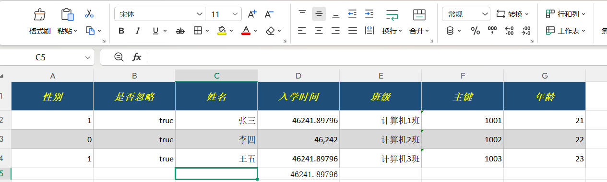

<br>

---

#### 2. `minimalistGrey` — 极简灰 / Minimalist Grey

炭黑表头搭配极浅灰斑马纹，左对齐文本，克制简洁。适合正式文档型导出。

Charcoal header with light grey zebra stripes, left-aligned text. Suitable for formal document exports.

<br>

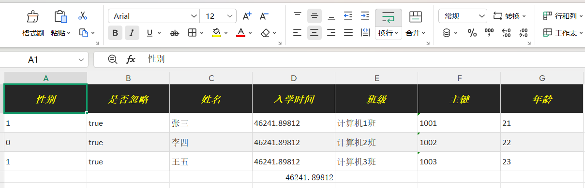

<br>

---

#### 3. `slate` — 板岩灰 / Slate Grey

板岩灰表头搭配浅灰蓝斑马纹，冷静商务。适合咨询、法务类报表。

Slate header with light grey-blue stripes, calm business style. Suitable for consulting and legal reports.

<br>

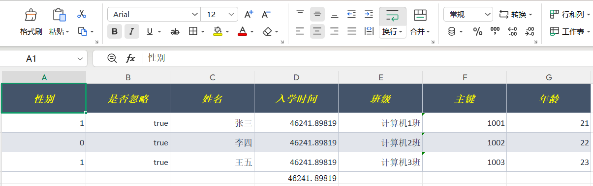

<br>

---

#### 4. `charcoal` — 炭灰 / Charcoal

炭灰表头搭配浅灰斑马纹，沉稳内敛。适合正式、行政类导出。

Charcoal header with light grey stripes, understated. Suitable for formal administrative exports.

<br>

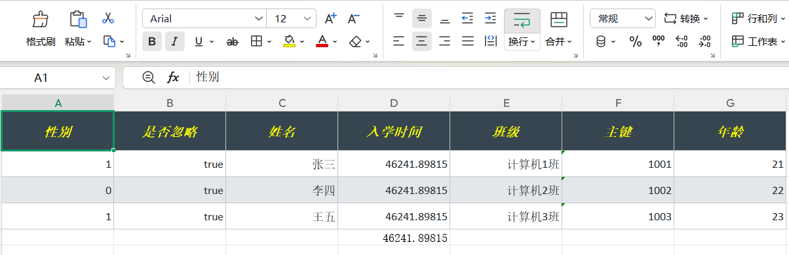

<br>

---

#### 5. `navyBlue` — 海军蓝 / Navy Blue

海军蓝表头搭配浅蓝斑马纹，稳重专业。适合政企、合规类报表。

Navy blue header with light blue stripes, professional. Suitable for enterprise and compliance reports.

<br>

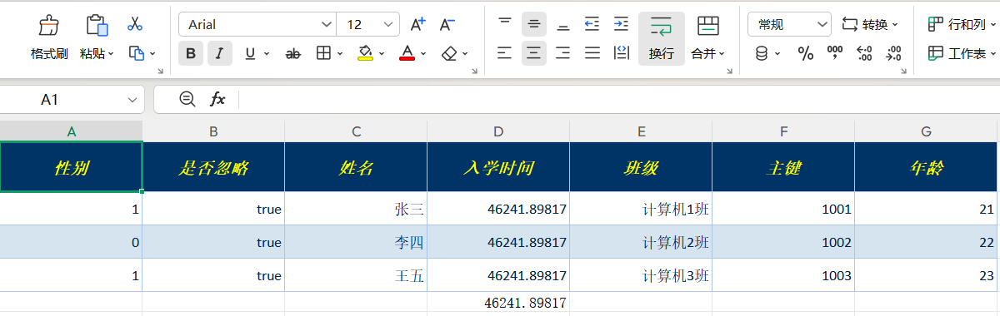

<br>

---

### 蓝色系 / Blue Family

#### 6. `oceanBlue` — 海洋蓝 / Ocean Blue

深蓝表头搭配浅蓝斑马纹，清新通透。适合财务、销售类报表。

Deep blue header with light blue stripes, fresh and transparent. Suitable for financial and sales reports.

<br>

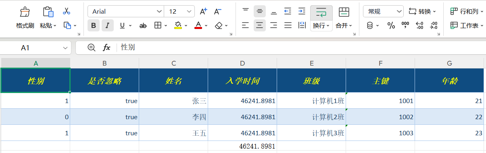

<br>

---

#### 7. `skyBlue` — 天空蓝 / Sky Blue

天空蓝表头搭配浅蓝斑马纹，明快清爽。适合互联网、SaaS 类报表。

Sky blue header with light blue stripes, bright and fresh. Suitable for Internet and SaaS reports.

<br>

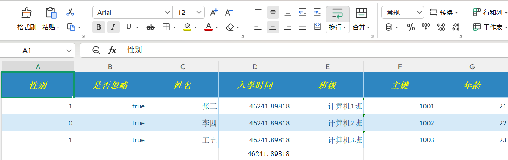

<br>

---

#### 8. `azure` — 蔚蓝 / Azure

蔚蓝表头搭配冰蓝斑马纹，通透辽阔。适合气象、物流类数据。

Azure header with ice-blue stripes, vast and transparent. Suitable for meteorological and logistics data.

<br>

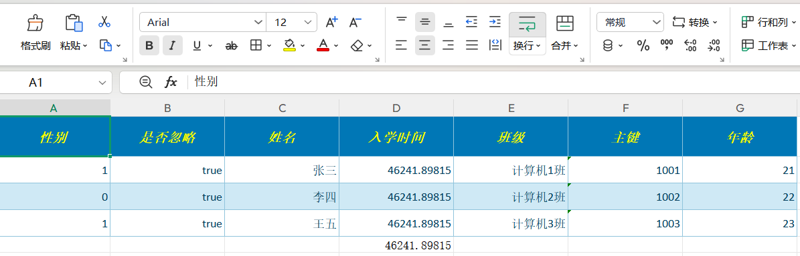

<br>

---

#### 9. `steelBlue` — 钢蓝 / Steel Blue

钢蓝表头搭配浅灰蓝斑马纹，冷静理性。适合制造、工程类数据。

Steel blue header with light grey-blue stripes, rational. Suitable for manufacturing and engineering data.

<br>

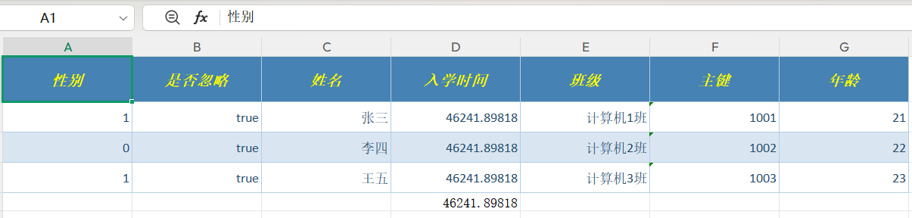

<br>

---

#### 10. `denim` — 牛仔蓝 / Denim Blue

牛仔蓝表头搭配浅蓝灰斑马纹，随性干练。适合零售、电商类导出。

Denim blue header with light blue-grey stripes, casual and capable. Suitable for retail and e-commerce.

<br>

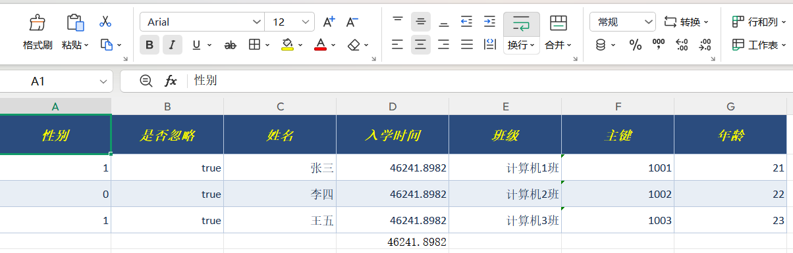

<br>

---

#### 11. `indigo` — 靛蓝 / Indigo

靛蓝表头搭配浅蓝紫斑马纹，沉静深邃。适合科技、研发类数据。

Indigo header with light blue-purple stripes, deep and calm. Suitable for tech and R&D data.

<br>

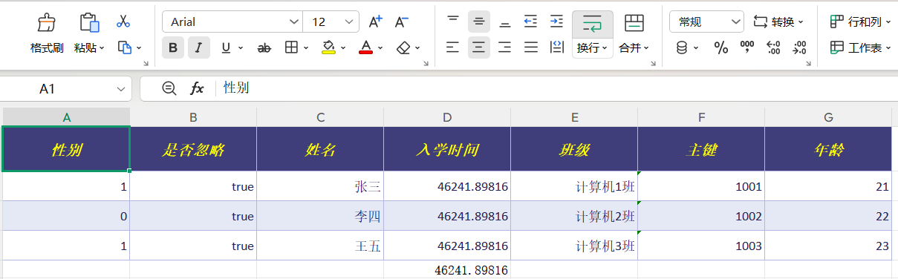

<br>

---

#### 12. `periwinkle` — 长春花蓝 / Periwinkle

长春花蓝表头搭配浅紫蓝斑马纹，柔和梦幻。适合设计、文创类导出。

Periwinkle header with light purple-blue stripes, soft and dreamy. Suitable for design and creative industries.

<br>

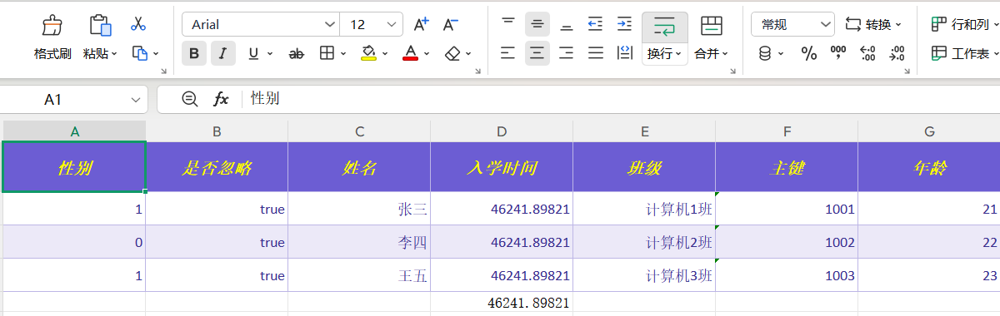

<br>

---

### 绿色系 / Green Family

#### 13. `forestGreen` — 森林绿 / Forest Green

深绿表头搭配嫩绿斑马纹，自然沉稳。适合库存、农业、环保类数据。

Deep green header with light green stripes, natural and steady. Suitable for inventory, agriculture, and environmental data.

<br>

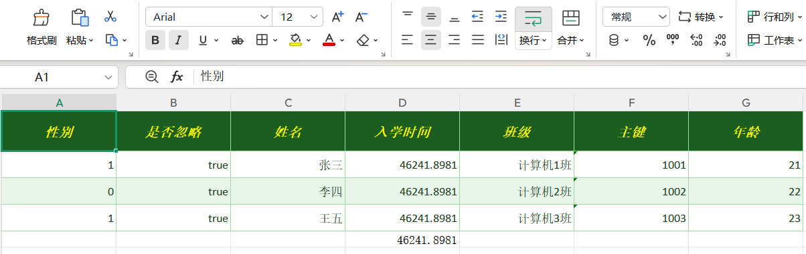

<br>

---

#### 14. `emerald` — 祖母绿 / Emerald

祖母绿表头搭配浅绿斑马纹，宝石质感。适合金融、财富管理类报表。

Emerald header with light green stripes, gem-like texture. Suitable for financial and wealth management reports.

<br>

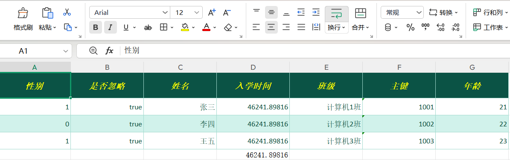

<br>

---

#### 15. `jade` — 翡翠绿 / Jade Green

翡翠绿表头搭配浅薄荷斑马纹，清润通透。适合环保、健康类导出。

Jade green header with light mint stripes, clear and transparent. Suitable for environmental and health exports.

<br>

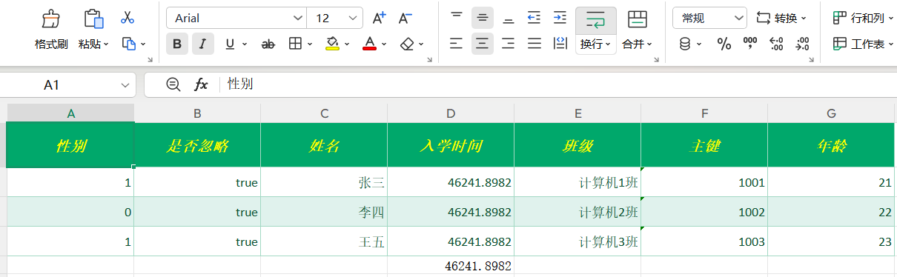

<br>

---

#### 16. `mintFresh` — 清新薄荷 / Mint Fresh

海绿表头搭配薄荷绿斑马纹，轻盈通透。适合教育、公益、生活服务类数据。

Sea green header with mint stripes, light and transparent. Suitable for education, public welfare, and lifestyle services.

<br>

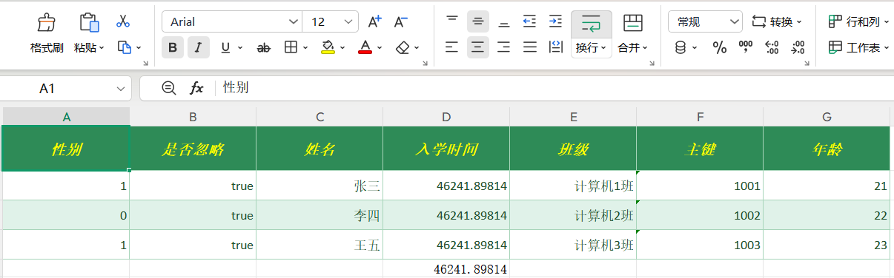

<br>

---

#### 17. `sage` — 鼠尾草绿 / Sage Green

鼠尾草绿表头搭配浅绿斑马纹，柔和舒缓。适合健康、冥想类数据。

Sage green header with light green stripes, soft and soothing. Suitable for health and wellness data.

<br>

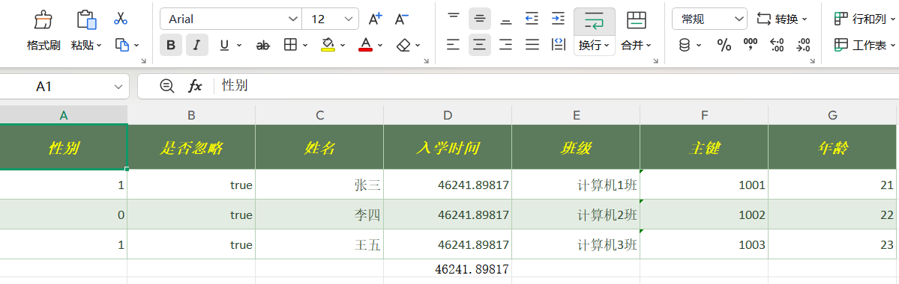

<br>

---

#### 18. `oliveGreen` — 橄榄绿 / Olive Green

橄榄绿表头搭配嫩黄绿斑马纹，质朴自然。适合农业、户外类数据。

Olive green header with light yellow-green stripes, rustic and natural. Suitable for agriculture and outdoor data.

<br>

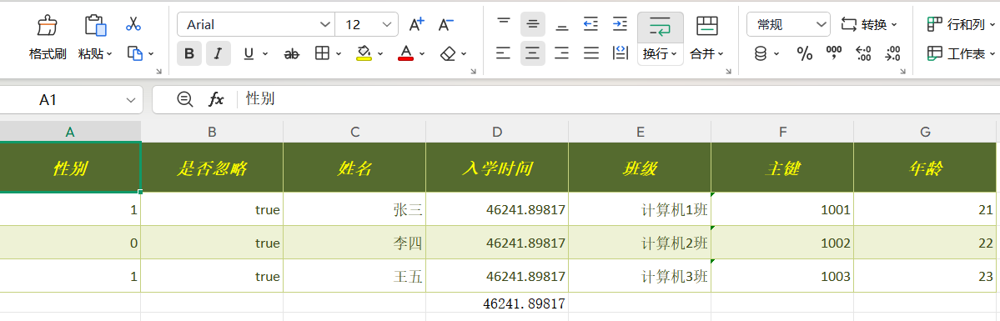

<br>

---

### 青色系 / Teal & Cyan Family

#### 19. `tropicalTeal` — 热带青 / Tropical Teal

青绿表头搭配薄荷斑马纹，清爽明亮。适合医疗、健康、旅游类数据。

Teal header with mint stripes, fresh and bright. Suitable for medical, health, and travel data.

<br>

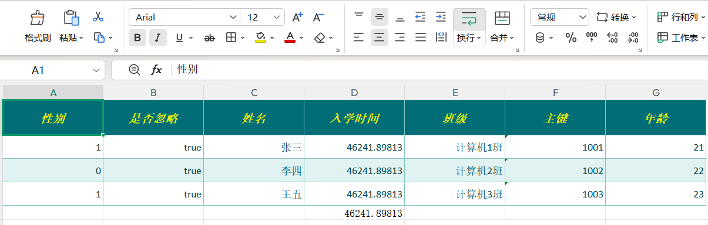

<br>

---

#### 20. `turquoise` — 绿松石 / Turquoise

绿松石表头搭配薄荷斑马纹，明艳灵动。适合珠宝、旅游类数据。

Turquoise header with mint stripes, vivid and agile. Suitable for jewelry and travel data.

<br>

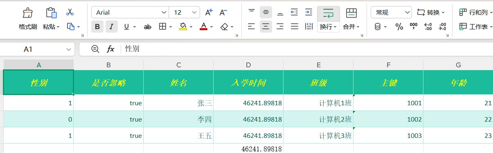

<br>

---

#### 21. `cyan` — 青色 / Cyan

青色表头搭配浅青斑马纹，清新通透。适合水务、环保类数据。

Cyan header with light cyan stripes, fresh and transparent. Suitable for water and environmental data.

<br>

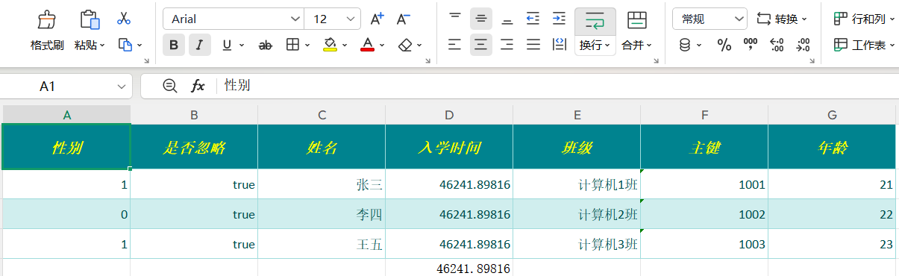

<br>

---

### 红色与橙色系 / Red & Orange Family

#### 22. `sunsetOrange` — 落日橙 / Sunset Orange

暖橙表头搭配杏色斑马纹，热情明亮。适合营销、运营类报表。

Warm orange header with apricot stripes, passionate and bright. Suitable for marketing and operations reports.

<br>

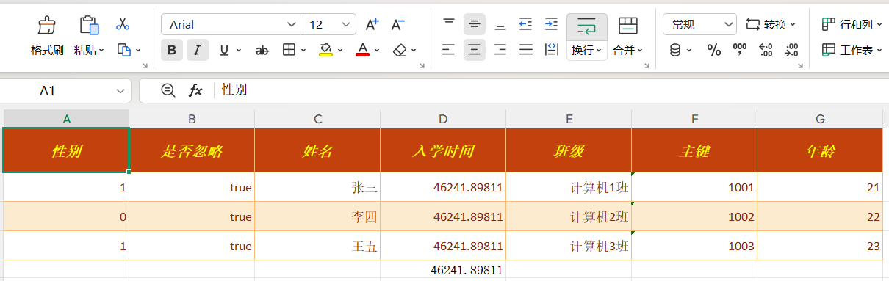

<br>

---

#### 23. `coral` — 珊瑚 / Coral

珊瑚红表头搭配粉白斑马纹，明快活泼。适合促销、活动类数据展示。

Coral red header with pink-white stripes, lively. Suitable for promotions and event data.

<br>

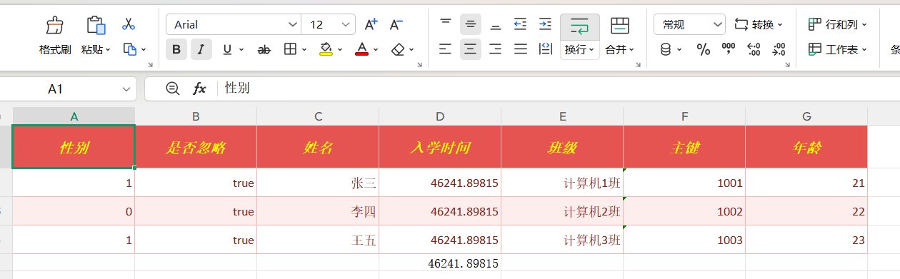

<br>

---

#### 24. `peach` — 蜜桃 / Peach

蜜桃橙表头搭配粉橙斑马纹，甜美柔和。适合母婴、生活服务类数据。

Peach orange header with pink-orange stripes, sweet and soft. Suitable for maternal and lifestyle services.

<br>

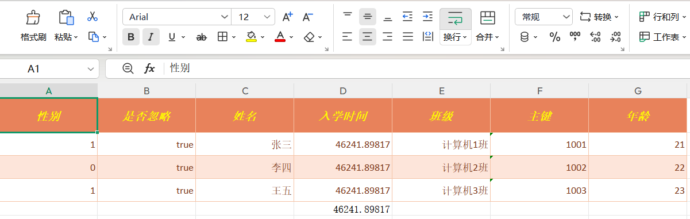

<br>

---

#### 25. `crimsonRed` — 深红 / Crimson Red

深红表头搭配浅红斑马纹，热烈庄重。适合预警、风控、重要指标类报表。

Crimson header with light red stripes, solemn. Suitable for alerts, risk control, and key metrics.

<br>

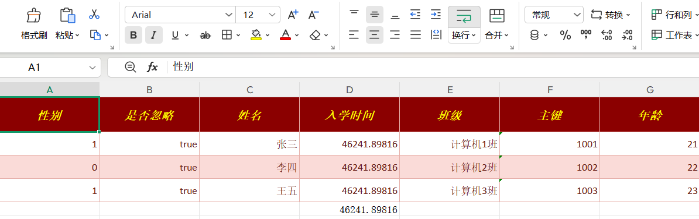

<br>

---

#### 26. `wineRed` — 酒红 / Wine Red

酒红表头搭配浅红斑马纹，醇厚典雅。适合高端餐饮、礼品类数据。

Wine red header with light red stripes, mellow and elegant. Suitable for high-end dining and gift data.

<br>

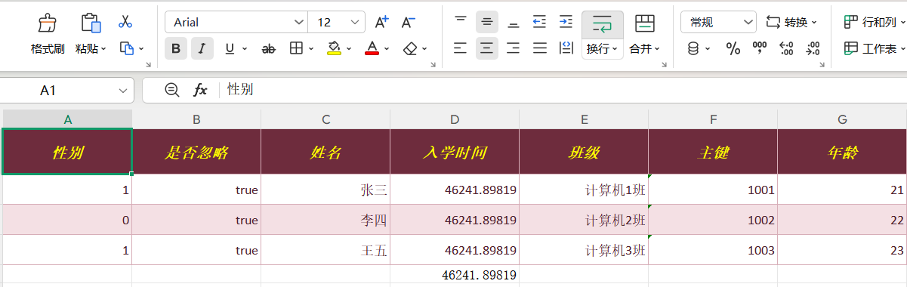

<br>

---

### 粉色与紫色系 / Pink & Purple Family

#### 27. `sakuraPink` — 樱花粉 / Sakura Pink

樱花红表头搭配粉白斑马纹，柔美温婉。适合电商、美妆、用户运营类报表。

Sakura red header with pink-white stripes, gentle and beautiful. Suitable for e-commerce, beauty, and user operations.

<br>

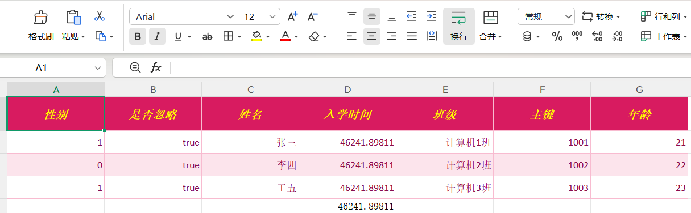

<br>

---

#### 28. `roseQuartz` — 粉晶 / Rose Quartz

玫瑰粉表头搭配浅粉斑马纹，柔美温婉。适合美妆、母婴类导出。

Rose pink header with light pink stripes, soft and gentle. Suitable for beauty and maternal exports.

<br>

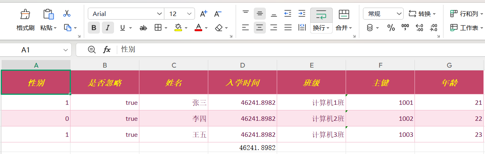

<br>

---

#### 29. `lavenderPurple` — 薰衣草紫 / Lavender Purple

深紫表头搭配淡紫斑马纹，优雅高贵。适合设计、文创类数据展示。

Deep purple header with light lavender stripes, elegant. Suitable for design and creative data.

<br>

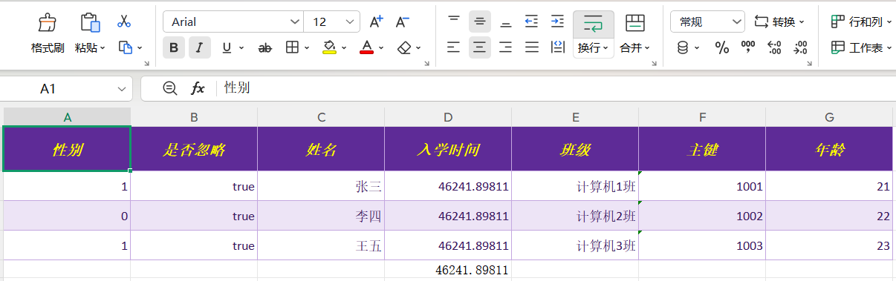

<br>

---

#### 30. `amethyst` — 紫水晶 / Amethyst

紫水晶表头搭配淡紫斑马纹，神秘高雅。适合设计、奢侈品导出。

Amethyst header with light purple stripes, mysterious and elegant. Suitable for design and luxury exports.

<br>

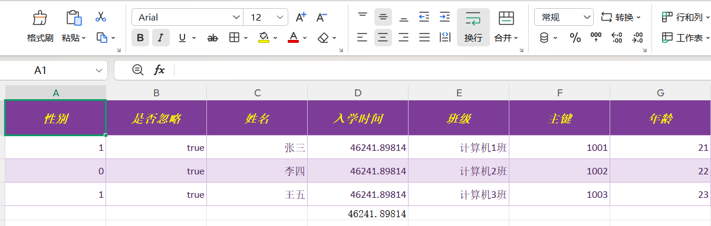

<br>

---

#### 31. `plum` — 紫梅 / Plum

深梅紫表头搭配浅紫斑马纹，神秘优雅。适合奢侈品、文创类导出。

Deep plum purple header with light purple stripes, mysterious and elegant. Suitable for luxury and creative exports.

<br>

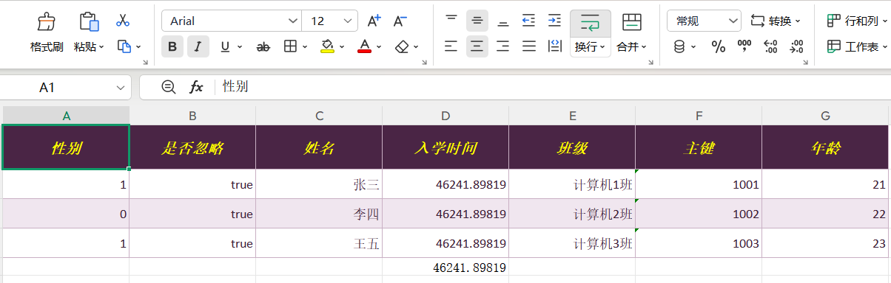

<br>

---

### 金色与棕色系 / Gold & Brown Family

#### 32. `royalGold` — 皇家金 / Royal Gold

纯黑表头搭配金色字体与金色边框，米色斑马纹，华贵大气。适合年报、金融、奢侈品类导出。

Black header with gold font and gold border, beige stripes, luxurious. Suitable for annual reports, finance, and luxury exports.

<br>

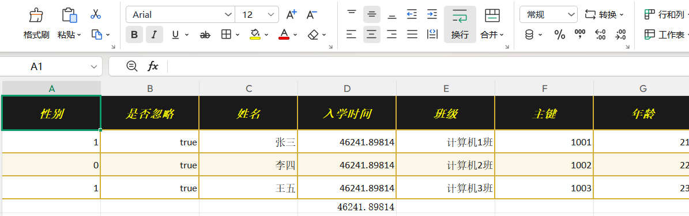

<br>

---

#### 33. `champagne` — 香槟金 / Champagne Gold

香槟色表头搭配米白斑马纹，低调奢华。适合金融、礼仪类导出。

Champagne header with cream stripes, understated luxury. Suitable for finance and ceremonial exports.

<br>

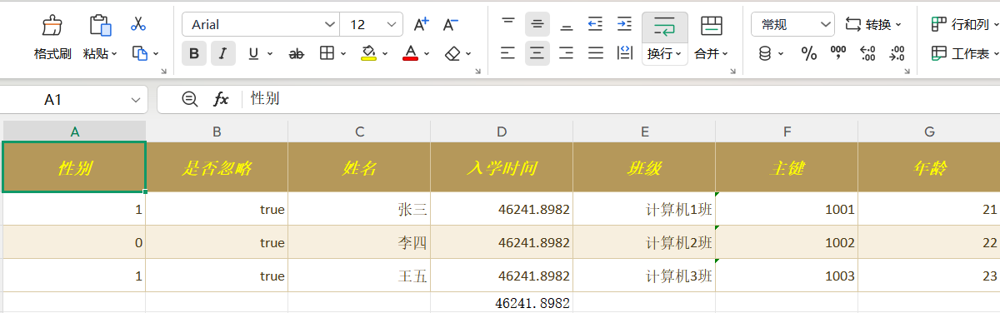

<br>

---

#### 34. `amber` — 琥珀 / Amber

琥珀金表头搭配浅黄斑马纹，温润光泽。适合珠宝、收藏品类数据。

Amber gold header with light yellow stripes, warm luster. Suitable for jewelry and collectibles data.

<br>

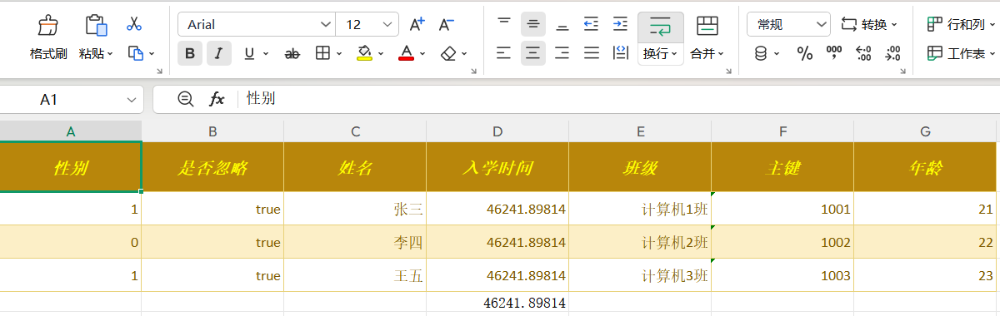

<br>

---

#### 35. `mustard` — 芥末黄 / Mustard Yellow

芥末黄表头搭配米黄斑马纹，复古温暖。适合文创、手作类数据。

Mustard yellow header with cream-yellow stripes, retro and warm. Suitable for creative and handcraft data.

<br>

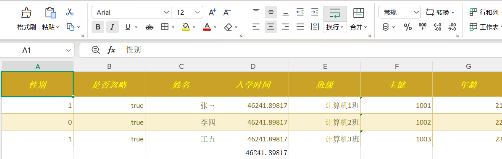

<br>

---

#### 36. `bronze` — 青铜 / Bronze

青铜表头搭配浅棕斑马纹，古朴厚重。适合博物馆、文物类数据。

Bronze header with light brown stripes, antique and heavy. Suitable for museum and cultural relic data.

<br>

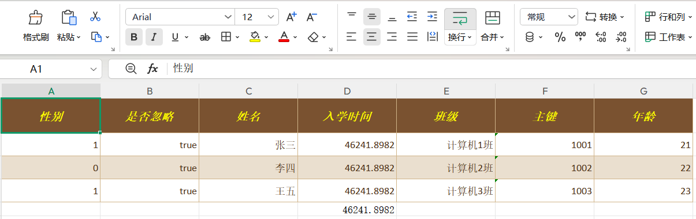

<br>

---

#### 37. `vintageSepia` — 复古棕 / Vintage Sepia

咖啡色表头搭配米色斑马纹与奶油色文字，左对齐，怀旧温润。适合档案、文史类导出。

Coffee header with cream stripes and cream text, left-aligned, nostalgic. Suitable for archival and historical exports.

<br>

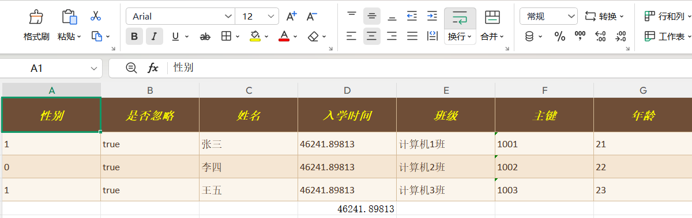

<br>

---

#### 38. `espresso` — 浓缩咖啡 / Espresso

浓缩咖啡表头搭配奶白斑马纹与奶油色文字，浓郁醇厚。适合咖啡、烘焙类数据。

Espresso header with cream-white stripes and cream text, rich and mellow. Suitable for coffee and baking data.

<br>

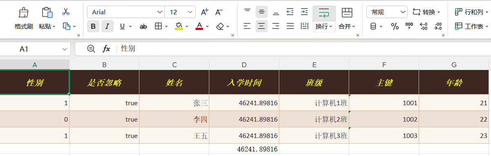

<br>

---

#### 39. `mahogany` — 红木 / Mahogany

红木色表头搭配浅褐斑马纹，沉稳大气。适合房地产、古典类导出。

Mahogany header with light brown stripes, steady and grand. Suitable for real estate and classical exports.

<br>

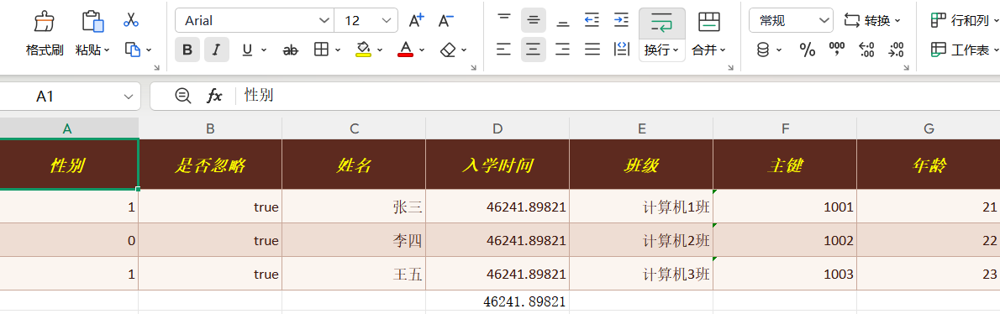

<br>

---

#### 40. `terracotta` — 陶土 / Terracotta

陶土棕表头搭配浅褐斑马纹，质朴温润。适合手工艺、家居类数据。

Terracotta brown header with light brown stripes, rustic and warm. Suitable for handcraft and home data.

<br>

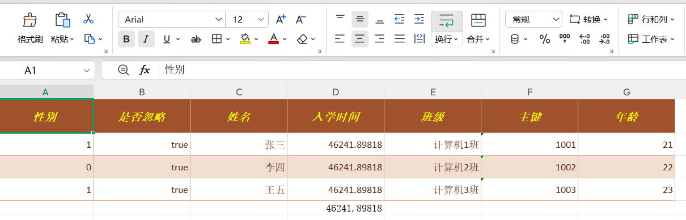

<br>

---

### 特殊风格 / Special Styles

#### 41. `midnightDark` — 午夜深色 / Midnight Dark

深色背景搭配浅色文字，护眼且具科技感。适合大屏看板、监控类数据导出。

Dark background with light text, eye-friendly and tech-savvy. Suitable for dashboards and monitoring data.

<br>

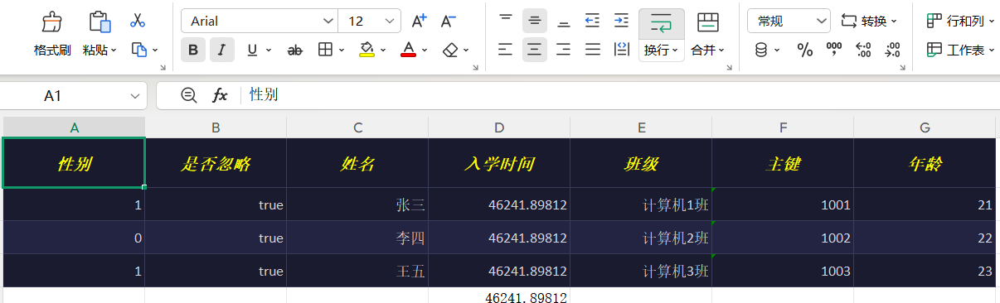

<br>

---

#### 42. `pearl` — 珍珠 / Pearl

珍珠灰紫表头搭配珠光斑马纹，温润优雅。适合美妆、婚庆类数据。

Pearl grey-purple header with pearlescent stripes, warm and elegant. Suitable for beauty and wedding data.

<br>

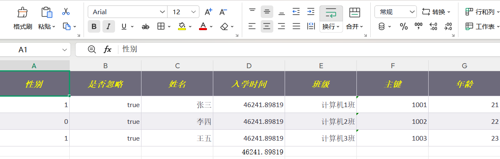

<br>

---

## 主题结构说明 / Theme Structure

每个主题由以下样式组件构成 / Each theme consists of the following style components:

| 组件 / Component | 方法 / Method | 说明 / Description |
|-----------------|-------------|-------------------|
| 表头样式 / Header Style | `buildHeaderStyle` | 表头行的背景色、字体、边框和对齐方式。<br>Background, font, border, and alignment for header rows. |
| 偶数行样式 / Even Row Style | `buildDataEvenStyle` | 数据偶数行的斑马纹样式。<br>Zebra stripe style for even data rows. |
| 奇数行样式 / Odd Row Style | `buildDataOddStyle` | 数据奇数行的样式。<br>Style for odd data rows. |
| 标题样式 / Title Style | `buildTitleStyle` | 合并单元格大标题的样式。<br>Style for merged cell titles. |
| 页脚样式 / Footer Style | `buildFooterStyle` | 页脚文本样式。<br>Footer text style. |
| 公式单元格样式 / Formula Cell Style | `buildFormulaCellStyle` | 公式计算单元格的强调样式。<br>Accent style for formula cells. |

## 主题编码汇总 / Theme Code Summary

| 序号 / No. | Code | 中文名称 / Chinese Name |
|---------|------|----------------------|
| 1 | `default` | 经典皇家蓝 |
| 2 | `minimalistGrey` | 极简灰 |
| 3 | `slate` | 板岩灰 |
| 4 | `charcoal` | 炭灰 |
| 5 | `navyBlue` | 海军蓝 |
| 6 | `oceanBlue` | 海洋蓝 |
| 7 | `skyBlue` | 天空蓝 |
| 8 | `azure` | 蔚蓝 |
| 9 | `steelBlue` | 钢蓝 |
| 10 | `denim` | 牛仔蓝 |
| 11 | `indigo` | 靛蓝 |
| 12 | `periwinkle` | 长春花蓝 |
| 13 | `forestGreen` | 森林绿 |
| 14 | `emerald` | 祖母绿 |
| 15 | `jade` | 翡翠绿 |
| 16 | `mintFresh` | 清新薄荷 |
| 17 | `sage` | 鼠尾草绿 |
| 18 | `oliveGreen` | 橄榄绿 |
| 19 | `tropicalTeal` | 热带青 |
| 20 | `turquoise` | 绿松石 |
| 21 | `cyan` | 青色 |
| 22 | `sunsetOrange` | 落日橙 |
| 23 | `coral` | 珊瑚 |
| 24 | `peach` | 蜜桃 |
| 25 | `crimsonRed` | 深红 |
| 26 | `wineRed` | 酒红 |
| 27 | `sakuraPink` | 樱花粉 |
| 28 | `roseQuartz` | 粉晶 |
| 29 | `lavenderPurple` | 薰衣草紫 |
| 30 | `amethyst` | 紫水晶 |
| 31 | `plum` | 紫梅 |
| 32 | `royalGold` | 皇家金 |
| 33 | `champagne` | 香槟金 |
| 34 | `amber` | 琥珀 |
| 35 | `mustard` | 芥末黄 |
| 36 | `bronze` | 青铜 |
| 37 | `vintageSepia` | 复古棕 |
| 38 | `espresso` | 浓缩咖啡 |
| 39 | `mahogany` | 红木 |
| 40 | `terracotta` | 陶土 |
| 41 | `midnightDark` | 午夜深色 |
| 42 | `pearl` | 珍珠 |
